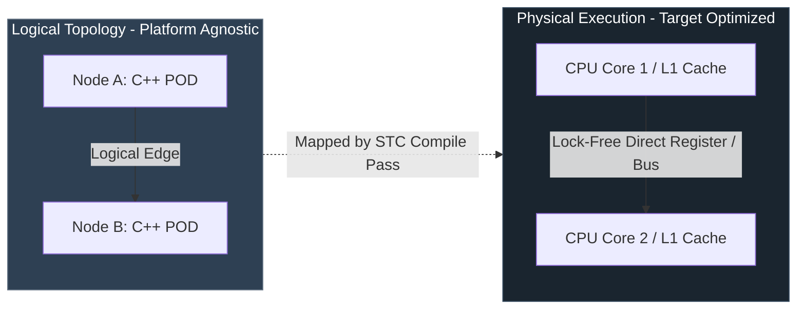
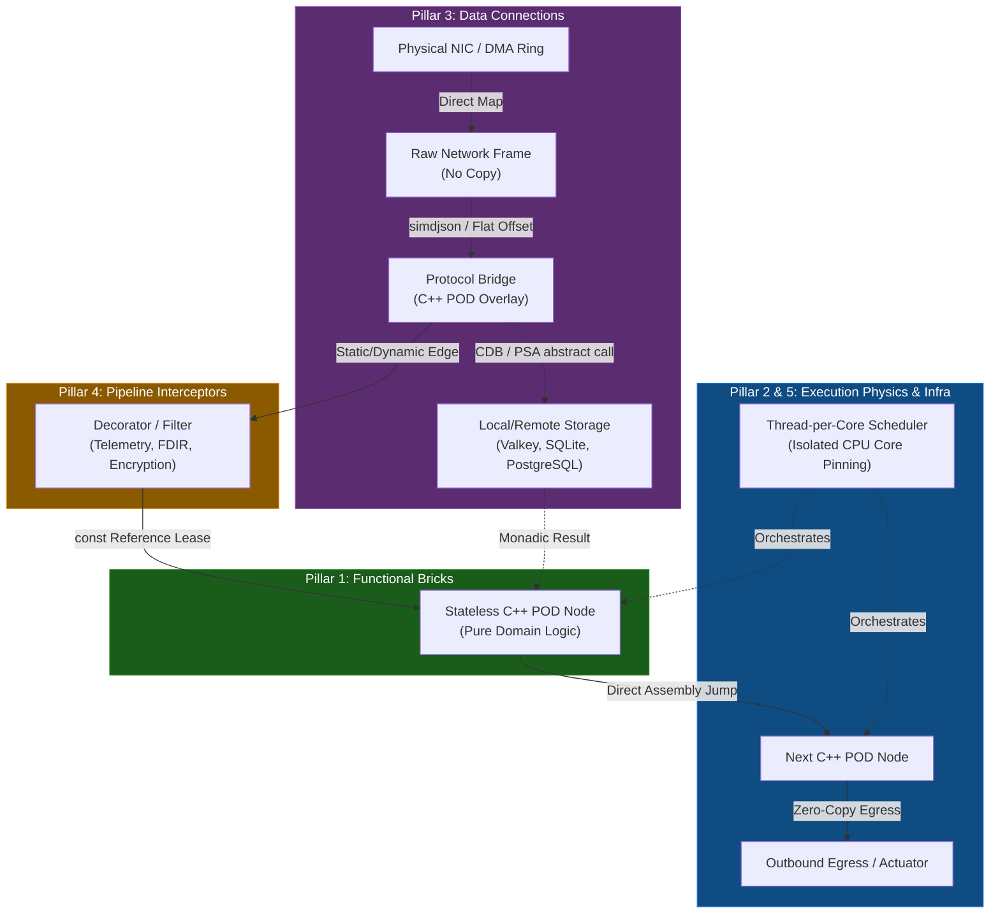
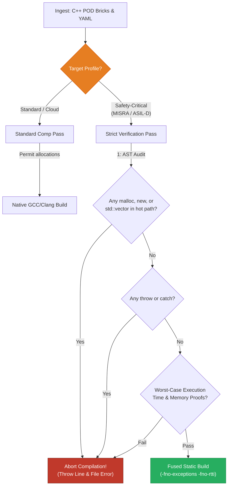

# STC Architectural Core Reference
**Version:** 2026.1.0  
**Classification:** Core System Architecture Specification

---

## 1. Foundational Paradigm: Logical vs. Physical Isolation

The System-Topology Compiler (STC) separates the **Logical Architecture** (domain-specific data transformation and control loops) from the **Physical Architecture** (hardware execution resources, memory domains, and network interfaces). 



*   **Logical Decoupling:** Lego modules (Pillar 1 Bricks) contain purely mathematical, declarative, and sequential operations [1]. They do not configure, nor do they dynamically inspect, where they run or how they communicate.
*   **Physical Morphing:** The compiler maps logical edges to hardware execution mechanisms (Clay) [1]. An edge between Node A and Node B can compile to a direct register-to-register assembly instruction, a lock-free ring buffer (Disruptor) [1], an in-memory shared memory segment (SHM) [2], or a kernel-bypass network packet (DPDK/AF_XDP) [3], depending on the target environment profile declared in the YAML recipe.

---

## 2. Detailed Pillars Specification

To trace data transformation and execution flow, STC processes events through the five strictly segregated architectural layers:



### Pillar 1: Functional Bricks (Domain Logic)
*   **POD Constraints:** Functional structures must be Plain Old Data (POD) [1]. No virtual method tables (VMTs), no virtual inheritance, and no private member fields that hide data layout. Memory layouts must be fully transparent to allow static alignment and cross-platform transpilation.
*   **Directed Graph Semantics:** The logical flow is a directed acyclic graph (DAG) [1]. Data flows unidirectional. Nodes are activated strictly by data arrival (Data-Flow execution model), bypassing standard instruction-pointer-driven call stacks where possible.
*   **Immutability:** Inputs to functional blocks are passed as `const` references. State changes are output strictly via dedicated, non-overlapping output structs, enforcing functional purity and preventing side effects.

### Pillar 2: Execution Physics (Concurrency & Drivers)
*   **Reactor / Proactor Engines:** Uses asynchronous, non-blocking multiplexing. For Linux targets, the runtime utilizes `io_uring` to queue SQEs (Submission Queue Entries) and process CQEs (Completion Queue Entries) in user space without kernel transition overhead [4].
*   **Thread-per-Core (TPC):** Restricts the operating system from scheduling threads dynamically. Each active execution thread is permanently pinned to a dedicated physical CPU core (`pthread_setaffinity_np`) with CPU isolation (`isolcpus`) enabled at the kernel boot level to prevent context-switch jitter.
*   **DPDK/AF_XDP Polling-Mode Drivers:** High-speed network interfaces utilize kernel-bypass polling-mode drivers. The application thread continuously polls ring descriptors directly from NIC memory, achieving line-rate processing with zero-copy page mappings.

### Pillar 3: Data Connections (Protocol Bridges, CDB, & PSA)
*   **Zero-Copy Serialization Bridges:** Protocol bridges do not allocate intermediate buffers. Network packets are parsed in-place using SIMD-accelerated offset calculators mapping directly onto raw buffers (e.g., JSON, Protobuf, gRPC, GTP-U) [5].
*   **Context Database (CDB) Command Passing:** Interaction with caching layers is abstracted into un-parsed commands (`execute({"CMD", ...})`) passed directly to local (Redis-Lite) or distributed (Valkey) engines [1]. This shields functional logic from thick external database client libraries [6].
*   **Persistent Storage Adapters (PSA):** Database interactions are decoupled using compile-time monadic contracts (e.g., `fetch_user()`). This eliminates pointer-chasing ORMs and dynamically allocated queries, translating database actions directly to statically fused prepared statements or direct asynchronous raw writes [2].

### Pillar 4: Pipeline Interceptors (Cross-Cutting Logic)
*   **Strategy A (Runtime Decorators):** Used for dynamic environments [1]. Edges are compiled as atomic function pointers. Interceptor modules (e.g., dynamic logging, real-time snapshotters) are loaded via `dlopen()`. The active pointer is hot-swapped using an epoch-based RCU (Read-Copy-Update) memory fence, ensuring zero packet drops during reconfiguration.
*   **Strategy B (Compile-Time Static Fusion):** Used for safety-critical environments [1]. The compiler performs static inline expansion. Interceptors are merged directly into the core execution loops of the functional blocks, resolving all dependencies at compile-time and removing any pointer indirection or dynamic memory allocation.

### Pillar 5: Infrastructure (Targeting & Compliance)
*   **ARINC 653 Partitioning:** For avionics, STC configures the spatial and temporal partitions of PikeOS/VxWorks, auto-generating the APEX sampling and queuing port code [7].
*   **Kubernetes Manifest Synthesis:** For cloud targets, STC compiles the application into scratch-based, multi-stage micro-containers and generates standard Deployment, StatefulSet, Ingress, and Multus CNI (SR-IOV) YAML files [8].
*   **Traceability Tracking:** Every generated block and edge includes embedded compiler metadata mapping back to system requirements (e.g., DOORS / DO-178C trace matrices) [7].

---

## 3. Conditional Compliance Framework

The STC compiler switches its compilation strictness dynamically based on the declarative profile declared in the YAML recipe:



| Metric / Feature | Standard / Cloud Profile | Safety-Critical (MISRA / ASIL-D) Profile |
| :--- | :--- | :--- |
| **Heap Allocations** | Permitted during initialization; managed via local pools during runtime. | **Strictly Forbidden.** Zero dynamic allocation (`malloc`, `new`, `std::vector`) at runtime or boot [7]. |
| **Exception Handling** | Standard C++ `try`/`catch` blocks allowed. | **Forbidden.** Compile flag `-fno-exceptions` enforced. Error propagation strictly managed via stack-allocated monadic `Result<T, E>`. |
| **RTTI** | Standard Run-Time Type Information enabled. | **Forbidden.** Compile flag `-fno-rtti` enforced. Polymorphism resolved strictly compile-time via templates. |
| **Pointers** | Smart pointers (`std::shared_ptr`, `std::unique_ptr`) allowed. | **Forbidden.** Raw pointer arithmetic forbidden. Stack references and static offset indexes enforced. |
| **Worst-Case Execution Time** | Best-effort heuristic optimization. | **Formally Proven.** High-precision static WCET analysis determines boundary safety margins [7]. |

### Monadic Error Handling (`Result<T, E>`) in Safety-Critical Profiles
Standard exceptions introduce non-deterministic execution paths. In safety-critical profiles, the compiler generates a stack-allocated monadic `Result` container:

```cpp
template <typename T, typename E>
class [[nodiscard]] Result {
private:
    union {
        T value;
        E error;
    };
    bool success;

public:
    Result(T val) : value(val), success(true) {}
    Result(E err) : error(err), success(false) {}

    inline bool is_ok() const { return success; }
    inline T get_value() { return value; }
    inline E get_error() { return error; }
};
```

---

## 4. Memory Model & Data Lifetime Guarantees

STC guarantees zero-copy, lock-free thread safety across the entire execution graph using a **Static Lifetime Lease Model**:

```mermaid
graph LR
    Ingress["1. Network Ingress Buffer<br/>(Hugepage-Backed Ring)"] -->|"Memory Lease Granted"| NodeA["2. Lego Node A<br/>(Read-Only const Ref)"]
    NodeA -->|"Pass Read-Only Lease"| NodeB["3. Lego Node B<br/>(Read-Only const Ref)"]
    NodeB -->|"Egress / Hardware Transmit"| Tx["4. Physical Outbound Tx<br/>(Actuator or NIC DMA)"]
    Tx -->|"Lease Automatically Voided"| Recycle["5. Buffer Safely Recycled<br/>(Zero-Copy Ring Return)"]
    Recycle -.->|"Ready for reuse"| Ingress

    style Ingress fill:#78281f,stroke:#c0392b,color:#fff
    style NodeA fill:#1f618d,stroke:#2980b9,color:#fff
    style NodeB fill:#1f618d,stroke:#2980b9,color:#fff
    style Recycle fill:#196f3d,stroke:#27ae60,color:#fff
```



1.  **Ingress Memory Mapping:** Incoming network or sensor data is read directly into memory-mapped, hugepage-backed ring buffers [4].
2.  **The Compile-Time Lease:** The compiler analyzes the execution path of the DAG. It calculates which nodes require access to the ingress buffer.
3.  **Read-Only Reference Passing:** Data is passed to downstream functional blocks strictly via `const` references. The compiler proves that no downstream block holds a reference to the buffer beyond the execution lifetime of the DAG.
4.  **Automatic Reclamation:** The moment the last leaf node in the DAG completes execution, the memory lease is automatically voided, and the buffer descriptor is returned to the ingress ring for reuse with zero execution cycles spent on memory copy or garbage collection [1].

---

## 5. References
[1] M. Thompson, D. Farley, M. Barker, and P. Gee, "Disruptor: High Performance Alternative to Bounded Queues for Sharing Data Among Threads," *LMAX Technical Paper*, 2011.  
[2] STC Co-Pilot & Systems Architect Reference Manual, "Pillar 1, 3, 4, 5 Specifications," 2026.  
[3] Valkey, "The Valkey server Manual & Migration," *Valkey Documentation*, 2026.  
[4] Intel, "Intel Resource Director Technology (Intel RDT): Cache Allocation Technology (CAT)," *Intel Documentation*, 2024.  
[5] T. Langdale and D. Lemire, "Parsing Gigabytes of JSON per Second," *The VLDB Journal*, vol. 29, no. 6, pp. 1227-1246, 2020.  
[6] OT-Container-Kit, "Redis Operator for Kubernetes," *GitHub Repository*, 2024.  
[7] RTCA, "DO-178C: Software Considerations in Airborne Systems and Equipment Certification," RTCA Incorporated, 2011.  
[8] Google, "Distroless Container Images," *Google Container Tools*, 2024.  
[9] CNCF, "Multus CNI: Multi-homed Pods in Kubernetes," *Kubernetes Network Plumbing Working Group*, 2023.