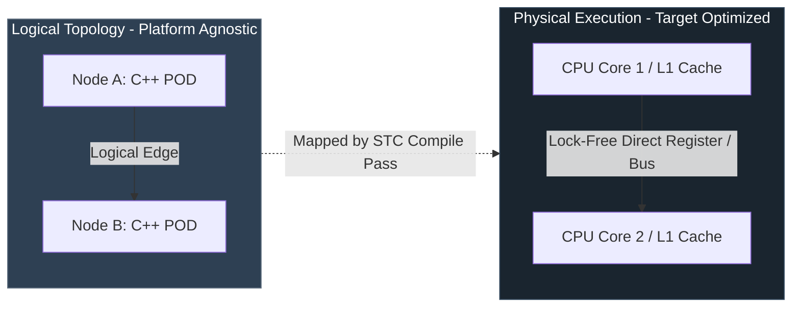

<!-- Part of: STC Co-Pilot & Systems Architect Reference Manual v2026.1.0 -->

## 1. Foundational Paradigm: Logical vs. Physical Isolation

The System-Topology Compiler (STC) separates the **Logical Architecture** (domain-specific data transformation and control loops) from the **Physical Architecture** (hardware execution resources, memory domains, and network interfaces). 

*   **Logical Decoupling:** Lego modules (Pillar 1 Bricks) contain purely mathematical, declarative, and sequential operations [1]. They do not configure, nor do they dynamically inspect, where they run or how they communicate.
*   **Physical Morphing:** The compiler maps logical edges to hardware execution mechanisms (Clay) [1]. An edge between Node A and Node B can compile to a direct register-to-register assembly instruction, a lock-free ring buffer (Disruptor) [1], an in-memory shared memory segment (SHM) [2], or a kernel-bypass network packet ([DPDK](#acronym-DPDK)/[AF_XDP](#acronym-AF_XDP)) [3], depending on the target environment profile declared in the YAML recipe.

