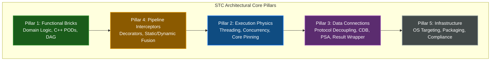

<!-- Part of: STC Co-Pilot & Systems Architect Reference Manual v2026.1.0 -->

## 2. Core Architectural Pillars

The System-Topology Compiler (STC) divides systems into five strictly segregated, non-overlapping architectural layers.

### Pillar 1: Functional Bricks (Core Domain Logic)
*   **Definition:** Pure, stateless, context-free business logic and state structures.
*   **Requirements:**
    *   Written strictly in native, memory-aligned C++ Plain Old Data ([POD](#acronym-POD)) classes.
    *   No thread-synchronization primitives (`std::mutex`, atomics), network headers, logging libraries, or database clients are permitted.
    *   No dynamic memory allocations (`malloc`, `new`, standard containers with heap allocators) are allowed on the hot path.
    *   Logical connectivity is modeled as a Directed Acyclic Graph (DAG) of inputs and outputs, never as a linear execution pipeline.

### Pillar 2: Execution Physics (Concurrency & Drivers)
*   **Definition:** The runtime threading, polling, scheduling, and driver layers that dictate *how* functional code is executed on hardware.
*   **Supported Profiles:**
    *   *Thread-per-Core (TPC):* Direct pinning of execution threads to dedicated physical cores with zero-preemption loops.
    *   *Disruptor:* High-performance, single-writer, lock-free ring buffers with wait-free sequences.
    *   *Interrupt-Driven Sleep:* Event-driven wakeups using hardware registers (Wait-For-Interrupt - `__WFI`).
    *   *Low-Latency Drivers:* Native polling-mode drivers (PMDs) such as DPDK, AF_XDP, and `io_uring` mapped directly to physical ring descriptors.

### Pillar 3: Data Connections (Protocol Decoupling, [CDB](#acronym-CDB), & [PSA](#acronym-PSA))
*   **Definition:** The translation, serialization, and database/caching boundary interfaces that shield core functional logic from external data formats and persistent storage engines.
*   **Bridges:** Deserialize incoming data (e.g., JSON, Protobuf, gRPC, GTP-U) directly onto the raw memory boundaries of the functional [POD](#acronym-POD)s without intermediate copies.
*   **Context Database Handlers ([CDB](#acronym-CDB)):** Abstract, un-parsed command-passing driver interfaces (`execute({"CMD", ...})`) used to interact with in-memory caching layers (Valkey, Redis-Lite, Redis Enterprise).
*   **Persistent Storage Adapters ([PSA](#acronym-PSA)):** Abstract, monadic, compile-time query interfaces (contracts) used to access persistent database layers (SQLite, PostgreSQL, MongoDB, or custom architect-defined DB engines) using zero-allocation stack data mappings.
*   **Type-Safe Result Containers:** Stack-allocated, zero-heap monadic wrappers (such as `CdbResult` and database query `Result<T, E>`) that prevent memory leaks, exceptions, and pointer-chasing in critical execution paths.

### Pillar 4: Pipeline Interceptors (Cross-Cutting Logic)
*   **Definition:** Decorators and filters woven onto execution edges to enforce security, telemetry, audit logs, and safety checks without polluting Pillar 1.
*   **Strategy A (Runtime Decorators):** Injects dynamically loaded modules (`.so` / `.dll`) into the execution path, utilizing epoch-based pointer swapping for runtime hot-swaps.
*   **Strategy B (Compile-Time Static Fusion):** Inlines interceptor logic directly into the generated C++ execution paths, optimizing out any runtime indirection.

### Pillar 5: Infrastructure (OS & Safety Compliance)
*   **Definition:** The deployment, packaging, and regulatory compliance layer.
*   **Targets:** Generates bare-metal firmware, RTOS binaries (FreeRTOS, PikeOS, QNX), or orchestrated Kubernetes manifests.
*   **Compliance Gates:** Automatically performs static AST verification to audit code against safety standards (such as ISO 26262 [ASIL-D](#acronym-ASIL-D), IEC 62304 Class C, and [MISRA](#acronym-MISRA)-C++).

---

