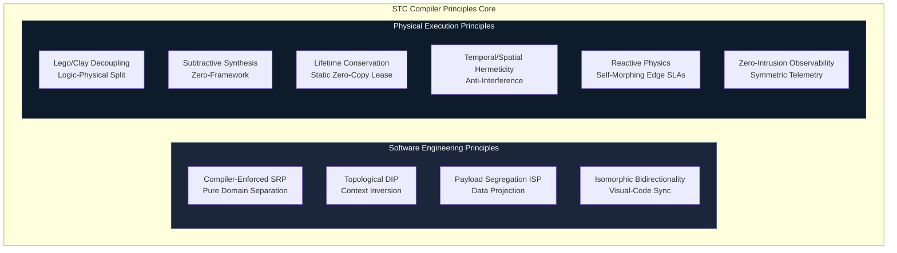

<!-- Part of: STC Co-Pilot & Systems Architect Reference Manual v2026.1.0 -->

## 3. Core Compiler Principles

STC unifies traditional compiler optimization passes with modern software engineering and physical hardware isolation practices.

### 1. The Lego/Clay Principle (Logical-Physical Decoupling)
Domain logic is written as decoupled, stateless C++ structures (Lego Bricks). The physical deployment architecture (the Clay) is declared in a separate topology recipe. The compiler morphs the same logical bricks to fit the physical constraints of any target without source-code modification.

### 2. Subtractive Physics Synthesis (The Zero-Framework Principle)
The compiler assumes zero operating system, zero scheduling library, and zero network stack exist. It only synthesizes the absolute minimum machine instructions needed to execute the edge path. Unused synchronization primitives, threading abstractions, and OS layers are entirely stripped out during compilation.

### 3. Isomorphic Bidirectionality (Visual-Code Isomorphism)
The YAML topology recipe, the Visual STC Playroom GUI, the compiler's ECS AST, and the generated C++ edge code exist in a continuous, bi-directional mathematical synchronization loop. Modifying one representation instantly updates all others without structure or metadata loss.

### 4. Lifetime Conservation (The Static Zero-Copy Lease)
To eliminate latency jitter from memory allocation and copying, the compiler statically calculates data lifetimes from physical ingress to egress. It generates compile-time static memory leases. Upstream nodes lease read-only memory blocks to downstream consumers, and memory is recycled instantly at the ingress buffer boundary the moment the last leaf node in the DAG completes execution.

### 5. Temporal & Spatial Hermeticity (The Anti-Interference Principle)
Prevents physical resource interference between critical and non-critical modules. The compiler aligns variable offsets to prevent L1/L2 cache-line bouncing (false sharing) and auto-generates CPU-specific instructions (such as Intel CAT or ARM MPAM) to lock dedicated cache lines for critical threads.

### 6. Reactive Physics (Self-Morphing Environmental Adaptability)
The compiler injects non-functional SLA monitors onto active edges. If an edge SLA (e.g., `< 30ms` latency over 5G) is violated at runtime, the monitoring guard triggers a dynamic reconfiguration event, hot-swapping the active routing pointer to a resilient buffered or rollback netcode path without halting execution.

### 7. Zero-Intrusion Observability (Symmetric Telemetry)
Functional blocks contain zero logging or metric-gathering code. Telemetry is synthesized directly on the edges at compile-time, mapping execution transits to hardware-level tracing mechanisms (such as Intel PT, ARM CoreSight, or kernel-bypass static [eBPF](#acronym-eBPF) probes) to read metrics directly from registers and cache lines with zero CPU-cycle overhead.

### 8. Compiler-Enforced Single Responsibility Principle (SRP)
The compiler makes it structurally impossible for a functional block to implement non-functional concerns. A Lego block can only execute domain logic. All cross-cutting concerns (logging, networking, thread sync) are automatically synthesized onto the edges as decoupled decorators.

### 9. Pure Topological Context Inversion (The Ultimate DIP)
Lego blocks do not contain pointers to next-nodes or define abstract interfaces of downstream consumers. The compiler reads the declarative YAML topology recipe and injects dependencies at compile-time, synthesizing direct function calls, memory offsets, or register jumps on the edges to eliminate virtual function table (VMT) latency.

### 10. Compile-Time Payload Segregation (The ISP of Data)
To prevent nodes from receiving unnecessary global state data, the compiler performs compile-time data projection. It analyzes the input requirements of a target node and automatically generates a sliced, minimal POD structure containing *only* the specific fields needed by that node, packing them into local registers or contiguous cache-aligned segments.

---

