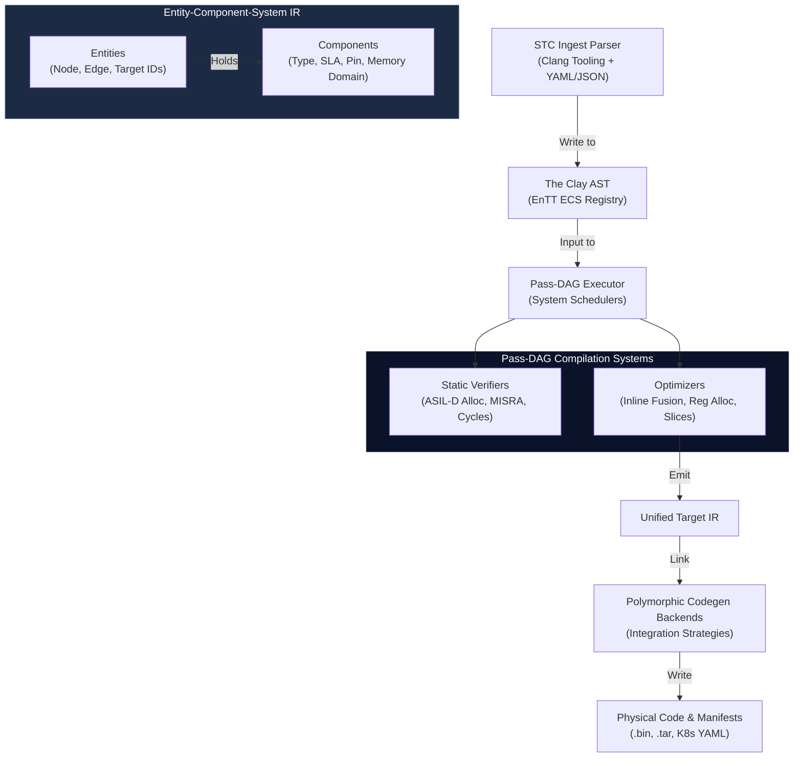

<!-- Part of: STC Co-Pilot & Systems Architect Reference Manual v2026.1.0 -->

## 4. Compiler Architecture & The Clay AST

The STC compiler utilizes a data-oriented execution pipeline built on a highly parallelizable, entity-component intermediate representation.

### 1. The Clay AST (ECS-Based Intermediate Representation)
To resolve the "Expression Problem" and support modular, dynamic extensions:
*   **Entities:** Every node, edge, and target in the compiler graph is represented as a unique integer ID.
*   **Components:** Syntactic, semantic, and non-functional properties (such as source locations, sample rates, network protocols, and hardware pin mappings) are appended to these entities as flat, memory-aligned structures in an entity component registry.
*   **Systems:** Compiler passes run as decoupled systems that query specific component patterns (e.g., a system that checks for physical rate mismatches across edges and injects queue adapters).

### 2. The Pass-DAG Executor
The compilation stages themselves run as a Directed Acyclic Graph (DAG) of independent compilation passes. The compiler's execution engine loads, wires, and schedules compile passes dynamically based on the target configuration.

### 3. Verification & Constraints
Before code generation, the compiler executes formal validation passes:
*   *Temporal Constraint Solver:* Proves that hard real-time execution blocks meet Worst-Case Execution Time ([WCET](19_legend.md#acronym-WCET)) bounds.
*   *Memory Guard:* Proves that static memory allocations do not exceed target embedded hardware SRAM/Flash limits.
*   *Compliance Verifier:* Audits AST structures to ensure zero dynamic memory allocations on safety-critical paths.

---

