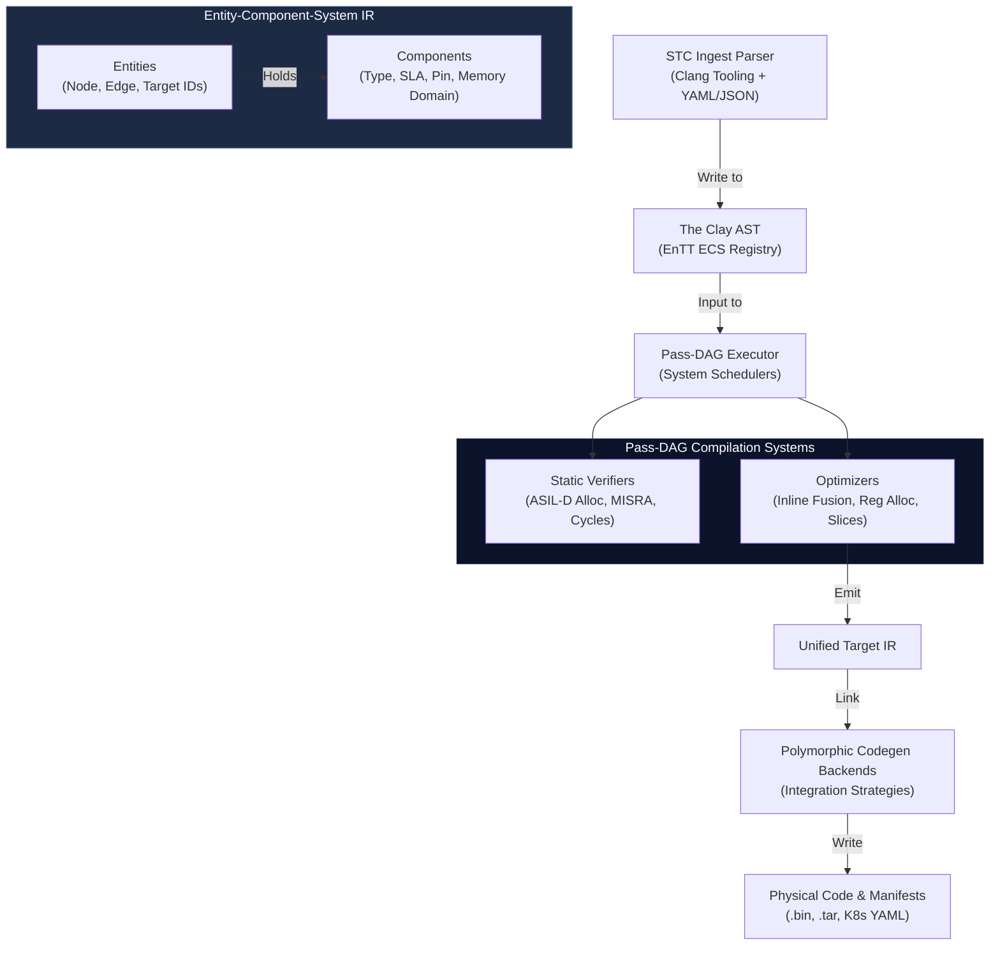

<!-- Part of: STC Co-Pilot & Systems Architect Reference Manual v2026.1.0 -->

## 4. Compiler Architecture & The Clay AST

The STC compiler utilizes a data-oriented execution pipeline built on a highly parallelizable, entity-component intermediate representation.



### 1. The Clay AST (ECS-Based Intermediate Representation)
To resolve the "Expression Problem" and support modular, dynamic extensions:
*   **Entities:** Every node, edge, and target in the compiler graph is represented as a unique integer ID.
*   **Components:** Syntactic, semantic, and non-functional properties (such as source locations, sample rates, network protocols, and hardware pin mappings) are appended to these entities as flat, memory-aligned structures in an entity component registry.
*   **Systems:** Compiler passes run as decoupled systems that query specific component patterns (e.g., a system that checks for physical rate mismatches across edges and injects queue adapters).

### 2. The Pass-DAG Executor
The compilation stages themselves run as a Directed Acyclic Graph (DAG) of independent compilation passes. The compiler's execution engine loads, wires, and schedules compile passes dynamically based on the target configuration.

### 3. Verification & Constraints
Before code generation, the compiler executes formal validation passes:
*   *Temporal Constraint Solver:* Proves that hard real-time execution blocks meet Worst-Case Execution Time ([WCET](19_legend.md#acronym-WCET)) bounds.
*   *Memory Guard:* Proves that static memory allocations do not exceed target embedded hardware SRAM/Flash limits.
*   *Compliance Verifier:* Audits AST structures to ensure zero dynamic memory allocations on safety-critical paths.

---

### 4. Component Schema — The Clay Component Catalog

> **In plain terms:** An "entity" in the ECS registry is just a number (e.g., `42` might be the node named `UserAuthProcessor`). The entity itself holds nothing — it is just an ID. "Components" are the actual data attached to an entity. This section defines what those data structs look like.

The Clay AST uses a **flat typed catalog**: each distinct semantic concern is represented as its own dedicated C++ struct. There is no inheritance, no virtual dispatch, and no dynamic type resolution — only flat memory-aligned data.

**Core component types:**

```cpp
// ─── Topology shape ───────────────────────────────────────────────────────────
// Classifies what role a node plays in the data-flow graph.
// Source     = first node; produces data (e.g., a sensor, a network listener).
// Processor  = transforms data (e.g., a filter, a classifier, a business rule).
// Sink       = final consumer; writes data out (e.g., a database writer, a display).
// Gateway    = external interface to another system or protocol domain.
struct NodeKindTag {
    enum class Kind : uint8_t { Source, Processor, Sink, Gateway } kind;
};

// ─── SLA (Service Level Agreement) ───────────────────────────────────────────
// The performance contract baked into a node at compile time.
// max_latency_ms: worst-case response time this node is allowed to take.
// sample_rate_hz: how many times per second data flows through this node.
// The compiler uses this to validate thread model choices and WCET bounds.
struct SlaConstraint {
    float    max_latency_ms;
    uint32_t sample_rate_hz;
};

// ─── CPU core pinning ─────────────────────────────────────────────────────────
// Declares which physical CPU core this node's thread is locked to.
// core_id:   0-based index of the physical core (e.g., 0, 1, 2 ...).
// numa_node: NUMA memory region (relevant on multi-socket servers; use 0 on
//            single-socket systems and embedded targets).
struct CorePin {
    uint8_t core_id;
    uint8_t numa_node;
};

// ─── Compliance profile ───────────────────────────────────────────────────────
// Which safety or regulatory standard governs this node's generated code.
// CloudSaaS: standard C++, dynamic allocation allowed, full STL.
// ASIL_D:    no heap in hot path, no exceptions, Result<T,E> error propagation.
// DO178C:    ASIL_D rules + formal WCET proof required + MPU isolation.
// IEC62304:  medical device rules; MPU walls; traceability to requirements.
struct ProfileTag {
    enum class Level : uint8_t { CloudSaaS, ASIL_D, DO178C, IEC62304 } level;
};

// ─── Edge transport ───────────────────────────────────────────────────────────
// How data physically moves across this edge.
// SHM:   shared memory (same machine, lowest latency).
// TCP:   standard TCP socket.
// gRPC:  HTTP/2 + Protobuf (cross-language, cross-service).
// DPDK:  kernel-bypass networking (ultra-low latency, Telecom/HFT).
// UDP:   unreliable datagram (gaming, real-time media).
struct EdgeTransport {
    enum class Proto : uint8_t { SHM, TCP, gRPC, DPDK, UDP } proto;
};

// ─── Memory domain ────────────────────────────────────────────────────────────
// Where the data buffer for this edge lives in memory.
// Stack:        data lives on the calling thread's stack (fastest, no allocation).
// StaticPool:   data lives in a compiler-reserved static array (safe for ASIL-D).
// SharedMemory: data lives in a named shared memory region (cross-process).
// The compiler uses this to prove zero-copy lifetime guarantees (see Section 10).
struct MemoryDomain {
    enum class Region : uint8_t { Stack, StaticPool, SharedMemory } region;
};
```

**Why this design?** The EnTT library stores each component type in its own contiguous memory array (a "sparse set"). When a pass asks "give me all entities that have *both* `SlaConstraint` and `CorePin`", EnTT answers by intersecting two arrays — a single cache-hot loop with no pointer chasing. Because each component is a flat struct with no virtual methods, data packs tightly in memory and the CPU prefetcher works optimally. Crucially, the executor can determine which passes touch the same component types and therefore which passes can safely run in parallel.

**Alternative — Tagged Union Categories:** If building external tooling on top of the compiler (IDE extensions, debugger plugins, recipe validators), the flat catalog can be cumbersome — every tool must know about every component type. An alternative groups related components into a small set of *category structs*, each as a discriminated union:

```cpp
// All topology-shape components under one umbrella struct.
// External tooling only needs to handle TopologyComponent, not each leaf type.
struct TopologyComponent {
    enum class Tag { NodeKind, EdgeProtocol, GraphCycle } tag;
    union {
        NodeKindTag   node_kind;
        EdgeTransport edge_proto;
    };
};
```

The trade-off: two passes that both query `TopologyComponent` cannot run in parallel even if they touch different inner tags, because the executor sees the same outer component type — parallelism granularity is coarser.

> **Decision:** Use the flat typed catalog for all compiler-internal passes. Use tagged union grouping *only* for the Introspection Schema exposed to STC-LSP and debugger tooling (see Open Brainstorm Direction A).

---

### 5. Pass Query Semantics — Declarative Manifests

> **In plain terms:** Now that we know what components exist, we need a contract for how a pass "asks" for the data it needs. The question is whether a pass just grabs data directly (simple, but the executor cannot see what it touches), or whether it announces upfront what it will read and write (more structure, but the executor can schedule passes in parallel automatically).

Every compiler pass is accompanied by a **manifest file** — a small YAML document declaring its component dependencies and execution phase:

```yaml
# manifest: SlaVerifier
# Checks that every node with an SLA constraint also has a CPU core assigned.
pass:   SlaVerifier
reads:  [SlaConstraint, CorePin, ProfileTag]
writes: []          # read-only: emits diagnostics but does not modify the AST
phase:  verify
```

```yaml
# manifest: InlineFusion
# Identifies adjacent Processor nodes that can be merged into a single function call.
pass:   InlineFusion
reads:  [NodeKindTag, SlaConstraint, EdgeTransport]
writes: [FusionPlanTag]   # creates a new annotation component on qualifying entities
phase:  optimize
```

```yaml
# manifest: CorePinOptimizer
# Assigns a physical CPU core to any node that has an SLA but no explicit pin set.
pass:   CorePinOptimizer
reads:  [SlaConstraint, NeedsCorePinning, ProfileTag]
writes: [CorePin]         # writes a new CorePin component; removes NeedsCorePinning
phase:  optimize
```

The **Pass-DAG Executor** reads all manifests at startup — before any compilation begins — and builds a dependency graph. The rules are:

1. Two passes in the same phase with no component-type overlap in their `reads`/`writes` sets may run in parallel.
2. If pass B reads a component type that pass A writes, B must run after A completes.
3. All passes in the `verify` phase complete before any `optimize` pass starts (phase boundary enforcement).

```
Verify phase (can parallelize):
  SlaVerifier   [reads: SlaConstraint, CorePin, ProfileTag]  ──┐
  MisraVerifier [reads: ProfileTag, NodeKindTag]             ──┤── concurrent
  WcetVerifier  [reads: SlaConstraint, ProfileTag]           ──┘

Optimize phase (partially sequential):
  InlineFusion     [reads: NodeKindTag; writes: FusionPlanTag]          runs first
  CorePinOptimizer [reads: FusionPlanTag, writes: CorePin]        waits for InlineFusion
```

**Alternative — Direct EnTT queries in pass body:** A pass can directly call `registry.view<SlaConstraint, CorePin>().each(...)` without any manifest. This is simpler and fully correct. The cost is that the executor becomes a blind scheduler — without declared dependencies it must serialize all passes conservatively, discarding parallelism. It also means STC-LSP cannot detect at recipe-edit time that a pass queries a component no recipe in the project ever populates.

> **For a first implementation or a single-threaded compiler, direct EnTT queries are acceptable.** The manifest system should be introduced when pass count grows large enough that serial execution becomes a bottleneck, or when the IDE integration layer is built.

---

### 6. Component Lifecycle Rules — Phase-Gated Mutation

> **In plain terms:** Components do not just appear once and stay static. Optimization passes need to *annotate* entities with new information discovered during compilation (e.g., "this node has been assigned to core 2"). The question is: who is allowed to write components, and when?

Compilation is divided into four **phases**. Each phase has a defined write window. Once a phase completes, all components written in that phase are **frozen** — treated as read-only by all subsequent phases.

| Phase | Writer | What gets written | Frozen after |
|---|---|---|---|
| **Ingest** | Parser only | All source-derived components: `NodeKindTag`, `SlaConstraint`, `EdgeTransport`, `ProfileTag`, `MemoryDomain` | Phase ends |
| **Verify** | Verifier passes | Diagnostic marker tags: `ComplianceViolationTag`, `NeedsCorePinning`, `WcetViolationTag` | Phase ends |
| **Optimize** | Optimizer passes | Annotation components: `FusionPlanTag`, `CorePin`, `AlignedMemoryDomain` | Phase ends |
| **Codegen** | Codegen backends | Read-only — no ECS writes | — |

**Example — phase-gated mutation in practice:**

```
Ingest phase:
  Parser creates entity #42 for node "UserAuthProcessor".
  Writes: NodeKindTag{Processor}, SlaConstraint{5ms, 1000Hz}, ProfileTag{ASIL_D}
  ── Ingest phase complete. These three components are now frozen. ──

Verify phase — SlaVerifier pass:
  Reads: SlaConstraint and CorePin on entity #42.
  Finds: no CorePin component exists yet.
  Writes: NeedsCorePinning{} marker tag.
  ── Verify phase complete. NeedsCorePinning is now frozen. ──

Optimize phase — CorePinOptimizer pass:
  Reads: NeedsCorePinning marker and SlaConstraint from entity #42.
  Selects an available ASIL-D-eligible core based on the SLA.
  Writes: CorePin{core_id: 2, numa_node: 0}.
  Removes: NeedsCorePinning marker (its purpose is fulfilled).
  ── Optimize phase complete. CorePin is now frozen. ──

Codegen phase:
  Reads CorePin, SlaConstraint, NodeKindTag, ProfileTag.
  Emits: pthread_setaffinity_np(thread, core_2_mask)
```

**Benefits:**
- **Safety:** A pass cannot accidentally corrupt data a previous pass finalized. Attempting to write a frozen component is a compiler-internal assertion failure.
- **Incremental compilation:** If only the YAML recipe changes (e.g., an SLA is adjusted), the executor can replay only Optimize + Codegen without re-running Verify — the Ingest-phase components are cached.
- **Bounded failure recovery:** If an Optimize-phase pass fails mid-execution, rollback is limited to the Optimize phase. The Verify phase's diagnostic markers remain valid.

**Alternative — Immutable After Ingest:** For a compliance-only build profile (where no optimization passes run — only verifiers), full immutability is the simplest and safest model. The parser writes all components; all passes are strictly read-only; codegen reads. There is no phase machinery to implement, and rollback is trivial. This is the appropriate choice for the first implementation of ASIL-D or DO-178C targets where code generation is deterministic and optimization is banned.

> **Decision:** Phase-gated mutation (Model II) is the standard mode for all profiles. Immutable-after-ingest (Model I) is the **mandatory fallback** for compliance-only build profiles with no optimizer passes registered.

---

<a id="declarative-topology-recipe-specification-yaml"></a>
