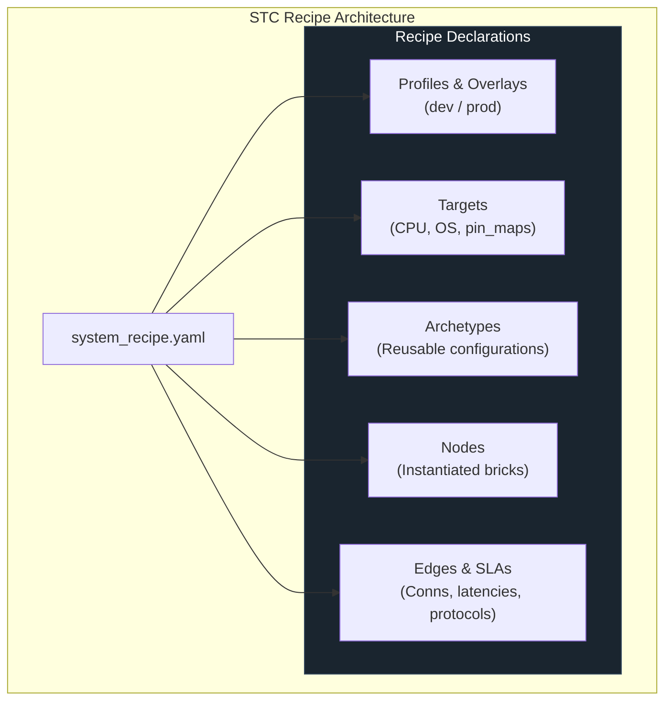

<!-- Part of: STC Co-Pilot & Systems Architect Reference Manual v2026.1.0 -->

## 5. Declarative Topology Recipe Specification (YAML)

The YAML recipe is the central contract defining how the logical system is partitioned, optimized, and deployed.



### 1. Syntax Schema

```yaml
topology:
  name: "UnifiedDistributedSystem"

  # 1. Port Type Schemas
  type_schemas:
    - path: "shared_types/system_types.stctype"

  # 2. Environment Overlays
  profiles:
    dev:
      targets.*.cache.deployment_mode: "embedded"
    prod:
      targets.*.cache.deployment_mode: "kubernetes"

  # 3. Target Deployment Configurations
  targets:
    embedded_target:
      arch: "stm32h7"
      os: "freertos"
      profile: "MedTech_Class_C"
      lang: "cpp"
      mpu_isolation: true
      pin_map:
        sensor_analog_in: "ADC1_CH2"

    cloud_target:
      arch: "x86_64-linux"
      os: "kubernetes"
      profile: "CloudSaaS"
      lang: "cpp"
      namespace: "production-services"

  # 4. Node Archetypes (Eliminates duplication)
  archetypes:
    analog_sensor:
      target: "embedded_target"
      brick: "AnalogSensorBrick@1.0.0"
      sample_rate_hz: 1000

  # 5. Node Instantiation
  nodes:
    - name: ProbeSensor1
      archetype: "analog_sensor"
    - name: ProbeSensor2
      archetype: "analog_sensor"
    - name: CloudAnalytics
      target: "cloud_target"
      brick: "AnalyticsProcessor@2.1.0"

  # 6. Wildcard Bindings & Non-Functional SLAs
  edges:
    - from: "ProbeSensor*.state"
      to: "CloudAnalytics.on_sensor_receive"
      sla:
        max_latency_ms: 15
        delivery_guarantee: "AtLeastOnce"
        bridge:
          protocol: "TCP_TLS"
          encryption: "AES_GCM_256"
```

---

<a id="dynamic-reconfiguration--live-morphing-operations"></a>
