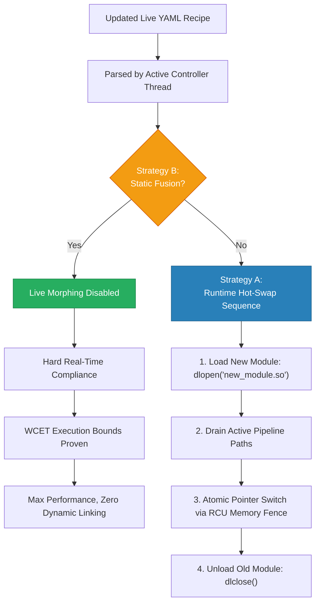

<!-- Part of: STC Co-Pilot & Systems Architect Reference Manual v2026.1.0 -->

## 6. Dynamic Reconfiguration & Live Morphing Operations

STC supports runtime topology adjustments while executing, using optimized path transition sequences.

### 1. Strategy A: Runtime Hot-Swap (Live Morphing)
For environments requiring continuous availability, the compiler injects a background **Topology Controller Thread** into the synthesized application.

#### The Hot-Swap Sequence:
1.  **Dynamic Loading:** The application calls `dlopen()` to load the newly compiled module `.so` into its active address space.
2.  **Path Handoff Execution:**
    *   *Option 1 ([RCU](#acronym-RCU) Pointer Swap):* The active function pointers on the edges are swapped atomically via an epoch-based memory fence.
    *   *Option 2 (Double-Buffer):* The controller thread switches the active route selector to the new path. Upstream packets flow to the new module instantly. The old path is allowed to drain its active queue.
3.  **Reclamation:** Once epoch tracking confirms all threads have cleared the old path, the controller thread executes `dlclose()` on the old module, completing the live morphing sequence with zero dropped packets and zero service downtime.

### 2. Strategy B: Compile-Time Static Fusion
For safety-critical configurations, the compiler completely strips out dynamic linkers and routing layers. The graph is baked into the binary as static code. Live morphing is disabled because dynamic memory mapping or dynamic linking is a safety violation in these domains.

> **Feature integration on live systems:** When new bricks or data paths need to be added to a running Strategy A topology without downtime, the **Topology Extension** mechanism (§17) compiles only the delta and deploys it into the live process via this hot-swap sequence. The base topology is never recompiled or interrupted.

---

