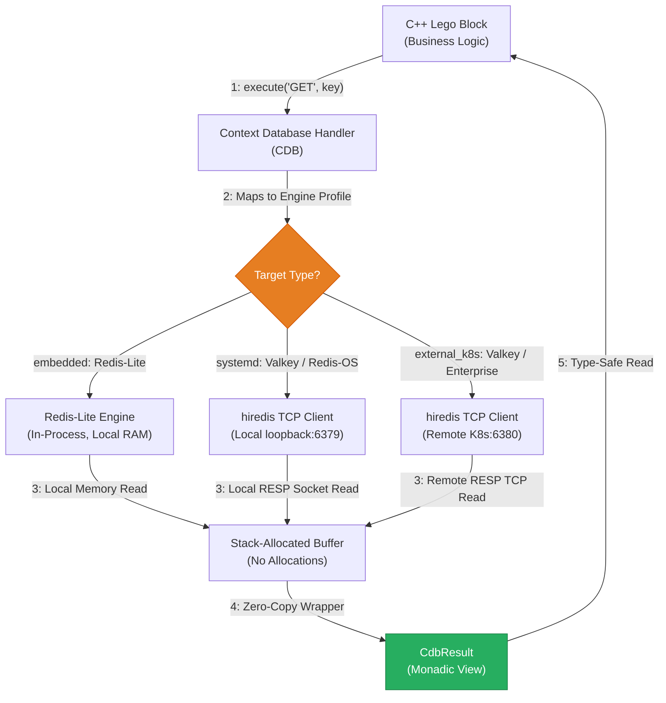

<!-- Part of: STC Co-Pilot & Systems Architect Reference Manual v2026.1.0 -->

## 7. Real-Time Context Database (CDB) Implementation

To maintain absolute independence from third-party database clients and caching frameworks, STC implements the Context Database (CDB) model under Pillar 3.



### 1. `CdbResult` Stack Allocation Specification
This zero-copy, allocation-free, and monadic result wrapper maps RESP/database raw network buffers into static stack memory.

```cpp
#pragma once
#include <string_view>
#include <vector>
#include <optional>

struct CdbResult {
    enum class Type : uint8_t { Nil, String, Integer, Array, Error };
    enum class ErrorCode : uint8_t { Success, Timeout, ParseError, ConnectionLost };

    Type type = Type::Nil;
    ErrorCode err = ErrorCode::Success;

    union {
        std::string_view str_val;
        int64_t int_val;
        struct {
            const CdbResult* elements;
            size_t size;
        } array_val;
    } payload;

    inline bool is_ok() const { return err == ErrorCode::Success && type != Type::Error; }
    inline std::optional<int64_t> as_int() const {
        if (type == Type::Integer) return payload.int_val;
        return std::nullopt;
    }
    inline std::optional<std::string_view> as_string() const {
        if (type == Type::String) return payload.str_val;
        return std::nullopt;
    }
};

class ContextDatabase {
public:
    virtual CdbResult execute(const std::vector<std::string_view>& cmd) = 0;
};
```

### 2. Client-Server Lifecycle & Bootstrap Orchestration
The compiler acts as the system bootstrapping coordinator, generating custom startup profiles based on the selected target's `deployment_mode` parameter:

*   **`embedded` (Redis-Lite):** STC compiles an in-process, lock-free, zero-copy local C database engine directly inside the binary. Port mapping and socket layers are omitted.
*   **`systemd` (Valkey / Redis-OS):** STC generates standard service configurations, compiles the service daemon, and outputs a systemd unit file (`valkey-server.service`). It injects loopback sockets and schedules startup sequences automatically on system boot, resolving locally via loopback interfaces (e.g., `127.0.0.1:6379`).
*   **`kubernetes` (Enterprise Caching Clusters):** STC generates complete K8s StatefulSet and Service manifests, binds dynamic storage classes, and auto-injects an `initContainers` block into the application Pod to ensure the application waits until the database service is fully responsive before booting.

---

<a id="persistent-storage-adapter-psa-implementation"></a>
