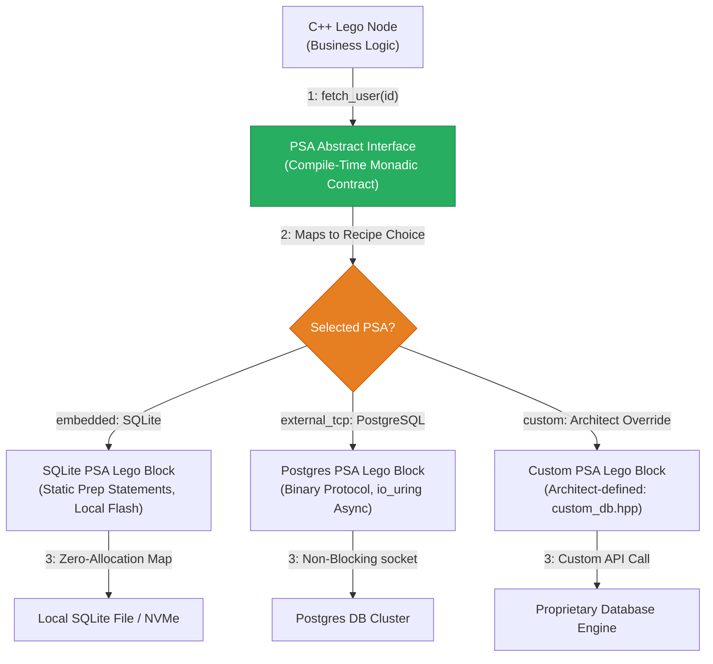

<!-- Part of: STC Co-Pilot & Systems Architect Reference Manual v2026.1.0 -->

## 8. Persistent Storage Adapter (PSA) Implementation

### Critique & Architectural Traps of Standard Database Adapters

*   **The Allocation & Pointer-Chasing Trap:** Traditional Object-Relational Mappers (ORMs) or database drivers (e.g., standard libpq, MongoDB C++ Driver) rely heavily on dynamic string parsing, heap allocation of query structures, and pointer-chasing result maps. This violates **Pillar 1** (no dynamic allocations in hot paths) and **Pillar 2** (predictable memory latency).
*   **Synchronous Blocking (Reactor Starvation):** External databases (PostgreSQL, MongoDB) operate over TCP. Executing a synchronous database query inside a Thread-per-Core (TPC) loop blocks the reactor thread, stalling all adjacent concurrent edges.
*   **The Schema-Drift / Fragility Trap:** If the database schema changes but physical queries are hardcoded inside functional logic, the codebase becomes brittle. Query schemas must be declared at the topology layer to maintain decoupling.

---

To handle persistent databases (e.g., SQLite, PostgreSQL, MongoDB) without introducing pointer-chasing, dynamic allocation, or blocking network bottlenecks, the STC compiler implements the **Persistent Storage Adapter (PSA)** contract under Pillar 3. 

Unlike the un-parsed command model of the Context Database (CDB) caching layer, the PSA utilizes **Type-Safe, Compile-Time Monadic Contracts**. The business logic defines its storage demands via C++ abstract contracts; the compiler then fuses these interfaces to pre-compiled database blocks or the architect’s custom implementation, optimizing out virtual method tables (VMTs) entirely.



### 1. Compiler-Enforced PSA Guidelines (The Constraints)
To maintain structural compliance inside high-performance and safety-critical execution spaces, the compiler enforces two strict restrictions on any database adapter:
1.  **Zero-Allocation Result Structures:** All returned database records must be mapped directly into stack-allocated, zero-copy payload structures.
2.  **Asynchronous, Non-Blocking Operations:** Any remote database queries must execute asynchronously, scheduling socket reads/writes directly through the application's underlying reactor (e.g., `io_uring` on Linux) to prevent thread stall.

### 2. Abstract C++ Contract Definition (`user_processor.hpp`)
The functional Lego block defines its storage queries strictly via abstract methods, remaining completely decoupled from SQL, BSON, or driver-level connections.

```cpp
#pragma once
#include <cstdint>
#include <string_view>

// Declared data schema
struct UserRecord {
    uint64_t user_id;
    char username[64];
    uint32_t account_balance;
};

enum class DbError : uint8_t { Success, QueryFailed, WriteFailed, Timeout };

// Monadic compiler result container
template <typename T, typename E>
class [[nodiscard]] Result {
private:
    union { T value; E error; };
    bool success;
public:
    Result(T val) : value(val), success(true) {}
    Result(E err) : error(err), success(false) {}
    inline bool is_ok() const { return success; }
    inline T get_value() { return value; }
    inline E get_error() { return error; }
};

// The strict abstract contract enforced by the compiler
class UserStorageContract {
public:
    virtual ~UserStorageContract() = default;
    virtual Result<UserRecord, DbError> fetch_user(uint64_t user_id) = 0;
    virtual Result<void, DbError> update_balance(uint64_t user_id, uint32_t new_balance) = 0;
};

// Core Business Logic Node
class UserProcessor {
private:
    UserStorageContract& db;

public:
    UserProcessor(UserStorageContract& adapter) : db(adapter) {}

    void process_transaction(uint64_t user_id, uint32_t transaction_cost) {
        auto result = db.fetch_user(user_id);
        if (result.is_ok()) {
            UserRecord record = result.get_value();
            if (record.account_balance >= transaction_cost) {
                db.update_balance(user_id, record.account_balance - transaction_cost);
            }
        }
    }
};
```

### 3. Custom Architect-Written Adapter (`custom_db_adapter.hpp`)
The architect can write their own database adapter to connect proprietary or licensed database platforms, wrapping the execution logic within the compiler's strict, allocation-free constraints.

```cpp
#pragma once
#include "user_processor.hpp"
#include <cstring>
#include <proprietary_db_client.h> // Proprietary licensed C-API

class CustomLicencedDBAdapter : public UserStorageContract {
private:
    ProprietaryClient* client_ctx;

public:
    CustomLicencedDBAdapter() {
        client_ctx = proprietary_connect("db://prod-cluster:9000");
    }

    ~CustomLicencedDBAdapter() override {
        proprietary_disconnect(client_ctx);
    }

    Result<UserRecord, DbError> fetch_user(uint64_t user_id) override {
        alignas(64) char raw_buffer[256];
        size_t bytes_read = 0;
        
        // Execute the proprietary non-blocking call
        int rc = proprietary_query_bin(client_ctx, user_id, raw_buffer, &bytes_read);
        if (rc != PROPRIETARY_SUCCESS) {
            return Result<UserRecord, DbError>(DbError::QueryFailed);
        }

        // Direct zero-copy memory copy into the stack-allocated structure
        UserRecord record;
        std::memcpy(&record, raw_buffer, sizeof(UserRecord));
        return Result<UserRecord, DbError>(record);
    }

    Result<void, DbError> update_balance(uint64_t user_id, uint32_t new_balance) override {
        int rc = proprietary_update_int(client_ctx, user_id, "account_balance", new_balance);
        if (rc != PROPRIETARY_SUCCESS) {
            return Result<void, DbError>(DbError::WriteFailed);
        }
        return Result<void, DbError>();
    }
};
```

### 4. Topology Recipe Registration (YAML)
The architect maps their custom implementation file directly to the database edge inside the recipe.

```yaml
topology:
  targets:
    pi_hub:
      arch: "aarch64-linux-gnu"
      os: "linux"
      profile: "ThreadPerCore"

  nodes:
    - name: TransactionEngine
      target: "pi_hub"
      source: "user_processor.hpp"
      logic_type: "UserProcessor"
      
    - name: EnterpriseDatabaseAdapter
      target: "pi_hub"
      source: "custom_db_adapter.hpp" # Architect-written implementation
      logic_type: "CustomLicencedDBAdapter"

  edges:
    - from: "TransactionEngine.db"
      to: "EnterpriseDatabaseAdapter"
      sla:
        max_latency_ms: 10 # Proven performance boundary
```

### 5. Compiler Fused Static Output (`main.cpp`)
When compiled with Strategy B (Static Fusion), the STC compiler completely optimizes out the C++ virtual method table. The interface method call `db.fetch_user()` compiles directly into a zero-latency, inlined assembly jump to the physical implementation:

```cpp
// Auto-generated by STC for target_pi_hub/main.cpp
#include "user_processor.hpp"
#include "custom_db_adapter.hpp"

int main() {
    // Statically fused execution path.
    // The C++ virtual method tables (VMTs) are completely optimized out compile-time;
    // 'db.fetch_user()' compiles to a direct register-jump to 'CustomLicencedDBAdapter::fetch_user()'.
    CustomLicencedDBAdapter db_adapter;
    UserProcessor engine(db_adapter);

    while (true) {
        // Continuous, high-frequency, non-blocking polling execution loop
        engine.process_transaction(10024, 50);
    }
}
```

---

<a id="conditional-compliance-framework"></a>
