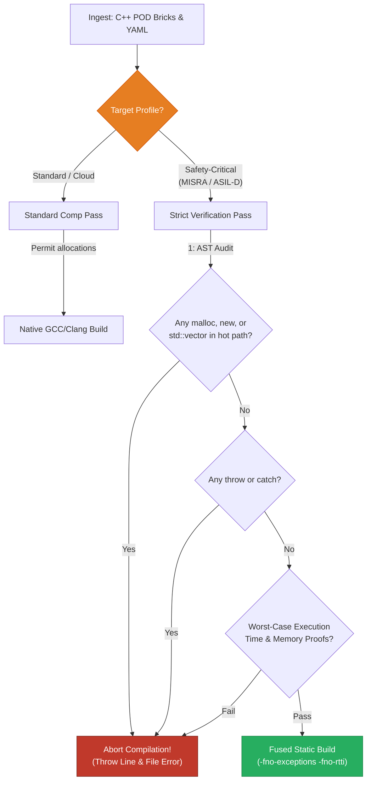

<!-- Part of: STC Co-Pilot & Systems Architect Reference Manual v2026.1.0 -->

## 9. Conditional Compliance Framework

The STC compiler switches its compilation strictness dynamically based on the declarative profile declared in the YAML recipe:

| Metric / Feature | Standard / Cloud Profile | Safety-Critical (MISRA / ASIL-D) Profile |
| :--- | :--- | :--- |
| **Heap Allocations** | Permitted during initialization; managed via local pools during runtime. | **Strictly Forbidden.** Zero dynamic allocation (`malloc`, `new`, `std::vector`) at runtime or boot [7]. |
| **Exception Handling** | Standard C++ `try`/`catch` blocks allowed. | **Forbidden.** Compile flag `-fno-exceptions` enforced. Error propagation strictly managed via stack-allocated monadic `Result<T, E>`. |
| **RTTI** | Standard Run-Time Type Information enabled. | **Forbidden.** Compile flag `-fno-rtti` enforced. Polymorphism resolved strictly compile-time via templates. |
| **Pointers** | Smart pointers (`std::shared_ptr`, `std::unique_ptr`) allowed. | **Forbidden.** Raw pointer arithmetic forbidden. Stack references and static offset indexes enforced. |
| **Worst-Case Execution Time** | Best-effort heuristic optimization. | **Formally Proven.** High-precision static WCET analysis determines boundary safety margins [7]. |

---

