<!-- Part of: STC Co-Pilot & Systems Architect Reference Manual v2026.1.0 -->

## 10. Memory Model & Data Lifetime Guarantees

STC guarantees zero-copy, lock-free thread safety across the entire execution graph using a **Static Lifetime Lease Model**:

```mermaid
graph LR
    Ingress["1. Network Ingress Buffer<br/>(Hugepage-Backed Ring)"] -->|"Memory Lease Granted"| NodeA["2. Lego Node A<br/>(Read-Only const Ref)"]
    NodeA -->|"Pass Read-Only Lease"| NodeB["3. Lego Node B<br/>(Read-Only const Ref)"]
    NodeB -->|"Egress / Hardware Transmit"| Tx["4. Physical Outbound Tx<br/>(Actuator or NIC DMA)"]
    Tx -->|"Lease Automatically Voided"| Recycle["5. Buffer Safely Recycled<br/>(Zero-Copy Ring Return)"]
    Recycle -.->|"Ready for reuse"| Ingress

    style Ingress fill:#78281f,stroke:#c0392b,color:#fff
    style NodeA fill:#1f618d,stroke:#2980b9,color:#fff
    style NodeB fill:#1f618d,stroke:#2980b9,color:#fff
    style Recycle fill:#196f3d,stroke:#27ae60,color:#fff
```

1.  **Ingress Memory Mapping:** Incoming network or sensor data is read directly into memory-mapped, hugepage-backed ring buffers [4].
2.  **The Compile-Time Lease:** The compiler analyzes the execution path of the DAG. It calculates which nodes require access to the ingress buffer.
3.  **Read-Only Reference Passing:** Data is passed to downstream functional blocks strictly via `const` references. The compiler proves that no downstream block holds a reference to the buffer beyond the execution lifetime of the DAG.
4.  **Automatic Reclamation:** The moment the last leaf node in the DAG completes execution, the memory lease is automatically voided, and the buffer descriptor is returned to the ingress ring for reuse with zero execution cycles spent on memory copy or garbage collection [1].

---

