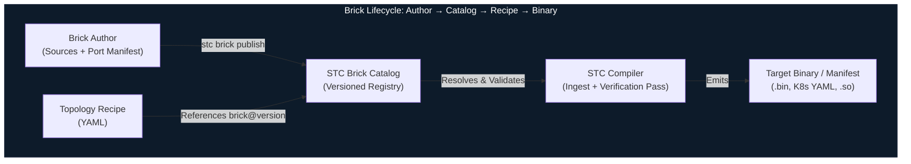
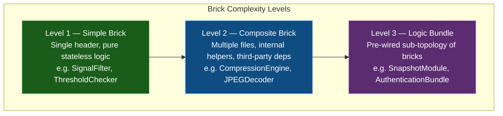
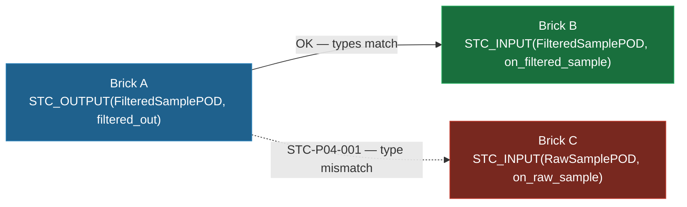
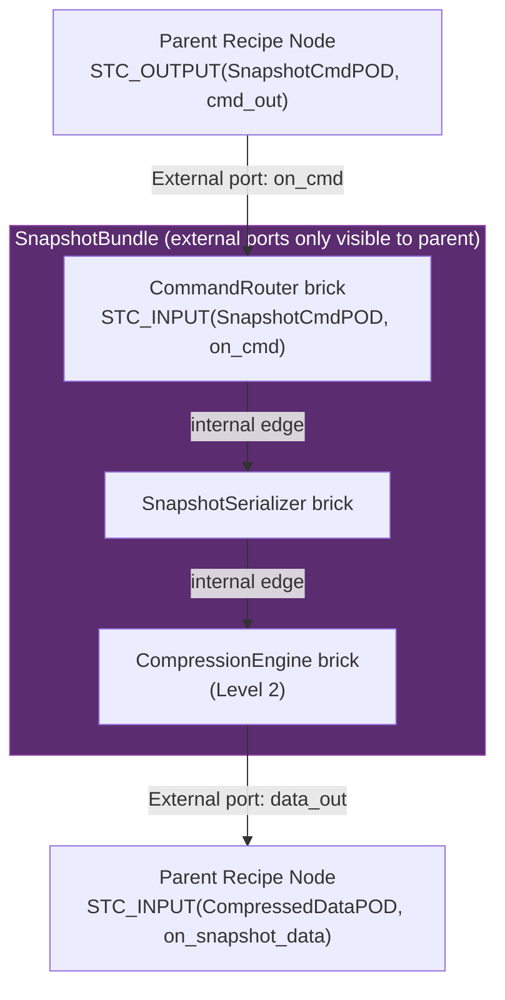
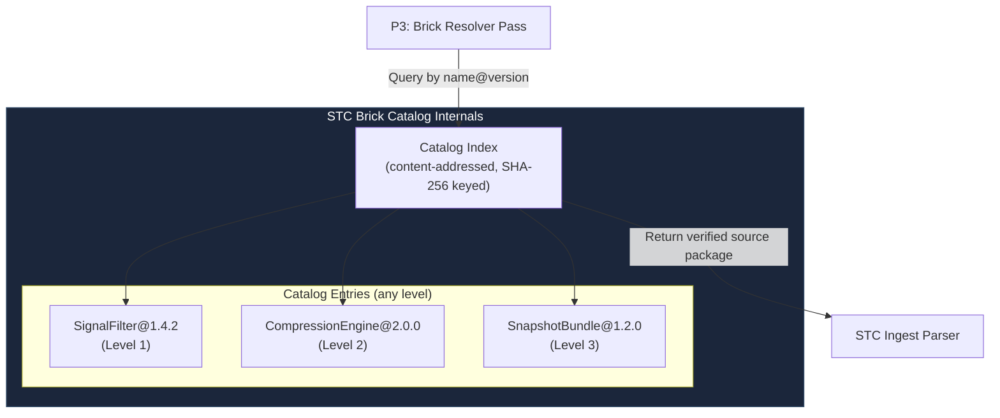

<!-- Part of: STC Co-Pilot & Systems Architect Reference Manual v2026.1.0 -->

## 11. Modularity & The Brick Catalog

The STC compiler treats modularity as a first-class architectural guarantee, not a convention. Every functional unit in a topology is a **Brick**: a self-contained, independently versioned, compiler-verifiable unit with a declared port surface. The **Brick Catalog** is the registry through which the compiler discovers, validates, and versions all available bricks before a recipe can be compiled.



---

### 1. The Three Brick Levels

Not all bricks are equally simple. STC defines three levels of brick complexity. All three share the same port contract surface and are equally first-class citizens in the catalog and recipe. The level only affects what is inside the brick package — it is invisible to anything that connects to the brick's ports.



The compiler enforces the same port contract rules on all three levels. The compliance verification scope differs only in what is considered the **hot path** — defined in §11.3.

---

### 2. The Port Contract (All Levels)

Ports are the **only** legal connectivity surface of any brick. The compiler rejects any edge in the recipe that targets a member not declared as a port. This rule is absolute across all three brick levels.

#### Port Annotations

```cpp
// signal_filter.hpp  (Level 1 example)
#pragma once
#include <stc/brick.hpp>  // STC annotation header — zero-overhead, header-only

struct RawSamplePOD {
    float    value;
    uint64_t timestamp_ns;
};

struct FilteredSamplePOD {
    float    smoothed_value;
    float    variance;
    uint64_t timestamp_ns;
};

// STC_BRICK  — declares this class as a compiler-visible brick unit.
// STC_INPUT  — declares an ingress port. The method IS the port handler.
// STC_OUTPUT — declares an egress port. Calling it emits data to the connected edge.
// All other class members are invisible to the topology recipe.
STC_BRICK(SignalFilter)
class SignalFilter {
public:
    STC_INPUT(RawSamplePOD,      on_raw_sample)
    STC_OUTPUT(FilteredSamplePOD, filtered_out)

    void on_raw_sample(const RawSamplePOD& sample) {
        state_.accumulator += sample.value;
        state_.count++;
        filtered_out({ state_.accumulator / state_.count, compute_variance(), sample.timestamp_ns });
    }

private:
    struct State { float accumulator = 0.0f; uint32_t count = 0; } state_;
    float compute_variance() const { return 0.0f; }
};
```

The macros expand to zero runtime overhead. At compile time they emit structured metadata into a dedicated ELF/COFF section that the STC Ingest Parser reads as the port manifest — no runtime reflection, no RTTI.

#### Port Type Contract

Port types must be POD types declared in a **shared type header** visible to both the upstream and downstream brick. The compiler's Edge Type Inference Pass (P4) verifies exact type identity at every edge. Implicit conversions are forbidden; a type mismatch is a compile error (`STC-P04-001`).



---

### 3. Hot Path vs Cold Path

Compliance rules (`no_heap`, WCET, no exceptions) apply only to the **hot path** — the call chain reachable from any `STC_INPUT` port handler during normal execution. They do not apply to the **cold path** — constructors, destructors, and one-time initialization methods.

This distinction is fundamental and applies to all three brick levels:

| Execution Path | When it runs | Compliance scope |
| :--- | :--- | :--- |
| **Hot path** | Every time a port handler is invoked (data flow) | Full profile constraints enforced (no heap, WCET, no exceptions) |
| **Cold path** | Once at startup / shutdown | Relaxed — heap allocation, blocking I/O, and initialization libraries are permitted |

A `CompressionEngine` brick may allocate a 4 MB zstd working buffer and dictionary **once in its constructor** — cold path, safe under all profiles including ASIL-D initialization rules. The `on_data_in` port handler that calls `zstd_compress()` on the pre-allocated context must be zero-allocation — hot path.

The `hot_path_entrypoints` field in the brick manifest makes this boundary explicit and compiler-verifiable.

---

### 4. Level 1 — Simple Brick

A single header file containing one `STC_BRICK`-annotated class with pure stateless logic. No external dependencies. The `SignalFilter` example in §11.2 is the canonical form.

**When to use:** Any leaf-level domain operation — filtering, transforming, validating, routing, threshold checking. If the entire logic fits cleanly in one header with no third-party code, it is a Level 1 brick.

**Package layout:**
```
SignalFilter/
└── 1.4.2/
    ├── brick.stc.yaml
    ├── signal_filter.hpp
    ├── shared_types/
    │   └── signal_types.hpp    # Shared POD type headers
    └── brick.sha256
```

**Manifest:**
```yaml
brick:
  name: "SignalFilter"
  version: "1.4.2"
  level: 1

  ports:
    inputs:
      - name: "on_raw_sample"
        type: "RawSamplePOD"
    outputs:
      - name: "filtered_out"
        type: "FilteredSamplePOD"

  hot_path_entrypoints:
    - "on_raw_sample"

  implementations:
    - lang: "cpp"
      source: "signal_filter.hpp"
      logic_type: "SignalFilter"
      constraints:
        no_heap: true
        no_exceptions: true
        max_stack_bytes: 512

  compatible_profiles:
    - "ASIL_D"
    - "MedTech_Class_C"
    - "CloudSaaS"
    - "ThreadPerCore"
    - "Standard"
```

---

### 5. Level 2 — Composite Brick

A brick composed of **multiple source files**, internal helper classes, and optionally third-party library dependencies. It still presents a single, clean port surface to the topology. The compiler sees only the ports; the internal structure is the brick author's responsibility.

**When to use:** Any domain operation that is too complex for a single header — data compression, image decoding, cryptographic operations, protocol parsing, or any brick that wraps a licensed third-party library.

**When two bricks become one:** If two bricks are so tightly coupled that one is meaningless without the other — for example, a compressor and its state manager that share internal data structures — they are not two bricks. They are one Composite Brick with internal modules. The rule is: **if the relationship between two components is implementation coupling rather than data flow, they belong inside one brick boundary.** Inheritance between bricks falls into this category. The correct model is always one Composite Brick with private internal classes, not two Simple Bricks with a class hierarchy between them.

**Package layout:**
```
CompressionEngine/
└── 2.0.0/
    ├── brick.stc.yaml
    ├── compression_engine.hpp      # Primary header — port declarations
    ├── compression_engine.cpp      # Implementation
    ├── internal/
    │   ├── huffman_table.cpp
    │   └── bit_stream.hpp
    ├── vendor/
    │   └── lz4/
    │       └── lz4.c               # Bundled third-party source
    ├── shared_types/
    │   └── compression_types.hpp
    └── brick.sha256
```

**Manifest:**
```yaml
brick:
  name: "CompressionEngine"
  version: "2.0.0"
  level: 2

  ports:
    inputs:
      - name: "on_data_in"
        type: "RawDataPOD"
    outputs:
      - name: "compressed_out"
        type: "CompressedDataPOD"

  hot_path_entrypoints:
    - "on_data_in"         # P9 compliance checks trace from here; constructor is excluded

  implementations:
    - lang: "cpp"
      sources:
        - "compression_engine.hpp"
        - "compression_engine.cpp"
        - "internal/huffman_table.cpp"
        - "internal/bit_stream.hpp"
      logic_type: "CompressionEngine"
      constraints:
        no_heap: true           # Enforced on hot_path_entrypoints only
        no_exceptions: true
        max_stack_bytes: 1024

  dependencies:
    - name: "zstd"
      type: "system_library"        # system_library | bundled_source | binary_archive
      link_flag: "-lzstd"
      hot_path_allocation_free: true  # Architect declaration: zstd streaming API uses pre-allocated ctx
      source_available: false         # Binary-only — declaration is trusted, recorded in audit trail
    - name: "lz4"
      type: "bundled_source"
      path: "vendor/lz4/lz4.c"
      hot_path_allocation_free: true
      source_available: true          # Compiler traces call chains through lz4.c

  compatible_profiles:
    - "ASIL_D"
    - "MedTech_Class_C"
    - "CloudSaaS"
    - "Standard"
```

#### Binary-Only Dependencies

When a dependency has `source_available: false`, the compiler cannot perform interprocedural call-chain analysis through it. Instead, it trusts the `hot_path_allocation_free` declaration and records it as an **architect attestation** in the build audit trail. For safety-critical profiles (`ASIL_D`, `DO178C`), this attestation is a mandatory signed field — unsigned attestations on binary-only dependencies cause `STC-P09-006`.

---

### 6. Level 3 — Logic Bundle

A Logic Bundle is a **pre-wired, versioned sub-topology** — a group of bricks (any level) with their internal edges declared and verified. The bundle exposes only **external ports** to the parent recipe. From the parent recipe's perspective, a bundle is instantiated exactly like a single brick node. The internal topology is opaque.

**When to use:** Any reusable multi-brick composition that represents a coherent, independently testable unit of functionality — a snapshot module, an authentication flow, a sensor fusion pipeline, a protocol stack.



#### Bundle Manifest (`bundle.stc.yaml`)

The bundle ships with its own internal recipe (a full topology YAML) and a manifest that declares only the external port surface:

```yaml
bundle:
  name: "SnapshotBundle"
  version: "1.2.0"
  level: 3
  internal_recipe: "snapshot_bundle.recipe.yaml"  # Full internal topology

  external_ports:
    inputs:
      - name: "on_create_cmd"
        type: "SnapshotCmdPOD"
        maps_to: "CommandRouter.on_cmd"
      - name: "on_update_cmd"
        type: "SnapshotCmdPOD"
        maps_to: "CommandRouter.on_cmd"
      - name: "on_delete_cmd"
        type: "SnapshotCmdPOD"
        maps_to: "CommandRouter.on_cmd"
    outputs:
      - name: "snapshot_data_out"
        type: "CompressedDataPOD"
        maps_to: "CompressionEngine.compressed_out"

  compatible_profiles:
    - "CloudSaaS"
    - "Standard"
    - "ThreadPerCore"
```

The internal recipe is a standard topology YAML with `nodes` and `edges` blocks. The compiler verifies the internal topology as an independent unit during `stc bundle verify`, producing a **pre-verification certificate** stored alongside the bundle manifest. When the parent recipe references a pre-verified bundle, the internal topology re-runs only the ingest passes (P1–P3) for freshness checking — the verification passes (P8–P13) are skipped if the certificate is valid. For safety-critical profiles, the certificate must be re-verified against the target profile at parent compile time.

#### Using a Bundle in a Recipe

```yaml
nodes:
  - name: SnapshotService
    bundle: "SnapshotBundle@1.2.0"   # Resolved from catalog like any brick
    target: "cloud_target"

  - name: CommandSource
    brick: "CommandDispatcher@3.0.1"
    target: "cloud_target"

  - name: StorageWriter
    brick: "ObjectStorageWriter@2.0.0"
    target: "cloud_target"

edges:
  - from: "CommandSource.snapshot_cmd_out"
    to: "SnapshotService.on_create_cmd"

  - from: "SnapshotService.snapshot_data_out"
    to: "StorageWriter.on_data_in"
```

---

### 7. Composition Over Coupling

STC enforces a single rule for inter-brick relationships: **data flows between bricks; implementation does not.**

| Pattern | STC Treatment |
| :--- | :--- |
| Brick A sends data to Brick B via an edge | Correct — this is the Lego principle |
| Brick A and B share a private utility function | Both include the same internal header — they are independent bricks |
| Brick A inherits from Brick B at the C++ level | A and B are implementation-coupled — they must be one Composite Brick |
| Brick A holds a pointer to Brick B internally | A and B are implementation-coupled — they must be one Composite Brick |
| Brick A and B share state that is not a port type | A and B are implementation-coupled — they must be one Composite Brick |

The compiler does not parse inheritance hierarchies between separately cataloged bricks. If two bricks share a base class, that base class is a private internal detail of a Composite Brick that contains both. The base class is never registered in the catalog independently; it is never a node in the topology.

High-frequency communication between tightly related bricks is not a special case requiring special ports. When both bricks are assigned to the same thread, the compiler selects Layer 0 transport — the `STC_OUTPUT` call is inlined directly into the downstream `STC_INPUT` handler. There is no queue, no copy, no synchronization overhead. Standard ports are the correct and zero-cost mechanism.

---

### 8. The Brick Catalog

The Brick Catalog is the versioned, content-addressable registry that the STC compiler queries during the Recipe Ingest phase. It resolves brick and bundle references to exact, verified source packages. It is not a binary package manager — it delivers source packages that the compiler always builds from scratch against the exact target profile.



#### Catalog Storage Modes

| Mode | Storage | Use Case |
| :--- | :--- | :--- |
| **Local filesystem** | `~/.stc/catalog/` or `.stc/catalog/` relative to recipe | Developer workstation, offline embedded builds |
| **Git-backed** | Any bare Git repository (SSH, HTTPS) | Team-shared brick libraries, CI/CD pipelines |
| **Enterprise registry** | STC Registry Server (gRPC API, TLS-authenticated) | Production, compliance-audited environments |

```yaml
topology:
  catalog:
    sources:
      - type: "local"
        path: "./.stc/catalog"
      - type: "git"
        url: "ssh://git@bricks.internal.corp/stc-bricks.git"
        ref: "release/2026.1"
      - type: "registry"
        url: "https://registry.stc.internal.corp"
        auth: "mtls"
    resolution: "first-match"
```

---

### 9. Brick Resolution & Versioning

The Brick Resolver Pass (P3) runs first in the Pass-DAG and resolves every `brick:` or `bundle:` reference to a concrete, pinned catalog entry before any other pass begins.

```yaml
nodes:
  - name: FilterStage1
    brick: "SignalFilter@1.4.2"       # Exact pin — production default
    target: "embedded_target"

  - name: FilterStage2
    brick: "SignalFilter@^1.4.0"      # Compatible minor — resolves to highest 1.4.x
    target: "embedded_target"

  - name: SnapshotService
    bundle: "SnapshotBundle@~1.2"     # Patch-compatible — resolves to highest 1.2.x
    target: "cloud_target"
```

The compiler writes a **lock file** (`system_recipe.lock.yaml`) after first resolution. Subsequent builds use the lock file for byte-identical reproducibility.

```yaml
# system_recipe.lock.yaml — auto-generated, commit to version control
resolved:
  - ref: "SignalFilter@^1.4.0"
    resolved: "SignalFilter@1.4.2"
    level: 1
    sha256: "a3f9c1e827d..."
    source: "local"
  - ref: "SnapshotBundle@~1.2"
    resolved: "SnapshotBundle@1.2.3"
    level: 3
    sha256: "f2a8b3d410c..."
    source: "git"
    bundle_cert: "snapshot_bundle_1.2.3.stccert"  # Pre-verification certificate
```

---

### 10. Archetype Expansion

Archetypes are **compile-time brick configuration templates** — parameter bundles applied at the Brick Resolver Pass. They work identically for all three brick levels.

```yaml
archetypes:
  analog_sensor:
    brick: "SignalFilter@1.4.2"
    target: "embedded_target"
    sample_rate_hz: 1000
    constraints:
      no_heap: true

nodes:
  - name: ProbeSensor1
    archetype: "analog_sensor"          # Uses archetype as-is

  - name: HighFreqProbe
    archetype: "analog_sensor"
    overrides:
      sample_rate_hz: 5000              # Only this parameter is overridden
```

---

### 11. Compiler Verification of Bricks

After resolution, two verification passes run against every brick and bundle:

#### Pass P8: Structural Integrity Verifier
- Every port named in the manifest exists in the source with the correct signature.
- Every port type is trivially copyable (`std::is_trivially_copyable`).
- No port type contains a virtual method table.
- For Level 2: all declared source files are present; all declared dependencies are resolvable.
- For Level 3: the internal recipe compiles cleanly as a standalone topology.

#### Pass P9: Profile Compliance Verifier
Compliance checks traverse only the **hot path** — method chains reachable from `hot_path_entrypoints`. The constructor and any methods not reachable from a declared entrypoint are excluded.

- No `malloc`/`new`/`delete` on the hot path (full interprocedural call-chain via Clang AST).
- For binary-only dependencies: `hot_path_allocation_free: true` must be present and is recorded as an architect attestation in the build audit trail. Missing attestation on a safety-critical profile emits `STC-P09-006`.
- For bundled-source dependencies with `source_available: true`: the compiler traces call chains through the vendor source directly.

```
[STC ERROR] STC-P09-001: Dynamic allocation on safety-critical hot path
  Node       : FilterStage1
  Brick      : SignalFilter@1.4.2
  Profile    : ASIL_D
  Location   : signal_filter.hpp:47  →  update_history()  →  std::vector::push_back
  Rule       : ASIL_D.NO_HEAP_ALLOCATION (hot path entrypoint: on_raw_sample)
  Resolution : Replace std::vector<float> with std::array<float, 64> and a manual ring index.
```

---

<a id="communication-transport-taxonomy--swapping"></a>
