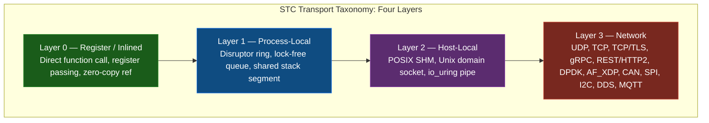
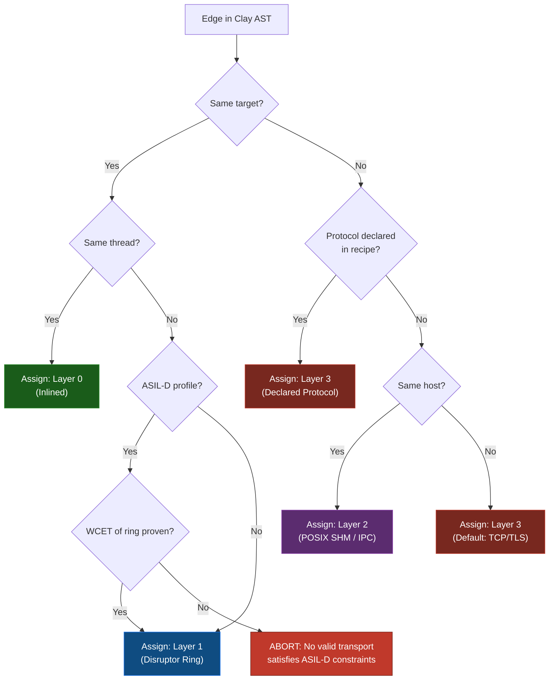
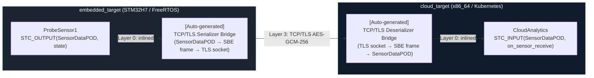
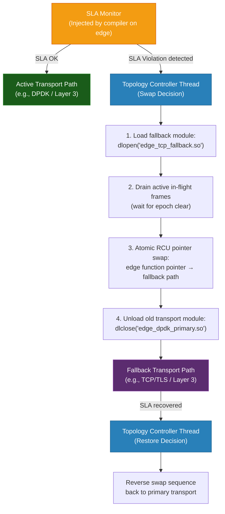

<!-- Part of: STC Co-Pilot & Systems Architect Reference Manual v2026.1.0 -->

## 12. Communication Transport Taxonomy & Swapping

In STC, the communication channel between two nodes is not a fixed implementation choice baked into the source code. It is a **compiler-resolved property of an edge**, declared in the topology recipe and synthesized by the Transport Selection Pass. The same two bricks can communicate via a direct CPU register transfer, a lock-free ring buffer, shared memory, a local socket, or a cross-machine encrypted TCP tunnel — without any change to their C++ source.

This section defines the complete transport taxonomy, the rules the compiler follows when selecting or validating a transport, and the mechanism by which transports can be swapped at runtime when SLA conditions change.



The layer number directly correlates to latency cost, serialization overhead, and SLA complexity. The compiler always selects the **lowest viable layer** that satisfies the edge's declared constraints — it never over-provisions transport capacity.

---

### 1. Transport Taxonomy

#### Layer 0 — Register / Inlined (Zero-Overhead)
Both nodes are assigned to the same physical core and execution thread. The compiler fuses the output function call of the upstream node directly into the input call of the downstream node as a static, inlined assembly instruction. No memory copy, no queue, no synchronization.

| Property | Value |
| :--- | :--- |
| **Latency** | Sub-nanosecond (register hand-off) |
| **Serialization** | None — direct `const` reference |
| **Allowed profiles** | All |
| **Cross-target** | No — both nodes must share the same `target` |
| **Safe for ASIL-D** | Yes — only viable option for ASIL-D hot paths |

#### Layer 1 — Process-Local (Lock-Free Ring)
Both nodes run in the same OS process but on different threads or cores. The compiler synthesizes a Disruptor-pattern lock-free ring buffer on the edge. The upstream node writes into the ring; the downstream node polls or is notified via a wait-free sequence.

| Property | Value |
| :--- | :--- |
| **Latency** | 50–300 ns (cache-line hand-off) |
| **Serialization** | None — shared memory within process |
| **Allowed profiles** | All except ASIL-D static-fusion builds |
| **Cross-target** | No — same process boundary required |
| **Safe for ASIL-D** | Conditional — permitted when WCET of ring drain is formally proven |

#### Layer 2 — Host-Local (IPC / SHM)
Nodes run in separate OS processes on the same physical host. The compiler generates a shared memory region (POSIX SHM or `memfd`) mapped into both process address spaces, with a Unix domain socket or `io_uring` eventfd as the notification mechanism.

| Property | Value |
| :--- | :--- |
| **Latency** | 1–10 µs (kernel IPC path) |
| **Serialization** | None for SHM — raw POD layout shared directly |
| **Allowed profiles** | Standard, CloudSaaS, ThreadPerCore |
| **Cross-target** | No — same host required |
| **Safe for ASIL-D** | No — separate process isolation breaks formal memory proofs |

#### Layer 3 — Network (Remote / Cross-Target)
Nodes run on different hosts, containers, or physical targets. A serialization bridge is synthesized on both sides of the edge. The transport protocol is declared in the edge's `sla.bridge.protocol` field. If omitted, the compiler selects the default for the target pair.

| Protocol | Serialization | Default Use Case |
| :--- | :--- | :--- |
| **UDP** | SBE / raw bytes | Low-latency telemetry, game netcode, sensor bursts |
| **TCP** | SBE / Protobuf | Reliable streaming between services |
| **TCP/TLS** | SBE / Protobuf | Encrypted inter-service communication |
| **gRPC** | Protobuf | Cloud microservice interconnects |
| **REST / HTTP2** | JSON / Protobuf | External API surfaces, browser-facing endpoints |
| **DPDK / AF_XDP** | SBE / raw bytes | Kernel-bypass, sub-10µs packet processing |
| **DDS** | CDR / SBE | Robotics, aerospace publish-subscribe fabric |
| **MQTT** | JSON / binary | IoT device telemetry, constrained networks |
| **CAN** | Fixed-frame binary | Automotive ECU-to-ECU communication |
| **SPI / I2C** | Fixed-frame binary | Embedded MCU peripheral buses |

---

### 2. Transport Selection Rules

The compiler's **Transport Selection Pass** runs after the Brick Resolver Pass and before the SLA Binding Pass. It evaluates every edge in the Clay AST and assigns a concrete transport using the following ordered rule chain:



#### Explicit Transport Declaration in the Recipe

The architect can pin a specific transport on any edge, overriding the compiler's automatic selection:

```yaml
edges:
  # Layer 0 — forced inlined call, both nodes must be on same thread
  - from: "FilterStage1.filtered_out"
    to: "ThresholdChecker.on_filtered_sample"
    transport:
      layer: 0

  # Layer 1 — explicit Disruptor ring with capacity and wait strategy
  - from: "DataIngress.frame_out"
    to: "FrameProcessor.on_frame"
    transport:
      layer: 1
      ring_capacity: 4096        # Must be power of 2
      wait_strategy: "BusySpin"  # BusySpin | Yielding | Sleeping | BlockingWait

  # Layer 3 — cross-target gRPC with explicit serialization
  - from: "EmbeddedSensor.reading_out"
    to: "CloudAnalytics.on_reading"
    transport:
      layer: 3
      protocol: "gRPC"
      serialization: "Protobuf"
    sla:
      max_latency_ms: 20
      delivery_guarantee: "AtLeastOnce"
      encryption: "TLS_1_3"

  # Layer 3 — kernel-bypass DPDK for sub-microsecond packet forwarding
  - from: "PacketIngestor.raw_frame_out"
    to: "PacketClassifier.on_raw_frame"
    transport:
      layer: 3
      protocol: "DPDK"
      serialization: "SBE"
      queue_depth: 2048
```

---

### 3. Cross-Target Bridge Auto-Generation

When an edge crosses a target boundary (e.g., `embedded_target` → `cloud_target`), the compiler auto-generates a **Transport Bridge** — a pair of symmetric Pillar 3 serialization bricks injected onto both ends of the edge. The architect does not write these; the compiler synthesizes them from the declared protocol and the POD types of the connected ports.



The auto-generated bridge bricks are:
- Compiled against the source target's profile and constraints (a bridge on an ASIL-D target obeys ASIL-D allocation rules)
- Registered in the Clay AST as synthetic entities distinct from user-authored bricks
- Emitted into the build output alongside user brick code, with source readable for audit

---

### 4. Runtime Transport Swapping

Runtime transport swapping is the physical implementation of **Reactive Physics (Principle 6)**: when an active edge's SLA is violated, the STC runtime morphs the transport to a pre-compiled fallback path without halting execution.

#### The Swap Sequence



#### Declaring a Fallback Transport in the Recipe

The fallback chain is declared alongside the primary transport on the edge. The compiler pre-compiles both paths at build time — there is no on-demand compilation at runtime.

```yaml
edges:
  - from: "PacketIngestor.raw_frame_out"
    to: "PacketClassifier.on_raw_frame"
    transport:
      primary:
        protocol: "DPDK"
        serialization: "SBE"
      fallback:
        - protocol: "AF_XDP"       # First fallback: kernel-bypass but without DPDK PMD
          trigger: "sla_breach"
        - protocol: "TCP"          # Second fallback: reliable but higher latency
          trigger: "sla_breach_critical"
    sla:
      max_latency_us: 50
      breach_threshold: 3          # Trigger swap after 3 consecutive SLA violations
      recovery_window_ms: 500      # Restore primary after 500ms of SLA compliance on fallback
```

#### Transport Swap Constraints

| Constraint | Rule |
| :--- | :--- |
| **Layer downgrade only** | A swap may only move to a higher layer number (e.g., Layer 1 → Layer 2). Upgrading to a lower layer requires a full recompile. |
| **Pre-compiled fallbacks only** | Fallback transport modules are compiled at build time. The runtime never JIT-compiles a new transport path. |
| **Static Fusion (Strategy B) blocks swapping** | If the target profile uses Static Fusion, transport selection is baked into the binary. No swap mechanism is injected. |
| **POD type unchanged** | The data type flowing across the edge does not change during a swap. Only the serialization and physical channel change. |
| **SLA monitor always active** | The SLA monitor itself is on a Layer 0 injected path and is never part of the swapped transport. It survives the swap. |

---

### 5. Transport-Aware SLA Binding

The SLA declared on an edge is always validated against the capabilities of the assigned transport. The **SLA Binding Pass** runs after Transport Selection and rejects combinations that are structurally impossible.

```
[STC ERROR] SLA binding failure
  Edge       : ProbeSensor1.state → CloudAnalytics.on_sensor_receive
  Transport  : UDP (Layer 3)
  SLA field  : delivery_guarantee = "ExactlyOnce"
  Violation  : UDP provides no delivery guarantee. ExactlyOnce requires TCP or gRPC.
  Resolution : Change protocol to "TCP" or "gRPC", or relax guarantee to "BestEffort".
```

Valid SLA field combinations per transport:

| SLA Field | UDP | TCP | TCP/TLS | gRPC | DPDK | Layer 0/1 |
| :--- | :---: | :---: | :---: | :---: | :---: | :---: |
| `max_latency_us` | ✓ | ✓ | ✓ | ✓ | ✓ | ✓ |
| `max_latency_ms` | ✓ | ✓ | ✓ | ✓ | ✓ | ✓ |
| `delivery_guarantee: BestEffort` | ✓ | ✓ | ✓ | ✓ | ✓ | ✓ |
| `delivery_guarantee: AtLeastOnce` | — | ✓ | ✓ | ✓ | — | ✓ |
| `delivery_guarantee: ExactlyOnce` | — | ✓ | ✓ | ✓ | — | ✓ |
| `encryption` | — | — | ✓ | ✓ | — | — |
| `ordering_guaranteed` | — | ✓ | ✓ | ✓ | — | ✓ |
| `max_queue_depth` | ✓ | ✓ | ✓ | ✓ | ✓ | ✓ |

---

<a id="compiler-pass-specification"></a>
