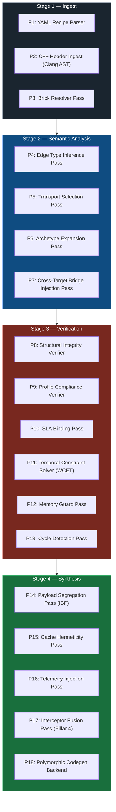

<!-- Part of: STC Co-Pilot & Systems Architect Reference Manual v2026.1.0 -->

## 13. Compiler Pass Specification

Section 4 defines the Clay AST structure and the Pass-DAG executor concept. This section specifies the **named, ordered passes** that execute within that framework for every compilation. Each pass has a defined role, a set of inputs it reads from the Clay AST, outputs it writes back, and the exact failure conditions that abort compilation.

Passes are organized into four sequential **stages**. Within a stage, independent passes may execute in parallel on separate ECS component queries. No pass in a later stage begins until all passes in the preceding stage have completed successfully.

---

### Stage 1 — Ingest

All ingest passes run first. Their collective output is a fully populated Clay AST registry with every entity, port, edge, and target represented. No semantic analysis or code generation touches the AST until all ingest passes complete without error.

---

#### P1: YAML Recipe Parser

| | |
| :--- | :--- |
| **Reads** | `system_recipe.yaml` from filesystem |
| **Writes** | Raw topology entities (nodes, edges, targets, profiles, archetypes) into the Clay AST ECS registry |
| **Fails if** | YAML is malformed; a required top-level key (`topology.nodes`, `topology.edges`) is missing; a profile overlay references a non-existent target key; a node references an archetype name not declared in `topology.archetypes`; an `extends:` chain contains a circular reference (`STC-P01-006`); an extension entity name collides with a base entity name (`STC-P01-005`) |

When `topology.extends:` is present, P1 resolves the full extension chain before writing any entity to the Clay AST. The chain is resolved depth-first: the deepest base recipe is written first, each tier's additions are written in order. By the time P1 completes, the Clay AST contains the complete merged entity set. No other pass has visibility into which tier each entity originated from.

The parser writes each YAML construct as an entity with a `RecipeSourceComponent` tagging the originating file path and line number. Every downstream error message is anchored to this component to produce source-location-aware diagnostics.

---

#### P2: C++ Header Ingest (Clang AST)

| | |
| :--- | :--- |
| **Reads** | C++ header file paths from each node entity's `RecipeSourceComponent.source` field |
| **Writes** | `CppAstComponent` per node entity, containing the Clang AST subtree for the brick class; `PortMetadataComponent` per port entity, containing the C++ type, memory layout, and alignment |
| **Fails if** | A declared `source` file does not exist or does not compile under the target's flags (`-fno-exceptions`, `-fno-rtti`, architecture flags); a `STC_INPUT` or `STC_OUTPUT` annotation references an undeclared type; the header includes a forbidden system header (e.g., `<thread>`, `<malloc.h>`) for safety-critical profiles |

This pass runs Clang as a library (not a subprocess) against each header in the context of the target's compiler flags. This means the same C++ source is parsed differently under `ASIL_D` and `CloudSaaS` profiles — a type that is legal in one context may be illegal in another.

---

#### P3: Brick Resolver Pass

| | |
| :--- | :--- |
| **Reads** | `brick@version` references from each node entity; catalog source configuration from the recipe |
| **Writes** | `BrickResolvedComponent` per node entity, containing the pinned version, catalog source, and SHA-256 content hash; updates or creates `system_recipe.lock.yaml` |
| **Fails if** | A referenced brick name or version does not exist in any configured catalog source; a resolved brick's SHA-256 does not match the lock file entry (tamper detection); a brick's `compatible_profiles` list does not include the target node's active profile |

---

### Stage 2 — Semantic Analysis

Semantic analysis passes transform the raw AST into a fully typed, transport-assigned, dependency-wired graph. All four passes in this stage operate on disjoint component sets and may execute in parallel.

---

#### P4: Edge Type Inference Pass

| | |
| :--- | :--- |
| **Reads** | Edge entities; `PortMetadataComponent` of the source and destination node ports |
| **Writes** | `EdgeTypeComponent` per edge entity, recording the resolved C++ POD type flowing across the edge |
| **Fails if** | The `STC_OUTPUT` type of the source port is not exactly equal to the `STC_INPUT` type of the destination port (no implicit conversions); a wildcard edge binding (`ProbeSensor*.state`) matches zero nodes after expansion |

Wildcard edge bindings are expanded here. `ProbeSensor*.state → CloudAnalytics.on_sensor_receive` is resolved to one concrete edge entity per matching node, each with its own `EdgeTypeComponent`. All concrete edges derived from a wildcard binding must resolve to the same port type, or the pass aborts with a heterogeneous-wildcard error.

---

#### P5: Transport Selection Pass

| | |
| :--- | :--- |
| **Reads** | Edge entities; `EdgeTypeComponent`; node `target` assignments; explicit `transport:` declarations from the recipe |
| **Writes** | `TransportComponent` per edge entity, recording the assigned layer, protocol, serialization format, ring capacity, and fallback chain |
| **Fails if** | An explicitly declared transport is incompatible with the node target pair (e.g., Layer 0 declared across different targets); a fallback chain contains a transport at a lower layer number than the primary; an ASIL-D edge is assigned Layer 1 without a WCET proof component being present |

This pass implements the full selection rule chain defined in Section 12.2.

---

#### P6: Archetype Expansion Pass

| | |
| :--- | :--- |
| **Reads** | Node entities carrying an `archetypes` reference; archetype definition entities from the recipe |
| **Writes** | Merges archetype parameters into each node entity's component set; node-level `overrides` take precedence over archetype defaults; removes the archetype reference component after merge |
| **Fails if** | An override key does not exist in the archetype's declared parameter set; a merged parameter value violates the brick's `brick.stc.yaml` constraints (e.g., `sample_rate_hz` exceeds hardware ADC limit declared in the target's `pin_map`) |

---

#### P7: Cross-Target Bridge Injection Pass

| | |
| :--- | :--- |
| **Reads** | Edge entities carrying a `TransportComponent` at Layer 3; source and destination node target assignments |
| **Writes** | Two new synthetic node entities per cross-target edge (serializer bridge and deserializer bridge); two new Layer 0 edge entities connecting the original source/destination nodes to their respective bridge nodes; marks the original edge as a `BridgedEdge` |
| **Fails if** | The declared protocol has no compiler-provided bridge template for the edge's POD type (architect must supply a custom bridge brick in this case, declared via `transport.custom_bridge_source`) |

Bridge entities carry a `SyntheticBrickComponent` flag. Verification passes treat them identically to user-authored bricks — they must pass all structural and compliance checks for the target profile they are compiled against.

---

### Stage 3 — Verification

Verification passes are read-only relative to the Clay AST structure — they do not add or remove entities. They only add `ViolationComponent` records to failing entities and, once all verification passes complete, the compiler checks for any `ViolationComponent` in the registry. If any exist, compilation aborts and all violations are emitted as structured errors before the process exits. This ensures the architect sees every problem in a single build, not one at a time.

---

#### P8: Structural Integrity Verifier

| | |
| :--- | :--- |
| **Reads** | All node entities; `CppAstComponent`; `PortMetadataComponent`; `BrickResolvedComponent` |
| **Writes** | `ViolationComponent` on any node failing a structural check |
| **Checks** | Every `STC_INPUT`/`STC_OUTPUT` port named in `brick.stc.yaml` is present in the parsed Clang AST; every port type is a POD type (`std::is_trivially_copyable`); no port type contains a virtual method table; no port handler method has a non-`void` return type other than the declared output call |

---

#### P9: Profile Compliance Verifier

| | |
| :--- | :--- |
| **Reads** | All node entities; `CppAstComponent`; active target profile |
| **Writes** | `ViolationComponent` on any node failing a compliance check |
| **Checks** | For safety-critical profiles: no `malloc`/`new`/`delete` reachable from any port handler (full call-chain traversal via Clang AST); no `throw`/`catch`; no `std::shared_ptr`/`std::unique_ptr` on the hot path; no RTTI (`dynamic_cast`, `typeid`); stack frame size within the brick's declared `max_stack_bytes` ceiling |

The call-chain traversal is **interprocedural** — a private helper method called from a port handler is checked, not just the handler itself. The violation report includes the full call chain from port handler to the offending instruction.

---

#### P10: SLA Binding Pass

| | |
| :--- | :--- |
| **Reads** | Edge entities; `TransportComponent`; `SlaComponent` (from recipe SLA declarations) |
| **Writes** | `ViolationComponent` on edges where the declared SLA is incompatible with the assigned transport |
| **Checks** | SLA field compatibility table from Section 12.5; `max_latency_us` / `max_latency_ms` bounds are physically achievable on the assigned transport layer given the target hardware profile |

---

#### P11: Temporal Constraint Solver (WCET)

| | |
| :--- | :--- |
| **Reads** | Node entities on safety-critical profiles; `CppAstComponent`; target CPU architecture from `TargetComponent` |
| **Writes** | `WcetBoundComponent` per node with the proven worst-case execution time in nanoseconds; `ViolationComponent` on any node where WCET cannot be bounded or exceeds the edge's `max_latency` SLA |
| **Checks** | All loops have statically provable iteration bounds; no recursion; instruction count is bounded on the target ISA; the sum of WCET values along the longest DAG path does not exceed any declared end-to-end latency SLA |
| **Only active for** | Profiles: `ASIL_D`, `MedTech_Class_C`, `DO178C`, or any profile with `wcet_required: true` |

---

#### P12: Memory Guard Pass

| | |
| :--- | :--- |
| **Reads** | All node entities; `BrickResolvedComponent.constraints.max_stack_bytes`; `TargetComponent.sram_limit` / `TargetComponent.flash_limit` |
| **Writes** | `MemoryFootprintComponent` per node; `ViolationComponent` on any node or target exceeding its memory ceiling |
| **Checks** | Per-node stack frame size against `max_stack_bytes` constraint; aggregate static memory footprint of all nodes assigned to a target against the target's `sram_limit`; code size against `flash_limit` for embedded targets |

---

#### P13: Cycle Detection Pass

| | |
| :--- | :--- |
| **Reads** | All edge entities forming the compiled DAG |
| **Writes** | `ViolationComponent` if any directed cycle is detected in the node graph |
| **Algorithm** | Depth-first search with grey/black node colouring (Tarjan's algorithm on the ECS edge list) |

Cycles are a structural impossibility in a correctly formed STC topology — data flows from ingress to egress with no feedback loops. Detected cycles are always a recipe authoring error. The violation report names the full cycle path: `NodeA → NodeB → NodeC → NodeA`.

---

### Stage 4 — Synthesis

Synthesis passes transform the verified, fully annotated Clay AST into physical code and deployment manifests. These are the only passes that produce output files.

---

#### P14: Payload Segregation Pass (ISP)

| | |
| :--- | :--- |
| **Reads** | Node entities; `PortMetadataComponent` of each node's input ports; `EdgeTypeComponent` of incoming edges |
| **Writes** | `SlicedPayloadComponent` per node, containing a compiler-generated minimal POD struct with only the fields consumed by that node's port handlers |

This pass implements Compiler Principle 10 (Compile-Time Payload Segregation). If an upstream brick emits a `SensorDataPOD` with 12 fields but the downstream brick only reads `value` and `timestamp_ns`, the compiler generates a 2-field projection struct and packs it into contiguous cache-aligned memory. The downstream brick never sees — and never pays the cache cost of — the other 10 fields.

---

#### P15: Cache Hermeticity Pass

| | |
| :--- | :--- |
| **Reads** | Node entities and their `TargetComponent.cpu_arch`; thread/core pin assignments from `ExecutionPhysicsComponent` |
| **Writes** | `CacheAlignmentDirective` per node, specifying struct member padding, cache-line alignment attributes, and Intel CAT / ARM MPAM partition assignments for safety-critical nodes |

This pass implements Compiler Principle 5 (Temporal & Spatial Hermeticity). It calculates struct field offsets to prevent false sharing between nodes running on adjacent cores and emits `[[gnu::aligned(64)]]` or equivalent directives into the generated code.

---

#### P16: Telemetry Injection Pass

| | |
| :--- | :--- |
| **Reads** | Edge entities; `TransportComponent`; target hardware tracing capabilities from `TargetComponent` |
| **Writes** | `TelemetryEdgeComponent` per edge, specifying the hardware tracing probe type (Intel PT, ARM CoreSight, eBPF, or software counter) and the metric fields to capture (entry timestamp, exit timestamp, queue depth, SLA delta) |

This pass implements Compiler Principle 7 (Zero-Intrusion Observability). Telemetry probes are synthesized onto edges, never injected into brick source code. On targets without hardware tracing (e.g., bare-metal MCUs), the pass falls back to lightweight software counters in a dedicated static memory segment, readable via the Topology Controller debug interface.

---

#### P17: Interceptor Fusion Pass (Pillar 4)

| | |
| :--- | :--- |
| **Reads** | Edge entities carrying `InterceptorComponent` (from recipe `interceptors:` declarations); `TransportComponent`; active Strategy A or B selection |
| **Writes** | For Strategy B: inlines interceptor C++ code directly into the generated edge call path (`StaticFusedInterceptorComponent`). For Strategy A: generates a dynamic dispatch shim and registers the interceptor `.so` path into the bootstrap loader sequence. |
| **Fails if** | An interceptor source file violates the compliance rules of the target profile (same checks as P9); a Strategy B interceptor contains a virtual function call that cannot be devirtualized |

---

#### P18: Polymorphic Codegen Backend

| | |
| :--- | :--- |
| **Reads** | The entire verified and annotated Clay AST |
| **Writes** | Physical output artifacts per target |

The codegen backend is the only pass that writes files outside the Clay AST. It dispatches to a target-specific emitter based on the `TargetComponent.arch` and `TargetComponent.os` fields:

| Target Type | Emitter | Output Artifacts |
| :--- | :--- | :--- |
| `bare-metal` (ARM/STM32) | ARM GCC / LLVM | `.bin`, `.elf`, `.map`, linker script |
| `freertos` / `zephyr` | ARM GCC / LLVM + RTOS headers | `.bin`, `.elf`, FreeRTOS task manifest |
| `linux` (x86 / aarch64) | Clang / GCC | Executable or `.so` modules + systemd units |
| `kubernetes` | Clang + K8s manifest generator | Docker image context + `deployment.yaml`, `service.yaml`, `configmap.yaml` |
| `fpga` (experimental) | HLS bridge | HLS-annotated C++ for downstream synthesis tools |

All emitters share the same input — the fully annotated Clay AST — and produce deterministic output given the same input and the same compiler version. Byte-identical reproducibility is enforced by the lock file (P3) and the content-hash of every brick source file.

---

