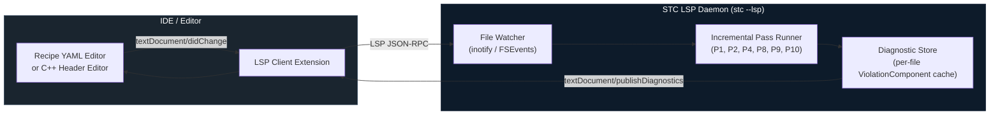

<!-- Part of: STC Co-Pilot & Systems Architect Reference Manual v2026.1.0 -->

## 14. Error Reporting Contract

The STC compiler treats error output as a first-class product surface. Every diagnostic is a structured, machine-readable record anchored to a specific source location. This section defines the error taxonomy, the structured diagnostic format, the exit code contract, and how diagnostics map to the IDE integration surface via the Language Server Protocol (LSP).

---

### 1. Design Principles

Three rules govern all STC diagnostics:

1. **Collect-all, abort-once.** The compiler never stops at the first error within a stage. All verification passes in Stage 3 run to completion, and all `ViolationComponent` records are emitted together before the process exits. An architect sees every problem in one build, not one problem per build.

2. **Every error is source-anchored.** Every diagnostic references the originating construct in at least one of: the YAML recipe (file path + line number), the C++ brick header (file path + line number + call chain), or the lock file. Errors that cannot be anchored to a source location are a compiler bug, not a diagnostic.

3. **Every error carries a resolution hint.** The `resolution` field is mandatory. It must name a concrete corrective action, not a description of the problem. "Replace `std::vector` with `std::array<T, N>`" is a valid resolution. "Dynamic allocation is forbidden" is not — that belongs in the `rule` field.

---

### 2. Structured Diagnostic Format

All STC diagnostics are emitted in a consistent structured format to both human-readable stderr and, when `--output-format=json` is active, as a newline-delimited JSON stream to stdout. This dual output allows terminal workflows and CI pipelines to use the same compiler binary.

#### Human-Readable Format

```
[STC <severity>] <error_code>: <title>
  Pass       : <pass_name> (P<pass_number>)
  Node       : <node_name>                     (if applicable)
  Edge       : <from_port> → <to_port>          (if applicable)
  Brick      : <brick_name>@<version>           (if applicable)
  Profile    : <active_profile>
  Location   : <file_path>:<line>:<column>
  Rule       : <rule_identifier>
  Detail     : <multi-line human explanation>
  Call chain : <method1> → <method2> → <offending_call>  (if applicable)
  Resolution : <concrete corrective action>
```

#### JSON Format (`--output-format=json`)

```json
{
  "schema": "stc-diagnostic/1.0",
  "severity": "error",
  "code": "STC-P09-003",
  "title": "Dynamic allocation on safety-critical hot path",
  "pass": { "name": "ProfileComplianceVerifier", "number": 9 },
  "node": "ProbeSensor1",
  "edge": null,
  "brick": { "name": "SignalFilter", "version": "1.4.2" },
  "profile": "ASIL_D",
  "location": {
    "file": "signal_filter.hpp",
    "line": 47,
    "column": 9
  },
  "rule": "ASIL_D.NO_HEAP_ALLOCATION",
  "detail": "std::vector::push_back() is reachable from port handler 'on_raw_sample' via call chain: on_raw_sample → update_history → std::vector::push_back",
  "call_chain": [
    { "method": "on_raw_sample",        "file": "signal_filter.hpp", "line": 31 },
    { "method": "update_history",       "file": "signal_filter.hpp", "line": 44 },
    { "method": "std::vector::push_back", "file": "<system>",          "line": 0  }
  ],
  "resolution": "Replace std::vector<float> with std::array<float, 64> and a manual ring index. See Section 9 compliance table."
}
```

---

### 3. Error Code Taxonomy

Every error code follows the pattern `STC-P<NN>-<NNN>` where `P<NN>` is the pass number from Section 13 and `<NNN>` is a three-digit sequence number within that pass.

#### Stage 1 — Ingest Errors (P01–P03)

| Code | Title | Emitting Pass |
| :--- | :--- | :--- |
| `STC-P01-001` | YAML syntax error | P1: YAML Recipe Parser |
| `STC-P01-002` | Missing required recipe key | P1: YAML Recipe Parser |
| `STC-P01-003` | Archetype reference not declared | P1: YAML Recipe Parser |
| `STC-P01-004` | Profile overlay references unknown target key | P1: YAML Recipe Parser |
| `STC-P02-001` | Brick source file not found | P2: C++ Header Ingest |
| `STC-P02-002` | Brick header fails to compile under target flags | P2: C++ Header Ingest |
| `STC-P02-003` | Forbidden system header included | P2: C++ Header Ingest |
| `STC-P02-004` | STC_INPUT / STC_OUTPUT references undeclared type | P2: C++ Header Ingest |
| `STC-P03-001` | Brick name or version not found in any catalog source | P3: Brick Resolver |
| `STC-P03-002` | Brick content hash mismatch (tamper detected) | P3: Brick Resolver |
| `STC-P03-003` | Brick profile incompatibility | P3: Brick Resolver |

#### Stage 2 — Semantic Analysis Errors (P04–P07)

| Code | Title | Emitting Pass |
| :--- | :--- | :--- |
| `STC-P04-001` | Edge port type mismatch | P4: Edge Type Inference |
| `STC-P04-002` | Wildcard edge binding matches zero nodes | P4: Edge Type Inference |
| `STC-P04-003` | Wildcard binding resolves to heterogeneous port types | P4: Edge Type Inference |
| `STC-P05-001` | Declared transport incompatible with target pair | P5: Transport Selection |
| `STC-P05-002` | Fallback transport layer not higher than primary | P5: Transport Selection |
| `STC-P05-003` | ASIL-D edge assigned Layer 1 without proven WCET | P5: Transport Selection |
| `STC-P06-001` | Archetype override key does not exist in archetype | P6: Archetype Expansion |
| `STC-P06-002` | Merged parameter violates brick hardware constraint | P6: Archetype Expansion |
| `STC-P07-001` | No compiler bridge template for declared protocol + POD type | P7: Bridge Injection |

#### Stage 3 — Verification Errors (P08–P13)

| Code | Title | Emitting Pass |
| :--- | :--- | :--- |
| `STC-P08-001` | Port declared in manifest missing from C++ header | P8: Structural Integrity |
| `STC-P08-002` | Port type is not trivially copyable | P8: Structural Integrity |
| `STC-P08-003` | Port type contains virtual method table | P8: Structural Integrity |
| `STC-P09-001` | Heap allocation on safety-critical hot path | P9: Profile Compliance |
| `STC-P09-002` | Exception handling (`throw`/`catch`) on safety-critical path | P9: Profile Compliance |
| `STC-P09-003` | RTTI usage (`dynamic_cast`, `typeid`) on safety-critical path | P9: Profile Compliance |
| `STC-P09-004` | Smart pointer on safety-critical hot path | P9: Profile Compliance |
| `STC-P09-005` | Stack frame exceeds declared `max_stack_bytes` | P9: Profile Compliance |
| `STC-P10-001` | SLA field incompatible with assigned transport | P10: SLA Binding |
| `STC-P10-002` | Latency SLA physically unachievable on transport layer | P10: SLA Binding |
| `STC-P11-001` | Loop with unbounded iteration count | P11: WCET Solver |
| `STC-P11-002` | Recursion detected on safety-critical path | P11: WCET Solver |
| `STC-P11-003` | WCET sum exceeds end-to-end latency SLA | P11: WCET Solver |
| `STC-P12-001` | Node stack frame exceeds `max_stack_bytes` | P12: Memory Guard |
| `STC-P12-002` | Target aggregate SRAM footprint exceeds `sram_limit` | P12: Memory Guard |
| `STC-P12-003` | Target code size exceeds `flash_limit` | P12: Memory Guard |
| `STC-P13-001` | Directed cycle detected in topology graph | P13: Cycle Detection |

#### Stage 4 — Synthesis Errors (P14–P18)

| Code | Title | Emitting Pass |
| :--- | :--- | :--- |
| `STC-P17-001` | Interceptor source fails profile compliance check | P17: Interceptor Fusion |
| `STC-P17-002` | Strategy B interceptor contains undevirtualizable call | P17: Interceptor Fusion |
| `STC-P18-001` | Codegen backend emitter failed for target type | P18: Polymorphic Codegen |

---

### 4. Severity Levels

| Severity | Meaning | Build outcome |
| :--- | :--- | :--- |
| `error` | A structural or compliance violation that cannot produce a valid binary. | Build aborts after all passes in the current stage complete. |
| `warning` | A non-fatal condition that is permitted under the active profile but may indicate an unintended configuration. | Build continues. Warnings are collected and emitted in the final summary. |
| `info` | A compiler decision the architect may want visibility into (e.g., transport auto-selected, archetype parameter defaulted). | Build continues. Suppressed unless `--verbose` is active. |

Warnings are **never silently discarded**. They are always written to the JSON output stream and to the final build summary line, even when `--quiet` is active. The architect may promote all warnings to errors by passing `--warnings-as-errors` to the compiler.

---

### 5. Exit Code Contract

The STC compiler process exits with a deterministic code that CI pipelines and build systems can branch on:

| Exit Code | Condition |
| :--- | :--- |
| `0` | Compilation succeeded. Zero errors. Warnings may be present. |
| `1` | One or more `error` diagnostics were emitted. Build artifacts were not written. |
| `2` | Internal compiler error (ICE). A bug in the compiler itself, not in the recipe or bricks. A structured ICE report is written to `stc-ice-<timestamp>.json` alongside the diagnostic output. |
| `3` | Catalog or filesystem I/O failure (missing catalog source, unreadable brick file, lock file write permission denied). |

---

### 6. IDE Integration via LSP

The STC compiler exposes a **Language Server Protocol (LSP) daemon mode** (`stc --lsp`) that IDEs use to provide real-time diagnostics as the architect edits the recipe YAML or brick C++ headers.



In LSP mode, only the **incremental passes** re-run on file change — not the full Pass-DAG. The LSP daemon caches the last known valid Clay AST state and re-runs only the passes whose input components are invalidated by the changed file:

| Changed file type | Passes re-run |
| :--- | :--- |
| Recipe YAML | P1, P3, P4, P5, P6, P7, P10, P13 |
| Brick C++ header | P2, P8, P9, P11, P12 |
| Brick manifest (`brick.stc.yaml`) | P3, P8, P9 |
| Lock file | P3 |

Diagnostics are mapped to LSP `Diagnostic` objects with:
- `range`: the line/column from the `location` field of the structured diagnostic
- `severity`: mapped from STC severity (error → 1, warning → 2, info → 3)
- `code`: the `STC-P<NN>-<NNN>` code string
- `source`: `"stc"`
- `message`: the `detail` field concatenated with the `resolution` field, separated by `\n\nResolution: `

Code actions (quick fixes) are provided for a defined subset of errors where the resolution is mechanically applicable — for example, `STC-P04-001` (port type mismatch) can offer an automatic insertion of a type-projection adapter brick into the recipe.

---

<a id="recipe-schema-formalization"></a>
