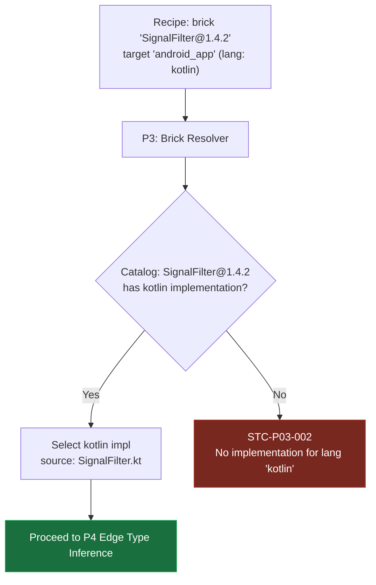
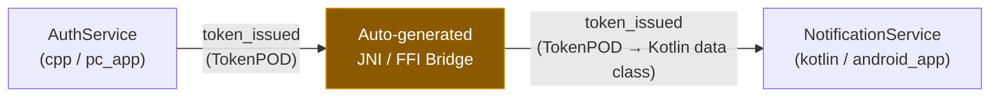

<!-- Part of: STC Co-Pilot & Systems Architect Reference Manual v2026.1.0 -->

## 16. Multi-Language Target Support

The STC topology compiler is language-neutral by design. The logical DAG — nodes, edges, targets, port type contracts — carries no implementation language assumption. Each target declares its language independently; the compiler selects the correct brick implementation, invokes the appropriate toolchain, and auto-generates any cross-language bridges required by edges that span language boundaries.

Port types are declared in an **STC Type Schema** (`.stctype` IDL), not in a language-specific header. Brick implementations are registered per language under the same brick name and version. The compiler remains the single authority for topology verification regardless of how many languages appear in a recipe.

---

### 1. Language-Neutral Port Type Schema

Port types are no longer declared as C++ POD structs in a C++ header. They are declared in an **STC Type Schema** — a language-neutral IDL file (`.stctype`) that the compiler uses to generate language-native equivalents for each target.

This keeps the topology contract at the schema level, above any single language. A type declared once in `.stctype` produces a verified, layout-compatible representation in every target language.

#### Type Schema Syntax

```stctype
// signal_types.stctype

package stc.examples.sensor

// All fields are value types. No pointers, references, or heap-allocated members.
// Layout is explicit: fields are ordered as declared, no implicit padding.
type RawSamplePOD {
    value:        f32
    timestamp_ns: u64
}

type FilteredSamplePOD {
    smoothed_value: f32
    variance:       f32
    timestamp_ns:   u64
}

type UserCommandPOD {
    user_id:    u64
    command_id: u32
    payload:    [u8; 64]   // Fixed-size array — no heap
}
```

#### Language-Native Generated Equivalents

The STC compiler's code-generation stage (Pass P18) emits a language-native type file for each target from the same `.stctype` source:

| Target Lang | Generated form | Layout guarantee |
| :--- | :--- | :--- |
| **C++** | `struct RawSamplePOD { float value; uint64_t timestamp_ns; };` in `.hpp` | `static_assert(std::is_trivially_copyable<T>)` enforced |
| **Kotlin** | `@JvmRecord data class RawSamplePOD(val value: Float, val timestampNs: Long)` | JVM value semantics; used with JNI bridge when crossing to C++ target |
| **TypeScript** | `interface RawSamplePOD { value: number; timestampNs: bigint; }` | Structural typing; no runtime overhead |
| **Rust** | `#[repr(C)] pub struct RawSamplePOD { pub value: f32, pub timestamp_ns: u64 }` | ABI-stable; zero-copy via FFI |
| **Python** | `@dataclass(frozen=True) class RawSamplePOD: value: float; timestamp_ns: int` | Used for ML/inference targets; type-checked at topology compile time |

Layout compatibility between targets is verified by the compiler when an edge crosses a language boundary. If the generated types are not ABI-compatible (e.g., the field order or alignment differs due to a language's object model), the compiler rejects the edge with `STC-P04-002` and generates the required bridge instead (see §16.7).

#### Type Schema Registration in Recipe

```yaml
topology:
  type_schemas:
    - path: "shared_types/signal_types.stctype"
    - path: "shared_types/command_types.stctype"
    - git: "ssh://git@types.internal.corp/stc-shared-types.git"
      ref: "v1.3.0"
      path: "common/network_types.stctype"
```

All `.stctype` files are resolved by P1 (YAML Parser) before any brick resolution begins. Every port type referenced in any brick implementation must resolve to a type declared in a registered schema.

---

### 2. Target Language Declaration

The `targets:` block in the recipe gains a `lang:` field. This declares the implementation language for everything compiled against that target. The compiler uses it to select the correct brick implementation and to invoke the appropriate toolchain.

```yaml
targets:
  pc_app:
    arch: "x86_64-linux"
    profile: "Standard"
    lang: "cpp"              # C++: Clang/GCC toolchain

  android_app:
    arch: "aarch64-android"
    profile: "Standard"
    lang: "kotlin"           # Kotlin: kotlinc + JVM runtime
    jvm_min_api: 26

  web_app:
    arch: "wasm32"
    profile: "Standard"
    lang: "typescript"       # TypeScript: tsc + framework adapter
    framework: "react"

  embedded_sensor:
    arch: "thumbv7em-none-eabi"
    profile: "ASIL_D"
    lang: "rust"             # Rust: rustc + no_std
    no_std: true
```

Supported `lang` values: `cpp`, `kotlin`, `typescript`, `rust`, `python`. The compiler's toolchain registry maps each value to a verified invocation pipeline. Unknown values are rejected at P1 with `STC-P01-004`.

---

### 3. Multi-Language Brick Registration

A brick is no longer tied to one language. The same logical brick — same name, same ports, same port types — can have multiple **language implementations** registered in the catalog under the same version. The compiler selects the implementation whose `lang:` matches the target.

#### Multi-Language Brick Manifest

```yaml
brick:
  name: "SignalFilter"
  version: "1.4.2"
  level: 1

  ports:
    inputs:
      - name: "on_raw_sample"
        type: "RawSamplePOD"           # Resolved from registered .stctype schema
    outputs:
      - name: "filtered_out"
        type: "FilteredSamplePOD"

  hot_path_entrypoints:
    - "on_raw_sample"

  implementations:
    - lang: "cpp"
      source: "signal_filter.hpp"
      logic_type: "SignalFilter"
      constraints:
        no_heap: true
        no_exceptions: true

    - lang: "kotlin"
      source: "SignalFilter.kt"
      logic_type: "SignalFilter"

    - lang: "typescript"
      source: "SignalFilter.ts"
      logic_type: "SignalFilter"

    - lang: "rust"
      source: "signal_filter.rs"
      logic_type: "SignalFilter"
      constraints:
        no_heap: true          # Enforces no_std allocator rules on hot path

  compatible_profiles:
    - "Standard"
    - "ASIL_D"                # Only the cpp and rust implementations satisfy ASIL_D
    - "CloudSaaS"
    - "ThreadPerCore"
```

If a target requests `lang: "kotlin"` and the brick has no Kotlin implementation, the Brick Resolver (P3) emits `STC-P03-002: No implementation for lang 'kotlin' in brick 'SignalFilter@1.4.2'`.

---

### 4. Multi-Target Node Expansion & The Learning Tool Example

#### `deploy_to:` — One Declaration, Multiple Targets

When the same logical brick is deployed identically across multiple targets, repeating the node declaration once per target creates unnecessary verbosity and a maintenance surface where one copy can drift from the others. The `deploy_to:` field collapses this into a single declaration:

```yaml
nodes:
  - name: LessonEngine
    brick: "LessonEngine@2.1.0"
    deploy_to: ["pc_app", "android_app", "web_app"]
```

The Archetype Expansion Pass (P6) expands this into one Clay AST node entity per listed target, automatically selecting the brick implementation whose `lang:` matches each target's declared language. Expanded instances are addressable in cross-target edges using the `<NodeName>@<target>` suffix — for example `LessonEngine@pc_app`.

**Edge auto-expansion:** When both the `from` and `to` nodes of an edge share an identical `deploy_to:` list, the edge auto-expands into N parallel per-target edges with no cross-target traffic. If the lists differ, the compiler emits `STC-P06-002: Ambiguous deploy_to expansion on edge '<from>→<to>' — use explicit '@target' suffix to resolve.`

**Archetype form:** `deploy_to:` is also valid as an archetype field, encoding a reusable multi-target deployment pattern that multiple nodes can share:

```yaml
archetypes:
  cross_platform:
    deploy_to: ["pc_app", "android_app", "web_app"]

nodes:
  - name: LessonEngine
    brick: "LessonEngine@2.1.0"
    archetype: "cross_platform"

  - name: ProgressTracker
    brick: "ProgressTracker@1.0.0"
    archetype: "cross_platform"

edges:
  - from: "LessonEngine.lesson_completed"
    to: "ProgressTracker.on_lesson_completed"
    # Both nodes share the same deploy_to list via 'cross_platform'.
    # P6 expands this into 3 parallel per-target edges — no cross-target traffic.
```

---

#### Full Example — Cross-Platform Learning Platform

The canonical multi-language scenario: the same domain logic topology runs on desktop (C++), Android (Kotlin), and web (TypeScript) — each as its own independently compiled binary — sharing one recipe and one set of port type schemas.

```yaml
topology:
  name: "LearningPlatform"
  version: "3.0.0"

  type_schemas:
    - path: "shared_types/lesson_types.stctype"
    - path: "shared_types/progress_types.stctype"

  catalog:
    sources:
      - type: "local"
        path: "./.stc/catalog"

targets:
  pc_app:
    arch: "x86_64-linux"
    profile: "Standard"
    lang: "cpp"

  android_app:
    arch: "aarch64-android"
    profile: "Standard"
    lang: "kotlin"
    jvm_min_api: 26

  web_app:
    arch: "wasm32"
    profile: "Standard"
    lang: "typescript"
    framework: "react"

archetypes:
  cross_platform:
    deploy_to: ["pc_app", "android_app", "web_app"]

nodes:
  - name: LessonEngine
    brick: "LessonEngine@2.1.0"       # Has cpp, kotlin, typescript implementations
    archetype: "cross_platform"       # Expands to LessonEngine@pc_app, @android_app, @web_app

  - name: ProgressTracker
    brick: "ProgressTracker@1.0.0"
    archetype: "cross_platform"

edges:
  - from: "LessonEngine.lesson_completed"
    to: "ProgressTracker.on_lesson_completed"
    # Identical deploy_to lists — P6 expands to 3 per-target edges automatically.
```

#### What the compiler produces

```mermaid
graph TD
    subgraph pc_app ["pc_app target (C++, x86_64-linux)"]
        LE_cpp["LessonEngine\n(cpp impl)"]
        PT_cpp["ProgressTracker\n(cpp impl)"]
        LE_cpp -->|"lesson_completed"| PT_cpp
    end

    subgraph android_app ["android_app target (Kotlin, aarch64-android)"]
        LE_kt["LessonEngine\n(kotlin impl)"]
        PT_kt["ProgressTracker\n(kotlin impl)"]
        LE_kt -->|"lesson_completed"| PT_kt
    end

    subgraph web_app ["web_app target (TypeScript, wasm32)"]
        LE_ts["LessonEngine\n(typescript impl)"]
        PT_ts["ProgressTracker\n(typescript impl)"]
        LE_ts -->|"lesson_completed"| PT_ts
    end

    style pc_app fill:#1a5c1a,stroke:#2d8c2d,color:#fff
    style android_app fill:#0f4c81,stroke:#1a73e8,color:#fff
    style web_app fill:#5b2c6f,stroke:#8e44ad,color:#fff
```



Three independent binaries are emitted from one recipe. The shared `.stctype` schemas guarantee that `LessonCompletedPOD` has the same field layout in the C++ struct, the Kotlin data class, and the TypeScript interface — enabling cross-target bridges to be auto-generated if inter-target edges are added later.

---

### 5. Compiler Implementation Selection

The Brick Resolver Pass (P3) selects one implementation per (brick, target) pair:



---

### 6. Language-Native Code Generation

Pass P18 (Polymorphic Codegen) is extended with per-language synthesis paths. Each path is a fully independent code generator that consumes the same Clay AST entities and emits language-native output:

| Target `lang:` | Toolchain invoked | Output artifact | Notes |
| :--- | :--- | :--- | :--- |
| `cpp` | Clang / GCC | `.o` objects → linked binary or `.so` | Profile flags (`-fno-exceptions`, `-fno-rtti`, ASAN, WCET instrumentation) applied |
| `kotlin` | `kotlinc` + Gradle wrapper | `.apk` / `.jar` | JVM bytecode; Kotlin coroutines mapped to STC execution model |
| `typescript` | `tsc` + bundler (Webpack / Vite) | `.wasm` / `.js` bundle | Port handlers compiled to WASM via AssemblyScript adapter or pure TS |
| `rust` | `rustc` + `cargo` | `.elf` / `.rlib` | `no_std` enforced when target declares `no_std: true`; `#[repr(C)]` required on all port types |
| `python` | `mypy` type-check + `setuptools` | Python package | Used for ML inference targets; hot path compliance limited to type-safety checks only |

The Clay AST is the single input to all five generators. Node/edge/target entities carry a `lang` component written by P3. P18 queries this component to select the correct generator for each node.

---

### 7. Cross-Language Bridges

When an edge connects a node on a C++ target to a node on a Kotlin, TypeScript, or Rust target, the compiler detects the language boundary and auto-generates a bridge — exactly as it generates transport bridges for cross-target edges in §12.



Bridge generation rules:

| Source lang | Destination lang | Bridge mechanism | Transport layer |
| :--- | :--- | :--- | :--- |
| `cpp` | `kotlin` | JNI wrapper (auto-generated from `.stctype`) | Layer 2 (POSIX SHM) or Layer 3 (gRPC) |
| `cpp` | `typescript` | WASM linear memory import / WebSocket | Layer 3 (WebSocket or WASM import) |
| `cpp` | `rust` | `extern "C"` FFI (zero-copy, same process) | Layer 0 or Layer 1 depending on thread assignment |
| `kotlin` | `typescript` | gRPC or REST (generated from `.stctype`) | Layer 3 |
| `rust` | `cpp` | `extern "C"` FFI | Layer 0 or Layer 1 |

The `.stctype` schema is the single source of truth for bridge type generation. Because both sides were generated from the same schema, the compiler can statically verify field-level compatibility before emitting the bridge. A bridge is never generated for a type that has not been declared in a registered `.stctype` file — no ad-hoc bridge serialization.

---

### 8. Compliance Scope for Non-C++ Targets

Safety-critical profiles (`ASIL_D`, `DO178C`, `MedTech_Class_C`) currently define their compliance rules in terms of C++ semantics (no heap, `-fno-exceptions`, WCET). For non-C++ targets the following applies:

| Profile | `kotlin` | `typescript` | `rust` | `python` |
| :--- | :--- | :--- | :--- | :--- |
| `ASIL_D` | Not supported — JVM GC makes WCET proof impossible | Not supported | Supported — `no_std`, `no_alloc` enforced on hot path | Not supported |
| `MedTech_Class_C` | Not supported | Not supported | Supported | Not supported |
| `DO178C` | Not supported | Not supported | Experimental — requires formal WCET tooling for Rust | Not supported |
| `Standard` / `CloudSaaS` / `ThreadPerCore` | Full support | Full support | Full support | Full support |

Attempting to assign a Kotlin or TypeScript brick to an ASIL_D target emits `STC-P09-007: Profile 'ASIL_D' is not supported for lang 'kotlin'. Only 'cpp' and 'rust' implementations are permitted under this profile.`

---

<a id="topology-extension--feature-integration"></a>
