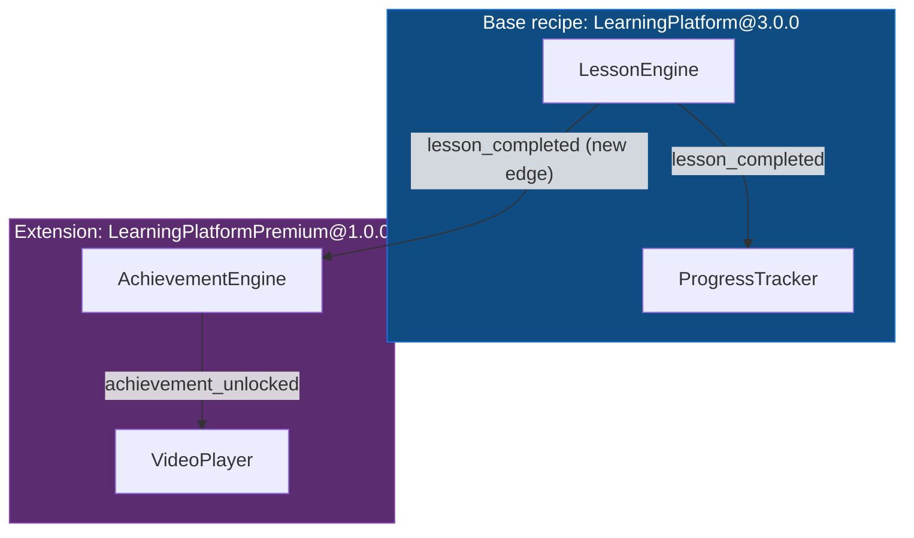
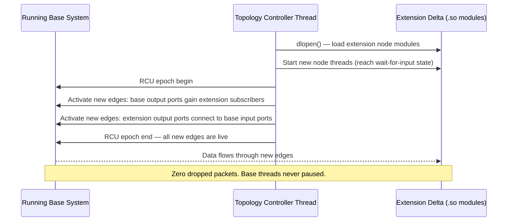

<!-- Part of: STC Co-Pilot & Systems Architect Reference Manual v2026.1.0 -->

## 17. Topology Extension & Feature Integration

A production topology grows over time. New features are added, new targets are introduced, new bricks are composed into existing data paths. Without a structured mechanism, every addition modifies the base recipe — requiring a full recompile, a full retest, and a full redeploy. STC solves this with **recipe extension**: a new recipe file that declares what to add, leaving the base recipe untouched and compiler-verifiable in isolation.

Extensions integrate with the §6 hot-swap mechanism to deploy new features into a live system with zero downtime.

---

### 1. The Extension Model

A recipe extension is a separate YAML file that declares `topology.extends:` pointing to a base recipe. The P1 YAML Parser resolves the full extension chain before any other pass runs, producing a single merged recipe that is the flat union of all entities in chain order. All subsequent passes (P2–P18) operate on the merged result — they have no visibility into which entities came from the base and which from the extension.

**Extensions are strictly additive.** This is a hard compiler rule:

| Operation | Permitted |
| :--- | :--- |
| Add new nodes | Yes |
| Add new edges (including edges that connect to base node ports) | Yes |
| Add new archetypes | Yes |
| Add new targets | Yes |
| Add new `type_schemas:` entries | Yes |
| Modify a base node, edge, archetype, or target | No — `STC-P01-005` |
| Delete a base node, edge, archetype, or target | No — `STC-P01-005` |
| Declare a node with a name that already exists in the base | No — `STC-P01-005` |

Base targets are in scope by name in the extension recipe without re-declaration. Extension nodes may reference base archetypes directly.

---

### 2. The `extends:` Declaration

`extends:` is a top-level key inside the `topology:` block, resolved before any other key in the recipe.

```yaml
topology:
  name: "LearningPlatformPremium"
  version: "1.0.0"

  # File path form — relative to this recipe file:
  extends: "./learning_platform.recipe.yaml"

  # Catalog form — versioned base topology from the brick catalog:
  # extends:
  #   ref: "LearningPlatform@3.0.0"
  #   catalog: "registry"         # optional; defaults to first catalog source
```

The catalog form treats the base recipe as a versioned, publishable artifact — exactly as bricks are registered in the catalog. This enables a team to publish a stable base topology as `LearningPlatform@3.0.0`, and any extension recipe can pin to that exact version. The lock file records the base recipe's SHA-256 independently from the extension's SHA-256, so a base upgrade is a deliberate, auditable act.

---

### 3. Extension Example — Adding Premium Features

Building on the `LearningPlatform` recipe from §16.4:

```yaml
topology:
  name: "LearningPlatformPremium"
  version: "1.0.0"
  extends: "./learning_platform.recipe.yaml"

  # No targets: block needed — base targets (pc_app, android_app, web_app)
  # are in scope by name. A new target for a new platform would be declared here.

  # No type_schemas: needed unless the extension introduces new port types.
  # Extensions that reuse only base port types inherit the base schema silently.

nodes:
  - name: VideoPlayer
    brick: "VideoPlayer@1.0.0"
    archetype: "cross_platform"           # 'cross_platform' archetype from base recipe

  - name: AchievementEngine
    brick: "AchievementEngine@2.0.0"
    archetype: "cross_platform"

edges:
  # Edge from a base node's output port to a new extension node:
  - from: "LessonEngine.lesson_completed"
    to: "AchievementEngine.on_lesson_completed"

  # Intra-extension edge:
  - from: "AchievementEngine.achievement_unlocked"
    to: "VideoPlayer.on_achievement"
```

#### What the compiler merges (conceptual — never written to disk)



The `deploy_to:` expansion from §16.4 applies normally to the extension nodes — `cross_platform` expands `VideoPlayer` and `AchievementEngine` across all three targets. The `LessonEngine.lesson_completed → AchievementEngine.on_lesson_completed` edge auto-expands into three per-target edges because both nodes share identical `deploy_to:` lists.

---

### 4. Chained Extensions

An extension recipe can itself be a base for a further extension:

```
learning_platform.recipe.yaml            ← base
  └── learning_platform_premium.recipe.yaml    ← tier 1 extension
        └── learning_platform_enterprise.recipe.yaml  ← tier 2 extension
```

P1 resolves the chain depth-first. The merged entity set is the ordered union: base entities first, then tier-1 additions, then tier-2 additions. Each tier sees all entities from all prior tiers as base entities — it can add edges connecting to any of them.

A name collision at any tier in the chain is `STC-P01-005`, citing both the originating tier and the conflicting tier.

A circular extension reference (`A extends B extends A`) is detected immediately at P1 with `STC-P01-006: Circular extension chain detected`.

---

### 5. Incremental Compilation

When an extension recipe changes but its base has not changed, the compiler:

1. Loads the base topology's cached Clay AST from the lock file's `base.sha256` entry — Stage 1 passes skip the base entities entirely.
2. Runs Stage 1 passes (P1–P3) on the extension's new entities only.
3. Runs Stage 2–3 passes (P4–P13) on the **complete merged topology** — the verification passes must see the full graph to catch conflicts that span the base/extension boundary. Example: a new extension edge that creates a cycle through base nodes triggers `STC-P13-001` on the merged graph, not just within the extension in isolation.
4. Runs Stage 4 passes (P14–P18) in synthesis-delta mode — only the extension's new node entities produce new output artifacts. Base artifacts are not rebuilt.

The lock file records base and extension resolutions separately:

```yaml
# system_recipe.lock.yaml (extension build)
resolved:
  base:
    recipe: "learning_platform.recipe.yaml"
    sha256: "a3f9c1e827d..."
    bricks:
      - ref: "LessonEngine@2.1.0"
        resolved: "LessonEngine@2.1.0"
        sha256: "d1b2c3e4f5..."
        source: "registry"
      - ref: "ProgressTracker@1.0.0"
        resolved: "ProgressTracker@1.0.0"
        sha256: "e2c3d4f5a6..."
        source: "registry"
  extension:
    recipe: "learning_platform_premium.recipe.yaml"
    sha256: "b77d2e4f901..."
    bricks:
      - ref: "VideoPlayer@1.0.0"
        resolved: "VideoPlayer@1.0.0"
        sha256: "c88e3f5a012..."
        source: "local"
      - ref: "AchievementEngine@2.0.0"
        resolved: "AchievementEngine@2.0.0"
        sha256: "f99b4d6c123..."
        source: "registry"
```

---

### 6. Live Feature Deployment

The extension compilation produces only the **delta artifact set** — the new nodes' compiled modules. The base topology continues running in production, unmodified and uninterrupted.

Deployment uses the §6 Strategy A hot-swap sequence applied to the delta:



The reverse — removing an extension from a live system — follows the same sequence in reverse: drain extension edges, RCU-swap base output ports back to their pre-extension state, wait for epoch clear, `dlclose()` the extension modules.

Extensions compiled with Strategy B (static fusion) cannot be deployed live. When a base recipe uses static fusion on a target, extension nodes on that target require a full recompile and a scheduled restart. Extension nodes on Strategy A targets in the same recipe are unaffected and can still be deployed live.

---

<a id="references"></a>
