# STC Systems Architect & Architectural Core Reference Manual
**Version:** 2026.1.0  
**Classification:** Core System Architecture & Compiler Specification

---
## Table of Contents

- [1. Foundational Paradigm: Logical vs. Physical Isolation](#1-foundational-paradigm-logical-vs-physical-isolation)
- [2. Core Architectural Pillars](#2-core-architectural-pillars)
- [3. Core Compiler Principles](#3-core-compiler-principles)
- [4. Compiler Architecture & The Clay AST](#4-compiler-architecture-the-clay-ast)
- [5. Declarative Topology Recipe Specification (YAML)](#5-declarative-topology-recipe-specification-yaml)
- [6. Dynamic Reconfiguration & Live Morphing Operations](#6-dynamic-reconfiguration-live-morphing-operations)
- [7. Real-Time Context Database (CDB) Implementation](#7-real-time-context-database-cdb-implementation)
- [8. Persistent Storage Adapter (PSA) Implementation](#8-persistent-storage-adapter-psa-implementation)
- [9. Conditional Compliance Framework](#9-conditional-compliance-framework)
- [10. Memory Model & Data Lifetime Guarantees](#10-memory-model-data-lifetime-guarantees)
- [11. Modularity & The Brick Catalog](#11-modularity-the-brick-catalog)
- [12. Communication Transport Taxonomy & Swapping](#12-communication-transport-taxonomy-swapping)
- [13. Compiler Pass Specification](#13-compiler-pass-specification)
- [14. Error Reporting Contract](#14-error-reporting-contract)
- [15. Recipe Schema Formalization](#15-recipe-schema-formalization)
- [16. Multi-Language Target Support](#16-multi-language-target-support)
- [17. Topology Extension & Feature Integration](#17-topology-extension-feature-integration)
- [18. References](#18-references)
- [19. Legend](#19-legend)
- [20. Dynamic Swapping — Implementation Patterns](#20-dynamic-swapping-implementation-patterns)

---

## 1. Foundational Paradigm: Logical vs. Physical Isolation

The System-Topology Compiler (STC) separates the **Logical Architecture** (domain-specific data transformation and control loops) from the **Physical Architecture** (hardware execution resources, memory domains, and network interfaces). 

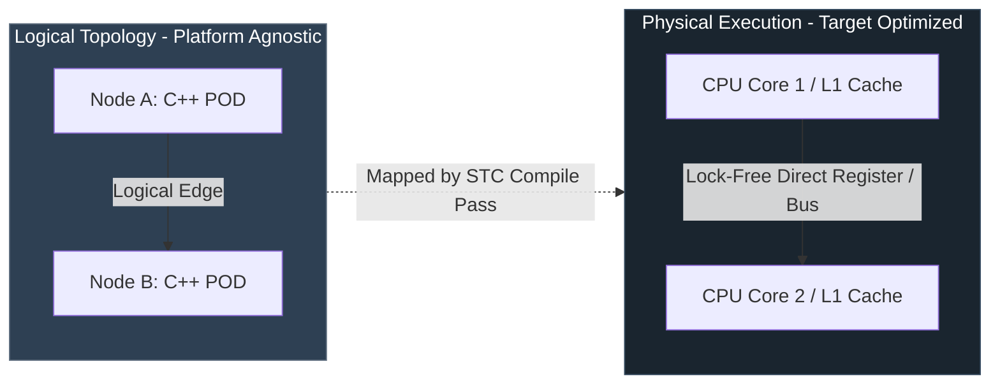

*   **Logical Decoupling:** Lego modules (Pillar 1 Bricks) contain purely mathematical, declarative, and sequential operations [1]. They do not configure, nor do they dynamically inspect, where they run or how they communicate.
*   **Physical Morphing:** The compiler maps logical edges to hardware execution mechanisms (Clay) [1]. An edge between Node A and Node B can compile to a direct register-to-register assembly instruction, a lock-free ring buffer (Disruptor) [1], an in-memory shared memory segment (SHM) [2], or a kernel-bypass network packet ([DPDK](#acronym-DPDK)/[AF_XDP](#acronym-AF_XDP)) [3], depending on the target environment profile declared in the YAML recipe.

<a id="core-architectural-pillars"></a>

---

## 2. Core Architectural Pillars

The System-Topology Compiler (STC) divides systems into five strictly segregated, non-overlapping architectural layers.

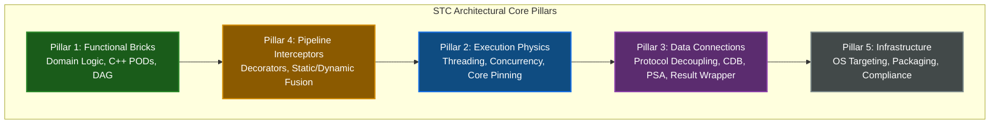

### Pillar 1: Functional Bricks (Core Domain Logic)
*   **Definition:** Pure, stateless, context-free business logic and state structures.
*   **Requirements:**
    *   Written strictly in native, memory-aligned C++ Plain Old Data ([POD](#acronym-POD)) classes.
    *   No thread-synchronization primitives (`std::mutex`, atomics), network headers, logging libraries, or database clients are permitted.
    *   No dynamic memory allocations (`malloc`, `new`, standard containers with heap allocators) are allowed on the hot path.
    *   Logical connectivity is modeled as a Directed Acyclic Graph (DAG) of inputs and outputs, never as a linear execution pipeline.

### Pillar 2: Execution Physics (Concurrency & Drivers)
*   **Definition:** The runtime threading, polling, scheduling, and driver layers that dictate *how* functional code is executed on hardware.
*   **Supported Profiles:**
    *   *Thread-per-Core (TPC):* Direct pinning of execution threads to dedicated physical cores with zero-preemption loops.
    *   *Disruptor:* High-performance, single-writer, lock-free ring buffers with wait-free sequences.
    *   *Interrupt-Driven Sleep:* Event-driven wakeups using hardware registers (Wait-For-Interrupt - `__WFI`).
    *   *Low-Latency Drivers:* Native polling-mode drivers (PMDs) such as DPDK, AF_XDP, and `io_uring` mapped directly to physical ring descriptors.

### Pillar 3: Data Connections (Protocol Decoupling, [CDB](#acronym-CDB), & [PSA](#acronym-PSA))
*   **Definition:** The translation, serialization, and database/caching boundary interfaces that shield core functional logic from external data formats and persistent storage engines.
*   **Bridges:** Deserialize incoming data (e.g., JSON, Protobuf, gRPC, GTP-U) directly onto the raw memory boundaries of the functional [POD](#acronym-POD)s without intermediate copies.
*   **Context Database Handlers ([CDB](#acronym-CDB)):** Abstract, un-parsed command-passing driver interfaces (`execute({"CMD", ...})`) used to interact with in-memory caching layers (Valkey, Redis-Lite, Redis Enterprise).
*   **Persistent Storage Adapters ([PSA](#acronym-PSA)):** Abstract, monadic, compile-time query interfaces (contracts) used to access persistent database layers (SQLite, PostgreSQL, MongoDB, or custom architect-defined DB engines) using zero-allocation stack data mappings.
*   **Type-Safe Result Containers:** Stack-allocated, zero-heap monadic wrappers (such as `CdbResult` and database query `Result<T, E>`) that prevent memory leaks, exceptions, and pointer-chasing in critical execution paths.

### Pillar 4: Pipeline Interceptors (Cross-Cutting Logic)
*   **Definition:** Decorators and filters woven onto execution edges to enforce security, telemetry, audit logs, and safety checks without polluting Pillar 1.
*   **Strategy A (Runtime Decorators):** Injects dynamically loaded modules (`.so` / `.dll`) into the execution path, utilizing epoch-based pointer swapping for runtime hot-swaps.
*   **Strategy B (Compile-Time Static Fusion):** Inlines interceptor logic directly into the generated C++ execution paths, optimizing out any runtime indirection.

### Pillar 5: Infrastructure (OS & Safety Compliance)
*   **Definition:** The deployment, packaging, and regulatory compliance layer.
*   **Targets:** Generates bare-metal firmware, RTOS binaries (FreeRTOS, PikeOS, QNX), or orchestrated Kubernetes manifests.
*   **Compliance Gates:** Automatically performs static AST verification to audit code against safety standards (such as ISO 26262 [ASIL-D](#acronym-ASIL-D), IEC 62304 Class C, and [MISRA](#acronym-MISRA)-C++).

---

<a id="core-compiler-principles"></a>

---

## 3. Core Compiler Principles

STC unifies traditional compiler optimization passes with modern software engineering and physical hardware isolation practices.

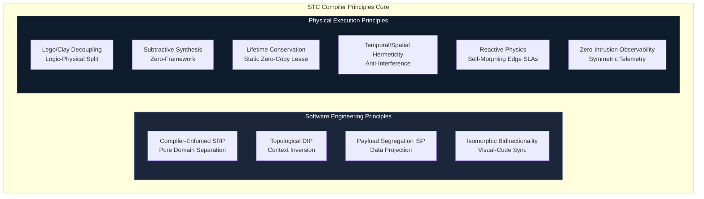

### 1. The Lego/Clay Principle (Logical-Physical Decoupling)
Domain logic is written as decoupled, stateless C++ structures (Lego Bricks). The physical deployment architecture (the Clay) is declared in a separate topology recipe. The compiler morphs the same logical bricks to fit the physical constraints of any target without source-code modification.

### 2. Subtractive Physics Synthesis (The Zero-Framework Principle)
The compiler assumes zero operating system, zero scheduling library, and zero network stack exist. It only synthesizes the absolute minimum machine instructions needed to execute the edge path. Unused synchronization primitives, threading abstractions, and OS layers are entirely stripped out during compilation.

### 3. Isomorphic Bidirectionality (Visual-Code Isomorphism)
The YAML topology recipe, the Visual STC Playroom GUI, the compiler's ECS AST, and the generated C++ edge code exist in a continuous, bi-directional mathematical synchronization loop. Modifying one representation instantly updates all others without structure or metadata loss.

### 4. Lifetime Conservation (The Static Zero-Copy Lease)
To eliminate latency jitter from memory allocation and copying, the compiler statically calculates data lifetimes from physical ingress to egress. It generates compile-time static memory leases. Upstream nodes lease read-only memory blocks to downstream consumers, and memory is recycled instantly at the ingress buffer boundary the moment the last leaf node in the DAG completes execution.

### 5. Temporal & Spatial Hermeticity (The Anti-Interference Principle)
Prevents physical resource interference between critical and non-critical modules. The compiler aligns variable offsets to prevent L1/L2 cache-line bouncing (false sharing) and auto-generates CPU-specific instructions (such as Intel CAT or ARM MPAM) to lock dedicated cache lines for critical threads.

### 6. Reactive Physics (Self-Morphing Environmental Adaptability)
The compiler injects non-functional SLA monitors onto active edges. If an edge SLA (e.g., `< 30ms` latency over 5G) is violated at runtime, the monitoring guard triggers a dynamic reconfiguration event, hot-swapping the active routing pointer to a resilient buffered or rollback netcode path without halting execution.

### 7. Zero-Intrusion Observability (Symmetric Telemetry)
Functional blocks contain zero logging or metric-gathering code. Telemetry is synthesized directly on the edges at compile-time, mapping execution transits to hardware-level tracing mechanisms (such as Intel PT, ARM CoreSight, or kernel-bypass static [eBPF](#acronym-eBPF) probes) to read metrics directly from registers and cache lines with zero CPU-cycle overhead.

### 8. Compiler-Enforced Single Responsibility Principle (SRP)
The compiler makes it structurally impossible for a functional block to implement non-functional concerns. A Lego block can only execute domain logic. All cross-cutting concerns (logging, networking, thread sync) are automatically synthesized onto the edges as decoupled decorators.

### 9. Pure Topological Context Inversion (The Ultimate DIP)
Lego blocks do not contain pointers to next-nodes or define abstract interfaces of downstream consumers. The compiler reads the declarative YAML topology recipe and injects dependencies at compile-time, synthesizing direct function calls, memory offsets, or register jumps on the edges to eliminate virtual function table (VMT) latency.

### 10. Compile-Time Payload Segregation (The ISP of Data)
To prevent nodes from receiving unnecessary global state data, the compiler performs compile-time data projection. It analyzes the input requirements of a target node and automatically generates a sliced, minimal POD structure containing *only* the specific fields needed by that node, packing them into local registers or contiguous cache-aligned segments.

---

<a id="compiler-architecture--the-clay-ast"></a>

---

## 4. Compiler Architecture & The Clay AST

The STC compiler utilizes a data-oriented execution pipeline built on a highly parallelizable, entity-component intermediate representation.

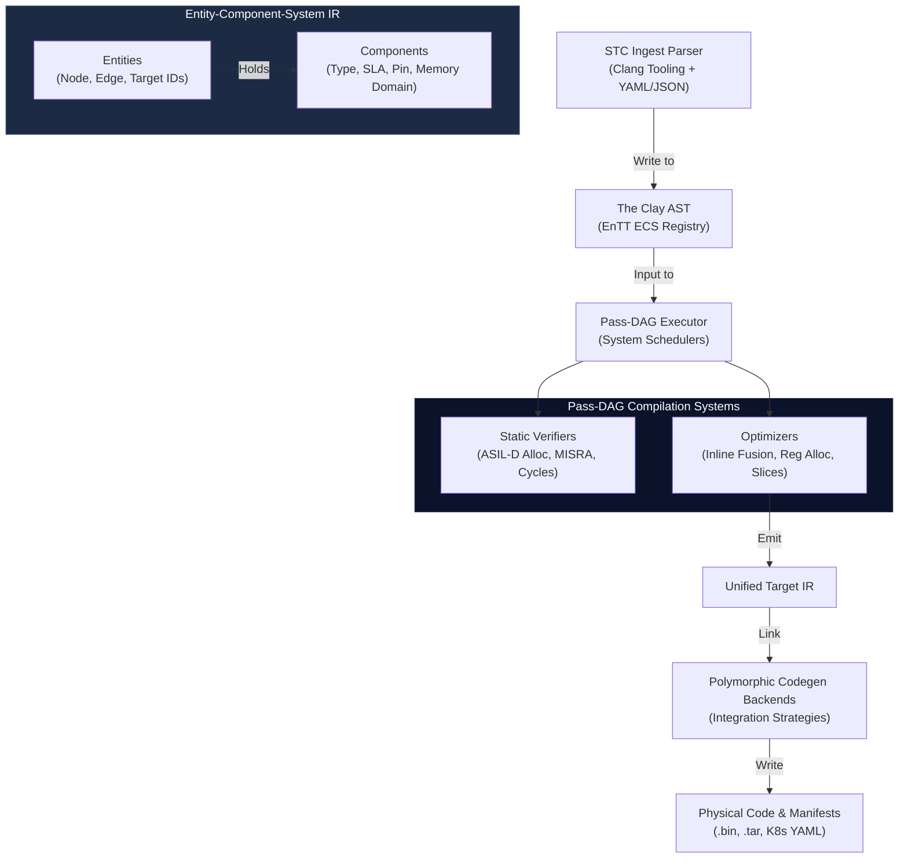

### 1. The Clay AST (ECS-Based Intermediate Representation)
To resolve the "Expression Problem" and support modular, dynamic extensions:
*   **Entities:** Every node, edge, and target in the compiler graph is represented as a unique integer ID.
*   **Components:** Syntactic, semantic, and non-functional properties (such as source locations, sample rates, network protocols, and hardware pin mappings) are appended to these entities as flat, memory-aligned structures in an entity component registry.
*   **Systems:** Compiler passes run as decoupled systems that query specific component patterns (e.g., a system that checks for physical rate mismatches across edges and injects queue adapters).

### 2. The Pass-DAG Executor
The compilation stages themselves run as a Directed Acyclic Graph (DAG) of independent compilation passes. The compiler's execution engine loads, wires, and schedules compile passes dynamically based on the target configuration.

### 3. Verification & Constraints
Before code generation, the compiler executes formal validation passes:
*   *Temporal Constraint Solver:* Proves that hard real-time execution blocks meet Worst-Case Execution Time ([WCET](#acronym-WCET)) bounds.
*   *Memory Guard:* Proves that static memory allocations do not exceed target embedded hardware SRAM/Flash limits.
*   *Compliance Verifier:* Audits AST structures to ensure zero dynamic memory allocations on safety-critical paths.

---

<a id="declarative-topology-recipe-specification-yaml"></a>

---

## 5. Declarative Topology Recipe Specification (YAML)

The YAML recipe is the central contract defining how the logical system is partitioned, optimized, and deployed.

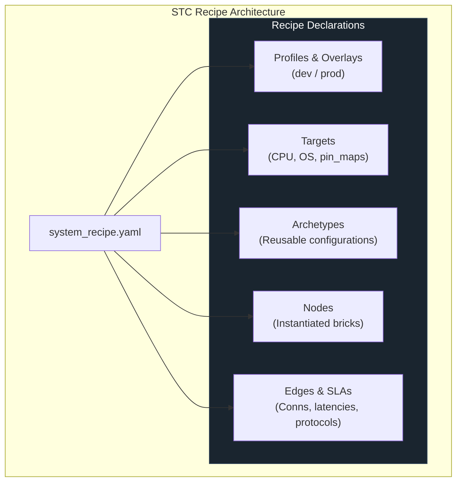

### 1. Syntax Schema

```yaml
topology:
  name: "UnifiedDistributedSystem"

  # 1. Port Type Schemas
  type_schemas:
    - path: "shared_types/system_types.stctype"

  # 2. Environment Overlays
  profiles:
    dev:
      targets.*.cache.deployment_mode: "embedded"
    prod:
      targets.*.cache.deployment_mode: "kubernetes"

  # 3. Target Deployment Configurations
  targets:
    embedded_target:
      arch: "stm32h7"
      os: "freertos"
      profile: "MedTech_Class_C"
      lang: "cpp"
      mpu_isolation: true
      pin_map:
        sensor_analog_in: "ADC1_CH2"

    cloud_target:
      arch: "x86_64-linux"
      os: "kubernetes"
      profile: "CloudSaaS"
      lang: "cpp"
      namespace: "production-services"

  # 4. Node Archetypes (Eliminates duplication)
  archetypes:
    analog_sensor:
      target: "embedded_target"
      brick: "AnalogSensorBrick@1.0.0"
      sample_rate_hz: 1000

  # 5. Node Instantiation
  nodes:
    - name: ProbeSensor1
      archetype: "analog_sensor"
    - name: ProbeSensor2
      archetype: "analog_sensor"
    - name: CloudAnalytics
      target: "cloud_target"
      brick: "AnalyticsProcessor@2.1.0"

  # 6. Wildcard Bindings & Non-Functional SLAs
  edges:
    - from: "ProbeSensor*.state"
      to: "CloudAnalytics.on_sensor_receive"
      sla:
        max_latency_ms: 15
        delivery_guarantee: "AtLeastOnce"
        bridge:
          protocol: "TCP_TLS"
          encryption: "AES_GCM_256"
```

---

<a id="dynamic-reconfiguration--live-morphing-operations"></a>

---

## 6. Dynamic Reconfiguration & Live Morphing Operations

STC supports runtime topology adjustments while executing, using optimized path transition sequences.

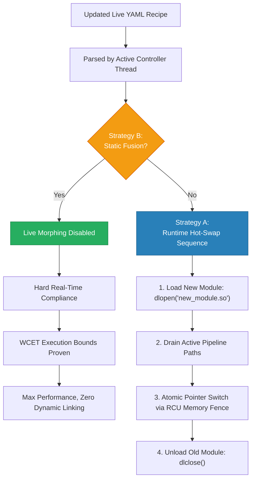

### 1. Strategy A: Runtime Hot-Swap (Live Morphing)
For environments requiring continuous availability, the compiler injects a background **Topology Controller Thread** into the synthesized application.

#### The Hot-Swap Sequence:
1.  **Dynamic Loading:** The application calls `dlopen()` to load the newly compiled module `.so` into its active address space.
2.  **Path Handoff Execution:**
    *   *Option 1 ([RCU](#acronym-RCU) Pointer Swap):* The active function pointers on the edges are swapped atomically via an epoch-based memory fence.
    *   *Option 2 (Double-Buffer):* The controller thread switches the active route selector to the new path. Upstream packets flow to the new module instantly. The old path is allowed to drain its active queue.
3.  **Reclamation:** Once epoch tracking confirms all threads have cleared the old path, the controller thread executes `dlclose()` on the old module, completing the live morphing sequence with zero dropped packets and zero service downtime.

### 2. Strategy B: Compile-Time Static Fusion
For safety-critical configurations, the compiler completely strips out dynamic linkers and routing layers. The graph is baked into the binary as static code. Live morphing is disabled because dynamic memory mapping or dynamic linking is a safety violation in these domains.

> **Feature integration on live systems:** When new bricks or data paths need to be added to a running Strategy A topology without downtime, the **Topology Extension** mechanism (§17) compiles only the delta and deploys it into the live process via this hot-swap sequence. The base topology is never recompiled or interrupted.

---

<a id="real-time-context-database-cdb-implementation"></a>

---

## 7. Real-Time Context Database (CDB) Implementation

To maintain absolute independence from third-party database clients and caching frameworks, STC implements the Context Database (CDB) model under Pillar 3.

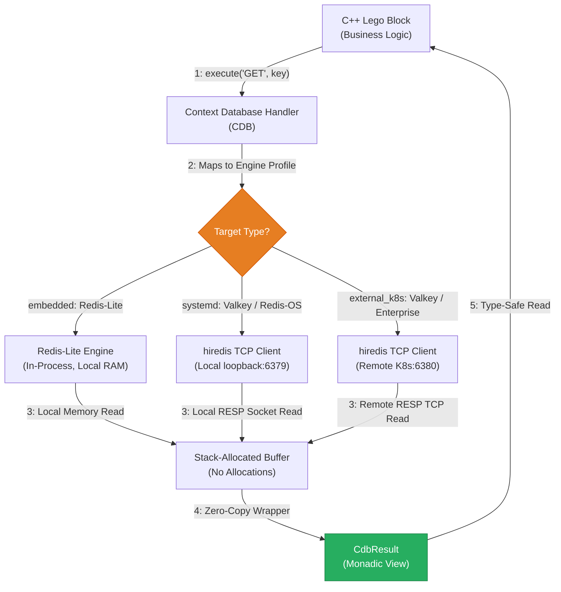

### 1. `CdbResult` Stack Allocation Specification
This zero-copy, allocation-free, and monadic result wrapper maps RESP/database raw network buffers into static stack memory.

```cpp
#pragma once
#include <string_view>
#include <vector>
#include <optional>

struct CdbResult {
    enum class Type : uint8_t { Nil, String, Integer, Array, Error };
    enum class ErrorCode : uint8_t { Success, Timeout, ParseError, ConnectionLost };

    Type type = Type::Nil;
    ErrorCode err = ErrorCode::Success;

    union {
        std::string_view str_val;
        int64_t int_val;
        struct {
            const CdbResult* elements;
            size_t size;
        } array_val;
    } payload;

    inline bool is_ok() const { return err == ErrorCode::Success && type != Type::Error; }
    inline std::optional<int64_t> as_int() const {
        if (type == Type::Integer) return payload.int_val;
        return std::nullopt;
    }
    inline std::optional<std::string_view> as_string() const {
        if (type == Type::String) return payload.str_val;
        return std::nullopt;
    }
};

class ContextDatabase {
public:
    virtual CdbResult execute(const std::vector<std::string_view>& cmd) = 0;
};
```

### 2. Client-Server Lifecycle & Bootstrap Orchestration
The compiler acts as the system bootstrapping coordinator, generating custom startup profiles based on the selected target's `deployment_mode` parameter:

*   **`embedded` (Redis-Lite):** STC compiles an in-process, lock-free, zero-copy local C database engine directly inside the binary. Port mapping and socket layers are omitted.
*   **`systemd` (Valkey / Redis-OS):** STC generates standard service configurations, compiles the service daemon, and outputs a systemd unit file (`valkey-server.service`). It injects loopback sockets and schedules startup sequences automatically on system boot, resolving locally via loopback interfaces (e.g., `127.0.0.1:6379`).
*   **`kubernetes` (Enterprise Caching Clusters):** STC generates complete K8s StatefulSet and Service manifests, binds dynamic storage classes, and auto-injects an `initContainers` block into the application Pod to ensure the application waits until the database service is fully responsive before booting.

---

<a id="persistent-storage-adapter-psa-implementation"></a>

---

## 8. Persistent Storage Adapter (PSA) Implementation

### Critique & Architectural Traps of Standard Database Adapters

*   **The Allocation & Pointer-Chasing Trap:** Traditional Object-Relational Mappers (ORMs) or database drivers (e.g., standard libpq, MongoDB C++ Driver) rely heavily on dynamic string parsing, heap allocation of query structures, and pointer-chasing result maps. This violates **Pillar 1** (no dynamic allocations in hot paths) and **Pillar 2** (predictable memory latency).
*   **Synchronous Blocking (Reactor Starvation):** External databases (PostgreSQL, MongoDB) operate over TCP. Executing a synchronous database query inside a Thread-per-Core (TPC) loop blocks the reactor thread, stalling all adjacent concurrent edges.
*   **The Schema-Drift / Fragility Trap:** If the database schema changes but physical queries are hardcoded inside functional logic, the codebase becomes brittle. Query schemas must be declared at the topology layer to maintain decoupling.

---

To handle persistent databases (e.g., SQLite, PostgreSQL, MongoDB) without introducing pointer-chasing, dynamic allocation, or blocking network bottlenecks, the STC compiler implements the **Persistent Storage Adapter (PSA)** contract under Pillar 3. 

Unlike the un-parsed command model of the Context Database (CDB) caching layer, the PSA utilizes **Type-Safe, Compile-Time Monadic Contracts**. The business logic defines its storage demands via C++ abstract contracts; the compiler then fuses these interfaces to pre-compiled database blocks or the architect’s custom implementation, optimizing out virtual method tables (VMTs) entirely.

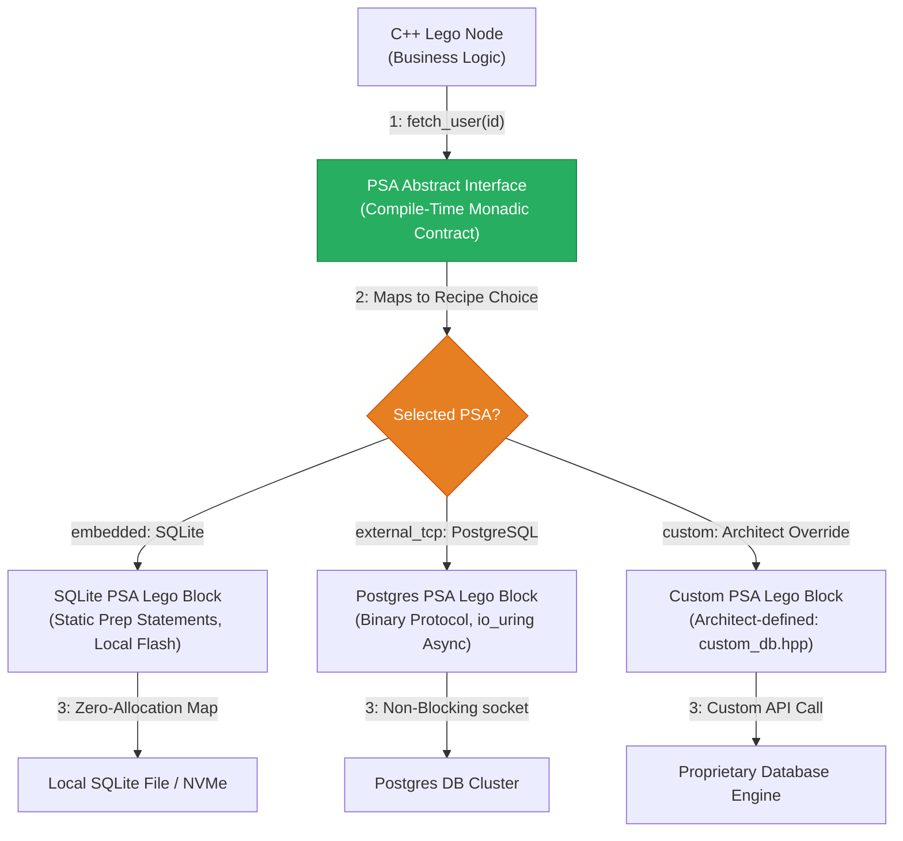

### 1. Compiler-Enforced PSA Guidelines (The Constraints)
To maintain structural compliance inside high-performance and safety-critical execution spaces, the compiler enforces two strict restrictions on any database adapter:
1.  **Zero-Allocation Result Structures:** All returned database records must be mapped directly into stack-allocated, zero-copy payload structures.
2.  **Asynchronous, Non-Blocking Operations:** Any remote database queries must execute asynchronously, scheduling socket reads/writes directly through the application's underlying reactor (e.g., `io_uring` on Linux) to prevent thread stall.

### 2. Abstract C++ Contract Definition (`user_processor.hpp`)
The functional Lego block defines its storage queries strictly via abstract methods, remaining completely decoupled from SQL, BSON, or driver-level connections.

```cpp
#pragma once
#include <cstdint>
#include <string_view>

// Declared data schema
struct UserRecord {
    uint64_t user_id;
    char username[64];
    uint32_t account_balance;
};

enum class DbError : uint8_t { Success, QueryFailed, WriteFailed, Timeout };

// Monadic compiler result container
template <typename T, typename E>
class [[nodiscard]] Result {
private:
    union { T value; E error; };
    bool success;
public:
    Result(T val) : value(val), success(true) {}
    Result(E err) : error(err), success(false) {}
    inline bool is_ok() const { return success; }
    inline T get_value() { return value; }
    inline E get_error() { return error; }
};

// The strict abstract contract enforced by the compiler
class UserStorageContract {
public:
    virtual ~UserStorageContract() = default;
    virtual Result<UserRecord, DbError> fetch_user(uint64_t user_id) = 0;
    virtual Result<void, DbError> update_balance(uint64_t user_id, uint32_t new_balance) = 0;
};

// Core Business Logic Node
class UserProcessor {
private:
    UserStorageContract& db;

public:
    UserProcessor(UserStorageContract& adapter) : db(adapter) {}

    void process_transaction(uint64_t user_id, uint32_t transaction_cost) {
        auto result = db.fetch_user(user_id);
        if (result.is_ok()) {
            UserRecord record = result.get_value();
            if (record.account_balance >= transaction_cost) {
                db.update_balance(user_id, record.account_balance - transaction_cost);
            }
        }
    }
};
```

### 3. Custom Architect-Written Adapter (`custom_db_adapter.hpp`)
The architect can write their own database adapter to connect proprietary or licensed database platforms, wrapping the execution logic within the compiler's strict, allocation-free constraints.

```cpp
#pragma once
#include "user_processor.hpp"
#include <cstring>
#include <proprietary_db_client.h> // Proprietary licensed C-API

class CustomLicencedDBAdapter : public UserStorageContract {
private:
    ProprietaryClient* client_ctx;

public:
    CustomLicencedDBAdapter() {
        client_ctx = proprietary_connect("db://prod-cluster:9000");
    }

    ~CustomLicencedDBAdapter() override {
        proprietary_disconnect(client_ctx);
    }

    Result<UserRecord, DbError> fetch_user(uint64_t user_id) override {
        alignas(64) char raw_buffer[256];
        size_t bytes_read = 0;
        
        // Execute the proprietary non-blocking call
        int rc = proprietary_query_bin(client_ctx, user_id, raw_buffer, &bytes_read);
        if (rc != PROPRIETARY_SUCCESS) {
            return Result<UserRecord, DbError>(DbError::QueryFailed);
        }

        // Direct zero-copy memory copy into the stack-allocated structure
        UserRecord record;
        std::memcpy(&record, raw_buffer, sizeof(UserRecord));
        return Result<UserRecord, DbError>(record);
    }

    Result<void, DbError> update_balance(uint64_t user_id, uint32_t new_balance) override {
        int rc = proprietary_update_int(client_ctx, user_id, "account_balance", new_balance);
        if (rc != PROPRIETARY_SUCCESS) {
            return Result<void, DbError>(DbError::WriteFailed);
        }
        return Result<void, DbError>();
    }
};
```

### 4. Topology Recipe Registration (YAML)
The architect maps their custom implementation file directly to the database edge inside the recipe.

```yaml
topology:
  targets:
    pi_hub:
      arch: "aarch64-linux-gnu"
      os: "linux"
      profile: "ThreadPerCore"

  nodes:
    - name: TransactionEngine
      target: "pi_hub"
      source: "user_processor.hpp"
      logic_type: "UserProcessor"
      
    - name: EnterpriseDatabaseAdapter
      target: "pi_hub"
      source: "custom_db_adapter.hpp" # Architect-written implementation
      logic_type: "CustomLicencedDBAdapter"

  edges:
    - from: "TransactionEngine.db"
      to: "EnterpriseDatabaseAdapter"
      sla:
        max_latency_ms: 10 # Proven performance boundary
```

### 5. Compiler Fused Static Output (`main.cpp`)
When compiled with Strategy B (Static Fusion), the STC compiler completely optimizes out the C++ virtual method table. The interface method call `db.fetch_user()` compiles directly into a zero-latency, inlined assembly jump to the physical implementation:

```cpp
// Auto-generated by STC for target_pi_hub/main.cpp
#include "user_processor.hpp"
#include "custom_db_adapter.hpp"

int main() {
    // Statically fused execution path.
    // The C++ virtual method tables (VMTs) are completely optimized out compile-time;
    // 'db.fetch_user()' compiles to a direct register-jump to 'CustomLicencedDBAdapter::fetch_user()'.
    CustomLicencedDBAdapter db_adapter;
    UserProcessor engine(db_adapter);

    while (true) {
        // Continuous, high-frequency, non-blocking polling execution loop
        engine.process_transaction(10024, 50);
    }
}
```

---

<a id="conditional-compliance-framework"></a>

---

## 9. Conditional Compliance Framework

The STC compiler switches its compilation strictness dynamically based on the declarative profile declared in the YAML recipe:

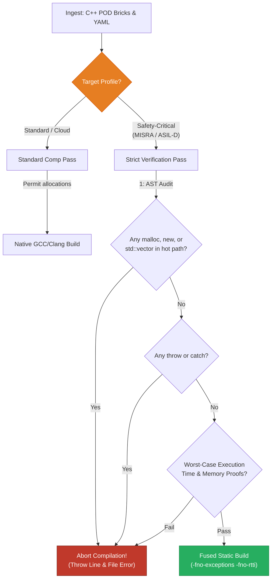

| Metric / Feature | Standard / Cloud Profile | Safety-Critical (MISRA / ASIL-D) Profile |
| :--- | :--- | :--- |
| **Heap Allocations** | Permitted during initialization; managed via local pools during runtime. | **Strictly Forbidden.** Zero dynamic allocation (`malloc`, `new`, `std::vector`) at runtime or boot [7]. |
| **Exception Handling** | Standard C++ `try`/`catch` blocks allowed. | **Forbidden.** Compile flag `-fno-exceptions` enforced. Error propagation strictly managed via stack-allocated monadic `Result<T, E>`. |
| **RTTI** | Standard Run-Time Type Information enabled. | **Forbidden.** Compile flag `-fno-rtti` enforced. Polymorphism resolved strictly compile-time via templates. |
| **Pointers** | Smart pointers (`std::shared_ptr`, `std::unique_ptr`) allowed. | **Forbidden.** Raw pointer arithmetic forbidden. Stack references and static offset indexes enforced. |
| **Worst-Case Execution Time** | Best-effort heuristic optimization. | **Formally Proven.** High-precision static WCET analysis determines boundary safety margins [7]. |

---

<a id="memory-model--data-lifetime-guarantees"></a>

---

## 10. Memory Model & Data Lifetime Guarantees

STC guarantees zero-copy, lock-free thread safety across the entire execution graph using a **Static Lifetime Lease Model**:


1.  **Ingress Memory Mapping:** Incoming network or sensor data is read directly into memory-mapped, hugepage-backed ring buffers [4].
2.  **The Compile-Time Lease:** The compiler analyzes the execution path of the DAG. It calculates which nodes require access to the ingress buffer.
3.  **Read-Only Reference Passing:** Data is passed to downstream functional blocks strictly via `const` references. The compiler proves that no downstream block holds a reference to the buffer beyond the execution lifetime of the DAG.
4.  **Automatic Reclamation:** The moment the last leaf node in the DAG completes execution, the memory lease is automatically voided, and the buffer descriptor is returned to the ingress ring for reuse with zero execution cycles spent on memory copy or garbage collection [1].

---

<a id="modularity--the-brick-catalog"></a>

---

## 11. Modularity & The Brick Catalog

The STC compiler treats modularity as a first-class architectural guarantee, not a convention. Every functional unit in a topology is a **Brick**: a self-contained, independently versioned, compiler-verifiable unit with a declared port surface. The **Brick Catalog** is the registry through which the compiler discovers, validates, and versions all available bricks before a recipe can be compiled.

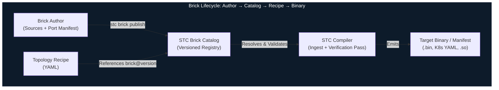

---

### 1. The Three Brick Levels

Not all bricks are equally simple. STC defines three levels of brick complexity. All three share the same port contract surface and are equally first-class citizens in the catalog and recipe. The level only affects what is inside the brick package — it is invisible to anything that connects to the brick's ports.

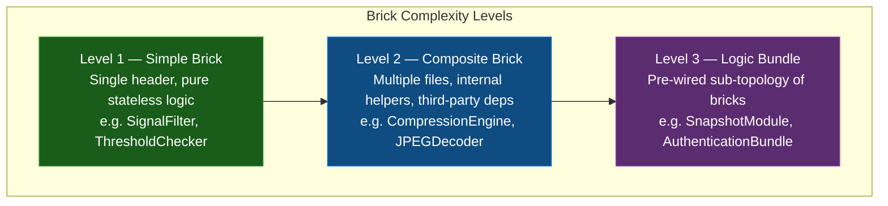

The compiler enforces the same port contract rules on all three levels. The compliance verification scope differs only in what is considered the **hot path** — defined in §11.3.

---

### 2. The Port Contract (All Levels)

Ports are the **only** legal connectivity surface of any brick. The compiler rejects any edge in the recipe that targets a member not declared as a port. This rule is absolute across all three brick levels.

#### Port Annotations

```cpp
// signal_filter.hpp  (Level 1 example)
#pragma once
#include <stc/brick.hpp>  // STC annotation header — zero-overhead, header-only

struct RawSamplePOD {
    float    value;
    uint64_t timestamp_ns;
};

struct FilteredSamplePOD {
    float    smoothed_value;
    float    variance;
    uint64_t timestamp_ns;
};

// STC_BRICK  — declares this class as a compiler-visible brick unit.
// STC_INPUT  — declares an ingress port. The method IS the port handler.
// STC_OUTPUT — declares an egress port. Calling it emits data to the connected edge.
// All other class members are invisible to the topology recipe.
STC_BRICK(SignalFilter)
class SignalFilter {
public:
    STC_INPUT(RawSamplePOD,      on_raw_sample)
    STC_OUTPUT(FilteredSamplePOD, filtered_out)

    void on_raw_sample(const RawSamplePOD& sample) {
        state_.accumulator += sample.value;
        state_.count++;
        filtered_out({ state_.accumulator / state_.count, compute_variance(), sample.timestamp_ns });
    }

private:
    struct State { float accumulator = 0.0f; uint32_t count = 0; } state_;
    float compute_variance() const { return 0.0f; }
};
```

The macros expand to zero runtime overhead. At compile time they emit structured metadata into a dedicated ELF/COFF section that the STC Ingest Parser reads as the port manifest — no runtime reflection, no RTTI.

#### Port Type Contract

Port types must be POD types declared in a **shared type header** visible to both the upstream and downstream brick. The compiler's Edge Type Inference Pass (P4) verifies exact type identity at every edge. Implicit conversions are forbidden; a type mismatch is a compile error (`STC-P04-001`).

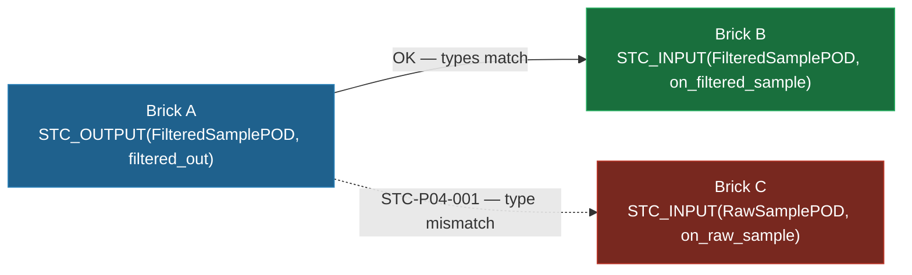

---

### 3. Hot Path vs Cold Path

Compliance rules (`no_heap`, WCET, no exceptions) apply only to the **hot path** — the call chain reachable from any `STC_INPUT` port handler during normal execution. They do not apply to the **cold path** — constructors, destructors, and one-time initialization methods.

This distinction is fundamental and applies to all three brick levels:

| Execution Path | When it runs | Compliance scope |
| :--- | :--- | :--- |
| **Hot path** | Every time a port handler is invoked (data flow) | Full profile constraints enforced (no heap, WCET, no exceptions) |
| **Cold path** | Once at startup / shutdown | Relaxed — heap allocation, blocking I/O, and initialization libraries are permitted |

A `CompressionEngine` brick may allocate a 4 MB zstd working buffer and dictionary **once in its constructor** — cold path, safe under all profiles including ASIL-D initialization rules. The `on_data_in` port handler that calls `zstd_compress()` on the pre-allocated context must be zero-allocation — hot path.

The `hot_path_entrypoints` field in the brick manifest makes this boundary explicit and compiler-verifiable.

---

### 4. Level 1 — Simple Brick

A single header file containing one `STC_BRICK`-annotated class with pure stateless logic. No external dependencies. The `SignalFilter` example in §11.2 is the canonical form.

**When to use:** Any leaf-level domain operation — filtering, transforming, validating, routing, threshold checking. If the entire logic fits cleanly in one header with no third-party code, it is a Level 1 brick.

**Package layout:**
```
SignalFilter/
└── 1.4.2/
    ├── brick.stc.yaml
    ├── signal_filter.hpp
    ├── shared_types/
    │   └── signal_types.hpp    # Shared POD type headers
    └── brick.sha256
```

**Manifest:**
```yaml
brick:
  name: "SignalFilter"
  version: "1.4.2"
  level: 1

  ports:
    inputs:
      - name: "on_raw_sample"
        type: "RawSamplePOD"
    outputs:
      - name: "filtered_out"
        type: "FilteredSamplePOD"

  hot_path_entrypoints:
    - "on_raw_sample"

  implementations:
    - lang: "cpp"
      source: "signal_filter.hpp"
      logic_type: "SignalFilter"
      constraints:
        no_heap: true
        no_exceptions: true
        max_stack_bytes: 512

  compatible_profiles:
    - "ASIL_D"
    - "MedTech_Class_C"
    - "CloudSaaS"
    - "ThreadPerCore"
    - "Standard"
```

---

### 5. Level 2 — Composite Brick

A brick composed of **multiple source files**, internal helper classes, and optionally third-party library dependencies. It still presents a single, clean port surface to the topology. The compiler sees only the ports; the internal structure is the brick author's responsibility.

**When to use:** Any domain operation that is too complex for a single header — data compression, image decoding, cryptographic operations, protocol parsing, or any brick that wraps a licensed third-party library.

**When two bricks become one:** If two bricks are so tightly coupled that one is meaningless without the other — for example, a compressor and its state manager that share internal data structures — they are not two bricks. They are one Composite Brick with internal modules. The rule is: **if the relationship between two components is implementation coupling rather than data flow, they belong inside one brick boundary.** Inheritance between bricks falls into this category. The correct model is always one Composite Brick with private internal classes, not two Simple Bricks with a class hierarchy between them.

**Package layout:**
```
CompressionEngine/
└── 2.0.0/
    ├── brick.stc.yaml
    ├── compression_engine.hpp      # Primary header — port declarations
    ├── compression_engine.cpp      # Implementation
    ├── internal/
    │   ├── huffman_table.cpp
    │   └── bit_stream.hpp
    ├── vendor/
    │   └── lz4/
    │       └── lz4.c               # Bundled third-party source
    ├── shared_types/
    │   └── compression_types.hpp
    └── brick.sha256
```

**Manifest:**
```yaml
brick:
  name: "CompressionEngine"
  version: "2.0.0"
  level: 2

  ports:
    inputs:
      - name: "on_data_in"
        type: "RawDataPOD"
    outputs:
      - name: "compressed_out"
        type: "CompressedDataPOD"

  hot_path_entrypoints:
    - "on_data_in"         # P9 compliance checks trace from here; constructor is excluded

  implementations:
    - lang: "cpp"
      sources:
        - "compression_engine.hpp"
        - "compression_engine.cpp"
        - "internal/huffman_table.cpp"
        - "internal/bit_stream.hpp"
      logic_type: "CompressionEngine"
      constraints:
        no_heap: true           # Enforced on hot_path_entrypoints only
        no_exceptions: true
        max_stack_bytes: 1024

  dependencies:
    - name: "zstd"
      type: "system_library"        # system_library | bundled_source | binary_archive
      link_flag: "-lzstd"
      hot_path_allocation_free: true  # Architect declaration: zstd streaming API uses pre-allocated ctx
      source_available: false         # Binary-only — declaration is trusted, recorded in audit trail
    - name: "lz4"
      type: "bundled_source"
      path: "vendor/lz4/lz4.c"
      hot_path_allocation_free: true
      source_available: true          # Compiler traces call chains through lz4.c

  compatible_profiles:
    - "ASIL_D"
    - "MedTech_Class_C"
    - "CloudSaaS"
    - "Standard"
```

#### Binary-Only Dependencies

When a dependency has `source_available: false`, the compiler cannot perform interprocedural call-chain analysis through it. Instead, it trusts the `hot_path_allocation_free` declaration and records it as an **architect attestation** in the build audit trail. For safety-critical profiles (`ASIL_D`, `DO178C`), this attestation is a mandatory signed field — unsigned attestations on binary-only dependencies cause `STC-P09-006`.

---

### 6. Level 3 — Logic Bundle

A Logic Bundle is a **pre-wired, versioned sub-topology** — a group of bricks (any level) with their internal edges declared and verified. The bundle exposes only **external ports** to the parent recipe. From the parent recipe's perspective, a bundle is instantiated exactly like a single brick node. The internal topology is opaque.

**When to use:** Any reusable multi-brick composition that represents a coherent, independently testable unit of functionality — a snapshot module, an authentication flow, a sensor fusion pipeline, a protocol stack.

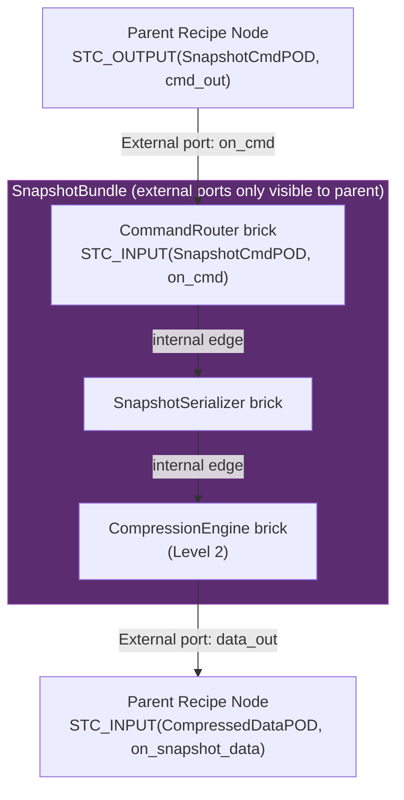

#### Bundle Manifest (`bundle.stc.yaml`)

The bundle ships with its own internal recipe (a full topology YAML) and a manifest that declares only the external port surface:

```yaml
bundle:
  name: "SnapshotBundle"
  version: "1.2.0"
  level: 3
  internal_recipe: "snapshot_bundle.recipe.yaml"  # Full internal topology

  external_ports:
    inputs:
      - name: "on_create_cmd"
        type: "SnapshotCmdPOD"
        maps_to: "CommandRouter.on_cmd"
      - name: "on_update_cmd"
        type: "SnapshotCmdPOD"
        maps_to: "CommandRouter.on_cmd"
      - name: "on_delete_cmd"
        type: "SnapshotCmdPOD"
        maps_to: "CommandRouter.on_cmd"
    outputs:
      - name: "snapshot_data_out"
        type: "CompressedDataPOD"
        maps_to: "CompressionEngine.compressed_out"

  compatible_profiles:
    - "CloudSaaS"
    - "Standard"
    - "ThreadPerCore"
```

The internal recipe is a standard topology YAML with `nodes` and `edges` blocks. The compiler verifies the internal topology as an independent unit during `stc bundle verify`, producing a **pre-verification certificate** stored alongside the bundle manifest. When the parent recipe references a pre-verified bundle, the internal topology re-runs only the ingest passes (P1–P3) for freshness checking — the verification passes (P8–P13) are skipped if the certificate is valid. For safety-critical profiles, the certificate must be re-verified against the target profile at parent compile time.

#### Using a Bundle in a Recipe

```yaml
nodes:
  - name: SnapshotService
    bundle: "SnapshotBundle@1.2.0"   # Resolved from catalog like any brick
    target: "cloud_target"

  - name: CommandSource
    brick: "CommandDispatcher@3.0.1"
    target: "cloud_target"

  - name: StorageWriter
    brick: "ObjectStorageWriter@2.0.0"
    target: "cloud_target"

edges:
  - from: "CommandSource.snapshot_cmd_out"
    to: "SnapshotService.on_create_cmd"

  - from: "SnapshotService.snapshot_data_out"
    to: "StorageWriter.on_data_in"
```

---

### 7. Composition Over Coupling

STC enforces a single rule for inter-brick relationships: **data flows between bricks; implementation does not.**

| Pattern | STC Treatment |
| :--- | :--- |
| Brick A sends data to Brick B via an edge | Correct — this is the Lego principle |
| Brick A and B share a private utility function | Both include the same internal header — they are independent bricks |
| Brick A inherits from Brick B at the C++ level | A and B are implementation-coupled — they must be one Composite Brick |
| Brick A holds a pointer to Brick B internally | A and B are implementation-coupled — they must be one Composite Brick |
| Brick A and B share state that is not a port type | A and B are implementation-coupled — they must be one Composite Brick |

The compiler does not parse inheritance hierarchies between separately cataloged bricks. If two bricks share a base class, that base class is a private internal detail of a Composite Brick that contains both. The base class is never registered in the catalog independently; it is never a node in the topology.

High-frequency communication between tightly related bricks is not a special case requiring special ports. When both bricks are assigned to the same thread, the compiler selects Layer 0 transport — the `STC_OUTPUT` call is inlined directly into the downstream `STC_INPUT` handler. There is no queue, no copy, no synchronization overhead. Standard ports are the correct and zero-cost mechanism.

---

### 8. The Brick Catalog

The Brick Catalog is the versioned, content-addressable registry that the STC compiler queries during the Recipe Ingest phase. It resolves brick and bundle references to exact, verified source packages. It is not a binary package manager — it delivers source packages that the compiler always builds from scratch against the exact target profile.

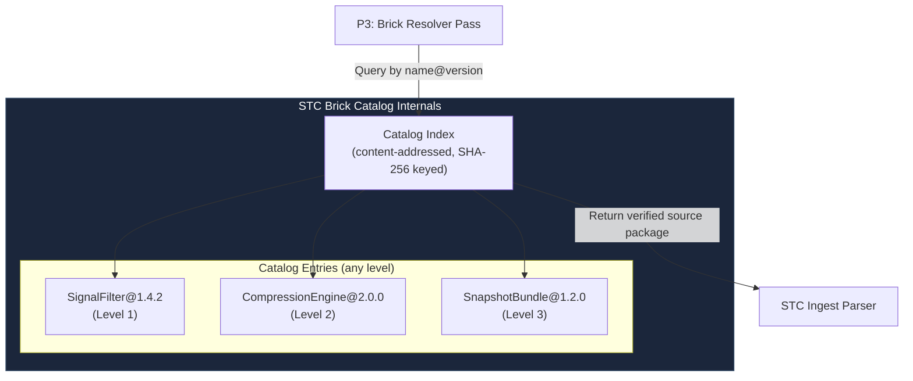

#### Catalog Storage Modes

| Mode | Storage | Use Case |
| :--- | :--- | :--- |
| **Local filesystem** | `~/.stc/catalog/` or `.stc/catalog/` relative to recipe | Developer workstation, offline embedded builds |
| **Git-backed** | Any bare Git repository (SSH, HTTPS) | Team-shared brick libraries, CI/CD pipelines |
| **Enterprise registry** | STC Registry Server (gRPC API, TLS-authenticated) | Production, compliance-audited environments |

```yaml
topology:
  catalog:
    sources:
      - type: "local"
        path: "./.stc/catalog"
      - type: "git"
        url: "ssh://git@bricks.internal.corp/stc-bricks.git"
        ref: "release/2026.1"
      - type: "registry"
        url: "https://registry.stc.internal.corp"
        auth: "mtls"
    resolution: "first-match"
```

---

### 9. Brick Resolution & Versioning

The Brick Resolver Pass (P3) runs first in the Pass-DAG and resolves every `brick:` or `bundle:` reference to a concrete, pinned catalog entry before any other pass begins.

```yaml
nodes:
  - name: FilterStage1
    brick: "SignalFilter@1.4.2"       # Exact pin — production default
    target: "embedded_target"

  - name: FilterStage2
    brick: "SignalFilter@^1.4.0"      # Compatible minor — resolves to highest 1.4.x
    target: "embedded_target"

  - name: SnapshotService
    bundle: "SnapshotBundle@~1.2"     # Patch-compatible — resolves to highest 1.2.x
    target: "cloud_target"
```

The compiler writes a **lock file** (`system_recipe.lock.yaml`) after first resolution. Subsequent builds use the lock file for byte-identical reproducibility.

```yaml
# system_recipe.lock.yaml — auto-generated, commit to version control
resolved:
  - ref: "SignalFilter@^1.4.0"
    resolved: "SignalFilter@1.4.2"
    level: 1
    sha256: "a3f9c1e827d..."
    source: "local"
  - ref: "SnapshotBundle@~1.2"
    resolved: "SnapshotBundle@1.2.3"
    level: 3
    sha256: "f2a8b3d410c..."
    source: "git"
    bundle_cert: "snapshot_bundle_1.2.3.stccert"  # Pre-verification certificate
```

---

### 10. Archetype Expansion

Archetypes are **compile-time brick configuration templates** — parameter bundles applied at the Brick Resolver Pass. They work identically for all three brick levels.

```yaml
archetypes:
  analog_sensor:
    brick: "SignalFilter@1.4.2"
    target: "embedded_target"
    sample_rate_hz: 1000
    constraints:
      no_heap: true

nodes:
  - name: ProbeSensor1
    archetype: "analog_sensor"          # Uses archetype as-is

  - name: HighFreqProbe
    archetype: "analog_sensor"
    overrides:
      sample_rate_hz: 5000              # Only this parameter is overridden
```

---

### 11. Compiler Verification of Bricks

After resolution, two verification passes run against every brick and bundle:

#### Pass P8: Structural Integrity Verifier
- Every port named in the manifest exists in the source with the correct signature.
- Every port type is trivially copyable (`std::is_trivially_copyable`).
- No port type contains a virtual method table.
- For Level 2: all declared source files are present; all declared dependencies are resolvable.
- For Level 3: the internal recipe compiles cleanly as a standalone topology.

#### Pass P9: Profile Compliance Verifier
Compliance checks traverse only the **hot path** — method chains reachable from `hot_path_entrypoints`. The constructor and any methods not reachable from a declared entrypoint are excluded.

- No `malloc`/`new`/`delete` on the hot path (full interprocedural call-chain via Clang AST).
- For binary-only dependencies: `hot_path_allocation_free: true` must be present and is recorded as an architect attestation in the build audit trail. Missing attestation on a safety-critical profile emits `STC-P09-006`.
- For bundled-source dependencies with `source_available: true`: the compiler traces call chains through the vendor source directly.

```
[STC ERROR] STC-P09-001: Dynamic allocation on safety-critical hot path
  Node       : FilterStage1
  Brick      : SignalFilter@1.4.2
  Profile    : ASIL_D
  Location   : signal_filter.hpp:47  →  update_history()  →  std::vector::push_back
  Rule       : ASIL_D.NO_HEAP_ALLOCATION (hot path entrypoint: on_raw_sample)
  Resolution : Replace std::vector<float> with std::array<float, 64> and a manual ring index.
```

---

<a id="communication-transport-taxonomy--swapping"></a>

---

## 12. Communication Transport Taxonomy & Swapping

In STC, the communication channel between two nodes is not a fixed implementation choice baked into the source code. It is a **compiler-resolved property of an edge**, declared in the topology recipe and synthesized by the Transport Selection Pass. The same two bricks can communicate via a direct CPU register transfer, a lock-free ring buffer, shared memory, a local socket, or a cross-machine encrypted TCP tunnel — without any change to their C++ source.

This section defines the complete transport taxonomy, the rules the compiler follows when selecting or validating a transport, and the mechanism by which transports can be swapped at runtime when SLA conditions change.

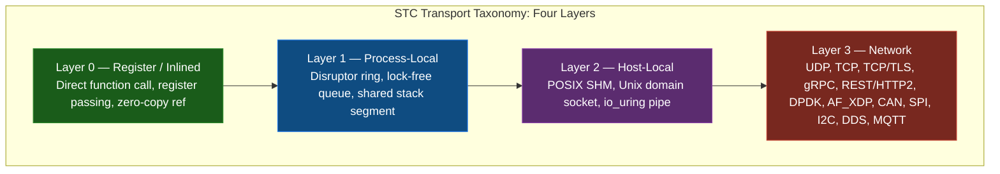

The layer number directly correlates to latency cost, serialization overhead, and SLA complexity. The compiler always selects the **lowest viable layer** that satisfies the edge's declared constraints — it never over-provisions transport capacity.

---

### 1. Transport Taxonomy

#### Layer 0 — Register / Inlined (Zero-Overhead)
Both nodes are assigned to the same physical core and execution thread. The compiler fuses the output function call of the upstream node directly into the input call of the downstream node as a static, inlined assembly instruction. No memory copy, no queue, no synchronization.

| Property | Value |
| :--- | :--- |
| **Latency** | Sub-nanosecond (register hand-off) |
| **Serialization** | None — direct `const` reference |
| **Allowed profiles** | All |
| **Cross-target** | No — both nodes must share the same `target` |
| **Safe for ASIL-D** | Yes — only viable option for ASIL-D hot paths |

#### Layer 1 — Process-Local (Lock-Free Ring)
Both nodes run in the same OS process but on different threads or cores. The compiler synthesizes a Disruptor-pattern lock-free ring buffer on the edge. The upstream node writes into the ring; the downstream node polls or is notified via a wait-free sequence.

| Property | Value |
| :--- | :--- |
| **Latency** | 50–300 ns (cache-line hand-off) |
| **Serialization** | None — shared memory within process |
| **Allowed profiles** | All except ASIL-D static-fusion builds |
| **Cross-target** | No — same process boundary required |
| **Safe for ASIL-D** | Conditional — permitted when WCET of ring drain is formally proven |

#### Layer 2 — Host-Local (IPC / SHM)
Nodes run in separate OS processes on the same physical host. The compiler generates a shared memory region (POSIX SHM or `memfd`) mapped into both process address spaces, with a Unix domain socket or `io_uring` eventfd as the notification mechanism.

| Property | Value |
| :--- | :--- |
| **Latency** | 1–10 µs (kernel IPC path) |
| **Serialization** | None for SHM — raw POD layout shared directly |
| **Allowed profiles** | Standard, CloudSaaS, ThreadPerCore |
| **Cross-target** | No — same host required |
| **Safe for ASIL-D** | No — separate process isolation breaks formal memory proofs |

#### Layer 3 — Network (Remote / Cross-Target)
Nodes run on different hosts, containers, or physical targets. A serialization bridge is synthesized on both sides of the edge. The transport protocol is declared in the edge's `sla.bridge.protocol` field. If omitted, the compiler selects the default for the target pair.

| Protocol | Serialization | Default Use Case |
| :--- | :--- | :--- |
| **UDP** | SBE / raw bytes | Low-latency telemetry, game netcode, sensor bursts |
| **TCP** | SBE / Protobuf | Reliable streaming between services |
| **TCP/TLS** | SBE / Protobuf | Encrypted inter-service communication |
| **gRPC** | Protobuf | Cloud microservice interconnects |
| **REST / HTTP2** | JSON / Protobuf | External API surfaces, browser-facing endpoints |
| **DPDK / AF_XDP** | SBE / raw bytes | Kernel-bypass, sub-10µs packet processing |
| **DDS** | CDR / SBE | Robotics, aerospace publish-subscribe fabric |
| **MQTT** | JSON / binary | IoT device telemetry, constrained networks |
| **CAN** | Fixed-frame binary | Automotive ECU-to-ECU communication |
| **SPI / I2C** | Fixed-frame binary | Embedded MCU peripheral buses |

---

### 2. Transport Selection Rules

The compiler's **Transport Selection Pass** runs after the Brick Resolver Pass and before the SLA Binding Pass. It evaluates every edge in the Clay AST and assigns a concrete transport using the following ordered rule chain:

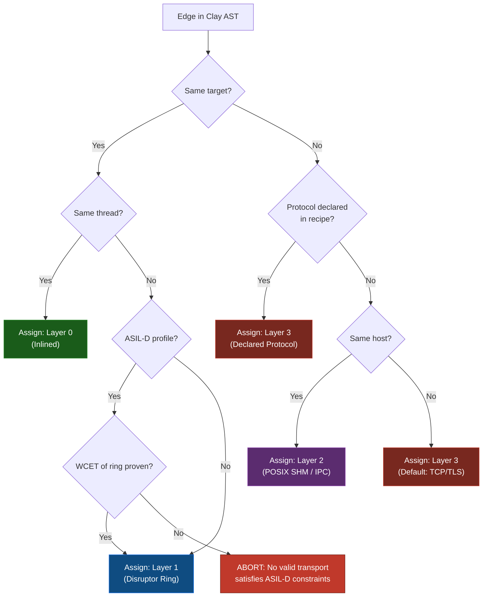

#### Explicit Transport Declaration in the Recipe

The architect can pin a specific transport on any edge, overriding the compiler's automatic selection:

```yaml
edges:
  # Layer 0 — forced inlined call, both nodes must be on same thread
  - from: "FilterStage1.filtered_out"
    to: "ThresholdChecker.on_filtered_sample"
    transport:
      layer: 0

  # Layer 1 — explicit Disruptor ring with capacity and wait strategy
  - from: "DataIngress.frame_out"
    to: "FrameProcessor.on_frame"
    transport:
      layer: 1
      ring_capacity: 4096        # Must be power of 2
      wait_strategy: "BusySpin"  # BusySpin | Yielding | Sleeping | BlockingWait

  # Layer 3 — cross-target gRPC with explicit serialization
  - from: "EmbeddedSensor.reading_out"
    to: "CloudAnalytics.on_reading"
    transport:
      layer: 3
      protocol: "gRPC"
      serialization: "Protobuf"
    sla:
      max_latency_ms: 20
      delivery_guarantee: "AtLeastOnce"
      encryption: "TLS_1_3"

  # Layer 3 — kernel-bypass DPDK for sub-microsecond packet forwarding
  - from: "PacketIngestor.raw_frame_out"
    to: "PacketClassifier.on_raw_frame"
    transport:
      layer: 3
      protocol: "DPDK"
      serialization: "SBE"
      queue_depth: 2048
```

---

### 3. Cross-Target Bridge Auto-Generation

When an edge crosses a target boundary (e.g., `embedded_target` → `cloud_target`), the compiler auto-generates a **Transport Bridge** — a pair of symmetric Pillar 3 serialization bricks injected onto both ends of the edge. The architect does not write these; the compiler synthesizes them from the declared protocol and the POD types of the connected ports.

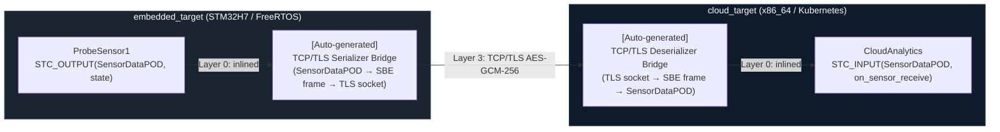

The auto-generated bridge bricks are:
- Compiled against the source target's profile and constraints (a bridge on an ASIL-D target obeys ASIL-D allocation rules)
- Registered in the Clay AST as synthetic entities distinct from user-authored bricks
- Emitted into the build output alongside user brick code, with source readable for audit

---

### 4. Runtime Transport Swapping

Runtime transport swapping is the physical implementation of **Reactive Physics (Principle 6)**: when an active edge's SLA is violated, the STC runtime morphs the transport to a pre-compiled fallback path without halting execution.

#### The Swap Sequence

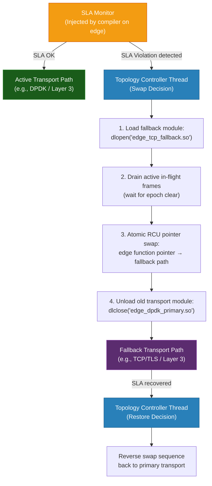

#### Declaring a Fallback Transport in the Recipe

The fallback chain is declared alongside the primary transport on the edge. The compiler pre-compiles both paths at build time — there is no on-demand compilation at runtime.

```yaml
edges:
  - from: "PacketIngestor.raw_frame_out"
    to: "PacketClassifier.on_raw_frame"
    transport:
      primary:
        protocol: "DPDK"
        serialization: "SBE"
      fallback:
        - protocol: "AF_XDP"       # First fallback: kernel-bypass but without DPDK PMD
          trigger: "sla_breach"
        - protocol: "TCP"          # Second fallback: reliable but higher latency
          trigger: "sla_breach_critical"
    sla:
      max_latency_us: 50
      breach_threshold: 3          # Trigger swap after 3 consecutive SLA violations
      recovery_window_ms: 500      # Restore primary after 500ms of SLA compliance on fallback
```

#### Transport Swap Constraints

| Constraint | Rule |
| :--- | :--- |
| **Layer downgrade only** | A swap may only move to a higher layer number (e.g., Layer 1 → Layer 2). Upgrading to a lower layer requires a full recompile. |
| **Pre-compiled fallbacks only** | Fallback transport modules are compiled at build time. The runtime never JIT-compiles a new transport path. |
| **Static Fusion (Strategy B) blocks swapping** | If the target profile uses Static Fusion, transport selection is baked into the binary. No swap mechanism is injected. |
| **POD type unchanged** | The data type flowing across the edge does not change during a swap. Only the serialization and physical channel change. |
| **SLA monitor always active** | The SLA monitor itself is on a Layer 0 injected path and is never part of the swapped transport. It survives the swap. |

---

### 5. Transport-Aware SLA Binding

The SLA declared on an edge is always validated against the capabilities of the assigned transport. The **SLA Binding Pass** runs after Transport Selection and rejects combinations that are structurally impossible.

```
[STC ERROR] SLA binding failure
  Edge       : ProbeSensor1.state → CloudAnalytics.on_sensor_receive
  Transport  : UDP (Layer 3)
  SLA field  : delivery_guarantee = "ExactlyOnce"
  Violation  : UDP provides no delivery guarantee. ExactlyOnce requires TCP or gRPC.
  Resolution : Change protocol to "TCP" or "gRPC", or relax guarantee to "BestEffort".
```

Valid SLA field combinations per transport:

| SLA Field | UDP | TCP | TCP/TLS | gRPC | DPDK | Layer 0/1 |
| :--- | :---: | :---: | :---: | :---: | :---: | :---: |
| `max_latency_us` | ✓ | ✓ | ✓ | ✓ | ✓ | ✓ |
| `max_latency_ms` | ✓ | ✓ | ✓ | ✓ | ✓ | ✓ |
| `delivery_guarantee: BestEffort` | ✓ | ✓ | ✓ | ✓ | ✓ | ✓ |
| `delivery_guarantee: AtLeastOnce` | — | ✓ | ✓ | ✓ | — | ✓ |
| `delivery_guarantee: ExactlyOnce` | — | ✓ | ✓ | ✓ | — | ✓ |
| `encryption` | — | — | ✓ | ✓ | — | — |
| `ordering_guaranteed` | — | ✓ | ✓ | ✓ | — | ✓ |
| `max_queue_depth` | ✓ | ✓ | ✓ | ✓ | ✓ | ✓ |

---

<a id="compiler-pass-specification"></a>

---

## 13. Compiler Pass Specification

Section 4 defines the Clay AST structure and the Pass-DAG executor concept. This section specifies the **named, ordered passes** that execute within that framework for every compilation. Each pass has a defined role, a set of inputs it reads from the Clay AST, outputs it writes back, and the exact failure conditions that abort compilation.

Passes are organized into four sequential **stages**. Within a stage, independent passes may execute in parallel on separate ECS component queries. No pass in a later stage begins until all passes in the preceding stage have completed successfully.

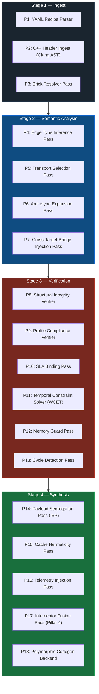

---

### Stage 1 — Ingest

All ingest passes run first. Their collective output is a fully populated Clay AST registry with every entity, port, edge, and target represented. No semantic analysis or code generation touches the AST until all ingest passes complete without error.

---

#### P1: YAML Recipe Parser

| | |
| :--- | :--- |
| **Reads** | `system_recipe.yaml` from filesystem |
| **Writes** | Raw topology entities (nodes, edges, targets, profiles, archetypes) into the Clay AST ECS registry |
| **Fails if** | YAML is malformed; a required top-level key (`topology.nodes`, `topology.edges`) is missing; a profile overlay references a non-existent target key; a node references an archetype name not declared in `topology.archetypes`; an `extends:` chain contains a circular reference (`STC-P01-006`); an extension entity name collides with a base entity name (`STC-P01-005`) |

When `topology.extends:` is present, P1 resolves the full extension chain before writing any entity to the Clay AST. The chain is resolved depth-first: the deepest base recipe is written first, each tier's additions are written in order. By the time P1 completes, the Clay AST contains the complete merged entity set. No other pass has visibility into which tier each entity originated from.

The parser writes each YAML construct as an entity with a `RecipeSourceComponent` tagging the originating file path and line number. Every downstream error message is anchored to this component to produce source-location-aware diagnostics.

---

#### P2: C++ Header Ingest (Clang AST)

| | |
| :--- | :--- |
| **Reads** | C++ header file paths from each node entity's `RecipeSourceComponent.source` field |
| **Writes** | `CppAstComponent` per node entity, containing the Clang AST subtree for the brick class; `PortMetadataComponent` per port entity, containing the C++ type, memory layout, and alignment |
| **Fails if** | A declared `source` file does not exist or does not compile under the target's flags (`-fno-exceptions`, `-fno-rtti`, architecture flags); a `STC_INPUT` or `STC_OUTPUT` annotation references an undeclared type; the header includes a forbidden system header (e.g., `<thread>`, `<malloc.h>`) for safety-critical profiles |

This pass runs Clang as a library (not a subprocess) against each header in the context of the target's compiler flags. This means the same C++ source is parsed differently under `ASIL_D` and `CloudSaaS` profiles — a type that is legal in one context may be illegal in another.

---

#### P3: Brick Resolver Pass

| | |
| :--- | :--- |
| **Reads** | `brick@version` references from each node entity; catalog source configuration from the recipe |
| **Writes** | `BrickResolvedComponent` per node entity, containing the pinned version, catalog source, and SHA-256 content hash; updates or creates `system_recipe.lock.yaml` |
| **Fails if** | A referenced brick name or version does not exist in any configured catalog source; a resolved brick's SHA-256 does not match the lock file entry (tamper detection); a brick's `compatible_profiles` list does not include the target node's active profile |

---

### Stage 2 — Semantic Analysis

Semantic analysis passes transform the raw AST into a fully typed, transport-assigned, dependency-wired graph. All four passes in this stage operate on disjoint component sets and may execute in parallel.

---

#### P4: Edge Type Inference Pass

| | |
| :--- | :--- |
| **Reads** | Edge entities; `PortMetadataComponent` of the source and destination node ports |
| **Writes** | `EdgeTypeComponent` per edge entity, recording the resolved C++ POD type flowing across the edge |
| **Fails if** | The `STC_OUTPUT` type of the source port is not exactly equal to the `STC_INPUT` type of the destination port (no implicit conversions); a wildcard edge binding (`ProbeSensor*.state`) matches zero nodes after expansion |

Wildcard edge bindings are expanded here. `ProbeSensor*.state → CloudAnalytics.on_sensor_receive` is resolved to one concrete edge entity per matching node, each with its own `EdgeTypeComponent`. All concrete edges derived from a wildcard binding must resolve to the same port type, or the pass aborts with a heterogeneous-wildcard error.

---

#### P5: Transport Selection Pass

| | |
| :--- | :--- |
| **Reads** | Edge entities; `EdgeTypeComponent`; node `target` assignments; explicit `transport:` declarations from the recipe |
| **Writes** | `TransportComponent` per edge entity, recording the assigned layer, protocol, serialization format, ring capacity, and fallback chain |
| **Fails if** | An explicitly declared transport is incompatible with the node target pair (e.g., Layer 0 declared across different targets); a fallback chain contains a transport at a lower layer number than the primary; an ASIL-D edge is assigned Layer 1 without a WCET proof component being present |

This pass implements the full selection rule chain defined in Section 12.2.

---

#### P6: Archetype Expansion Pass

| | |
| :--- | :--- |
| **Reads** | Node entities carrying an `archetypes` reference; archetype definition entities from the recipe |
| **Writes** | Merges archetype parameters into each node entity's component set; node-level `overrides` take precedence over archetype defaults; removes the archetype reference component after merge |
| **Fails if** | An override key does not exist in the archetype's declared parameter set; a merged parameter value violates the brick's `brick.stc.yaml` constraints (e.g., `sample_rate_hz` exceeds hardware ADC limit declared in the target's `pin_map`) |

---

#### P7: Cross-Target Bridge Injection Pass

| | |
| :--- | :--- |
| **Reads** | Edge entities carrying a `TransportComponent` at Layer 3; source and destination node target assignments |
| **Writes** | Two new synthetic node entities per cross-target edge (serializer bridge and deserializer bridge); two new Layer 0 edge entities connecting the original source/destination nodes to their respective bridge nodes; marks the original edge as a `BridgedEdge` |
| **Fails if** | The declared protocol has no compiler-provided bridge template for the edge's POD type (architect must supply a custom bridge brick in this case, declared via `transport.custom_bridge_source`) |

Bridge entities carry a `SyntheticBrickComponent` flag. Verification passes treat them identically to user-authored bricks — they must pass all structural and compliance checks for the target profile they are compiled against.

---

### Stage 3 — Verification

Verification passes are read-only relative to the Clay AST structure — they do not add or remove entities. They only add `ViolationComponent` records to failing entities and, once all verification passes complete, the compiler checks for any `ViolationComponent` in the registry. If any exist, compilation aborts and all violations are emitted as structured errors before the process exits. This ensures the architect sees every problem in a single build, not one at a time.

---

#### P8: Structural Integrity Verifier

| | |
| :--- | :--- |
| **Reads** | All node entities; `CppAstComponent`; `PortMetadataComponent`; `BrickResolvedComponent` |
| **Writes** | `ViolationComponent` on any node failing a structural check |
| **Checks** | Every `STC_INPUT`/`STC_OUTPUT` port named in `brick.stc.yaml` is present in the parsed Clang AST; every port type is a POD type (`std::is_trivially_copyable`); no port type contains a virtual method table; no port handler method has a non-`void` return type other than the declared output call |

---

#### P9: Profile Compliance Verifier

| | |
| :--- | :--- |
| **Reads** | All node entities; `CppAstComponent`; active target profile |
| **Writes** | `ViolationComponent` on any node failing a compliance check |
| **Checks** | For safety-critical profiles: no `malloc`/`new`/`delete` reachable from any port handler (full call-chain traversal via Clang AST); no `throw`/`catch`; no `std::shared_ptr`/`std::unique_ptr` on the hot path; no RTTI (`dynamic_cast`, `typeid`); stack frame size within the brick's declared `max_stack_bytes` ceiling |

The call-chain traversal is **interprocedural** — a private helper method called from a port handler is checked, not just the handler itself. The violation report includes the full call chain from port handler to the offending instruction.

---

#### P10: SLA Binding Pass

| | |
| :--- | :--- |
| **Reads** | Edge entities; `TransportComponent`; `SlaComponent` (from recipe SLA declarations) |
| **Writes** | `ViolationComponent` on edges where the declared SLA is incompatible with the assigned transport |
| **Checks** | SLA field compatibility table from Section 12.5; `max_latency_us` / `max_latency_ms` bounds are physically achievable on the assigned transport layer given the target hardware profile |

---

#### P11: Temporal Constraint Solver (WCET)

| | |
| :--- | :--- |
| **Reads** | Node entities on safety-critical profiles; `CppAstComponent`; target CPU architecture from `TargetComponent` |
| **Writes** | `WcetBoundComponent` per node with the proven worst-case execution time in nanoseconds; `ViolationComponent` on any node where WCET cannot be bounded or exceeds the edge's `max_latency` SLA |
| **Checks** | All loops have statically provable iteration bounds; no recursion; instruction count is bounded on the target ISA; the sum of WCET values along the longest DAG path does not exceed any declared end-to-end latency SLA |
| **Only active for** | Profiles: `ASIL_D`, `MedTech_Class_C`, `DO178C`, or any profile with `wcet_required: true` |

---

#### P12: Memory Guard Pass

| | |
| :--- | :--- |
| **Reads** | All node entities; `BrickResolvedComponent.constraints.max_stack_bytes`; `TargetComponent.sram_limit` / `TargetComponent.flash_limit` |
| **Writes** | `MemoryFootprintComponent` per node; `ViolationComponent` on any node or target exceeding its memory ceiling |
| **Checks** | Per-node stack frame size against `max_stack_bytes` constraint; aggregate static memory footprint of all nodes assigned to a target against the target's `sram_limit`; code size against `flash_limit` for embedded targets |

---

#### P13: Cycle Detection Pass

| | |
| :--- | :--- |
| **Reads** | All edge entities forming the compiled DAG |
| **Writes** | `ViolationComponent` if any directed cycle is detected in the node graph |
| **Algorithm** | Depth-first search with grey/black node colouring (Tarjan's algorithm on the ECS edge list) |

Cycles are a structural impossibility in a correctly formed STC topology — data flows from ingress to egress with no feedback loops. Detected cycles are always a recipe authoring error. The violation report names the full cycle path: `NodeA → NodeB → NodeC → NodeA`.

---

### Stage 4 — Synthesis

Synthesis passes transform the verified, fully annotated Clay AST into physical code and deployment manifests. These are the only passes that produce output files.

---

#### P14: Payload Segregation Pass (ISP)

| | |
| :--- | :--- |
| **Reads** | Node entities; `PortMetadataComponent` of each node's input ports; `EdgeTypeComponent` of incoming edges |
| **Writes** | `SlicedPayloadComponent` per node, containing a compiler-generated minimal POD struct with only the fields consumed by that node's port handlers |

This pass implements Compiler Principle 10 (Compile-Time Payload Segregation). If an upstream brick emits a `SensorDataPOD` with 12 fields but the downstream brick only reads `value` and `timestamp_ns`, the compiler generates a 2-field projection struct and packs it into contiguous cache-aligned memory. The downstream brick never sees — and never pays the cache cost of — the other 10 fields.

---

#### P15: Cache Hermeticity Pass

| | |
| :--- | :--- |
| **Reads** | Node entities and their `TargetComponent.cpu_arch`; thread/core pin assignments from `ExecutionPhysicsComponent` |
| **Writes** | `CacheAlignmentDirective` per node, specifying struct member padding, cache-line alignment attributes, and Intel CAT / ARM MPAM partition assignments for safety-critical nodes |

This pass implements Compiler Principle 5 (Temporal & Spatial Hermeticity). It calculates struct field offsets to prevent false sharing between nodes running on adjacent cores and emits `[[gnu::aligned(64)]]` or equivalent directives into the generated code.

---

#### P16: Telemetry Injection Pass

| | |
| :--- | :--- |
| **Reads** | Edge entities; `TransportComponent`; target hardware tracing capabilities from `TargetComponent` |
| **Writes** | `TelemetryEdgeComponent` per edge, specifying the hardware tracing probe type (Intel PT, ARM CoreSight, eBPF, or software counter) and the metric fields to capture (entry timestamp, exit timestamp, queue depth, SLA delta) |

This pass implements Compiler Principle 7 (Zero-Intrusion Observability). Telemetry probes are synthesized onto edges, never injected into brick source code. On targets without hardware tracing (e.g., bare-metal MCUs), the pass falls back to lightweight software counters in a dedicated static memory segment, readable via the Topology Controller debug interface.

---

#### P17: Interceptor Fusion Pass (Pillar 4)

| | |
| :--- | :--- |
| **Reads** | Edge entities carrying `InterceptorComponent` (from recipe `interceptors:` declarations); `TransportComponent`; active Strategy A or B selection |
| **Writes** | For Strategy B: inlines interceptor C++ code directly into the generated edge call path (`StaticFusedInterceptorComponent`). For Strategy A: generates a dynamic dispatch shim and registers the interceptor `.so` path into the bootstrap loader sequence. |
| **Fails if** | An interceptor source file violates the compliance rules of the target profile (same checks as P9); a Strategy B interceptor contains a virtual function call that cannot be devirtualized |

---

#### P18: Polymorphic Codegen Backend

| | |
| :--- | :--- |
| **Reads** | The entire verified and annotated Clay AST |
| **Writes** | Physical output artifacts per target |

The codegen backend is the only pass that writes files outside the Clay AST. It dispatches to a target-specific emitter based on the `TargetComponent.arch` and `TargetComponent.os` fields:

| Target Type | Emitter | Output Artifacts |
| :--- | :--- | :--- |
| `bare-metal` (ARM/STM32) | ARM GCC / LLVM | `.bin`, `.elf`, `.map`, linker script |
| `freertos` / `zephyr` | ARM GCC / LLVM + RTOS headers | `.bin`, `.elf`, FreeRTOS task manifest |
| `linux` (x86 / aarch64) | Clang / GCC | Executable or `.so` modules + systemd units |
| `kubernetes` | Clang + K8s manifest generator | Docker image context + `deployment.yaml`, `service.yaml`, `configmap.yaml` |
| `fpga` (experimental) | HLS bridge | HLS-annotated C++ for downstream synthesis tools |

All emitters share the same input — the fully annotated Clay AST — and produce deterministic output given the same input and the same compiler version. Byte-identical reproducibility is enforced by the lock file (P3) and the content-hash of every brick source file.

---

<a id="error-reporting-contract"></a>

---

## 14. Error Reporting Contract

The STC compiler treats error output as a first-class product surface. Every diagnostic is a structured, machine-readable record anchored to a specific source location. This section defines the error taxonomy, the structured diagnostic format, the exit code contract, and how diagnostics map to the IDE integration surface via the Language Server Protocol (LSP).

---

### 1. Design Principles

Three rules govern all STC diagnostics:

1. **Collect-all, abort-once.** The compiler never stops at the first error within a stage. All verification passes in Stage 3 run to completion, and all `ViolationComponent` records are emitted together before the process exits. An architect sees every problem in one build, not one problem per build.

2. **Every error is source-anchored.** Every diagnostic references the originating construct in at least one of: the YAML recipe (file path + line number), the C++ brick header (file path + line number + call chain), or the lock file. Errors that cannot be anchored to a source location are a compiler bug, not a diagnostic.

3. **Every error carries a resolution hint.** The `resolution` field is mandatory. It must name a concrete corrective action, not a description of the problem. "Replace `std::vector` with `std::array<T, N>`" is a valid resolution. "Dynamic allocation is forbidden" is not — that belongs in the `rule` field.

---

### 2. Structured Diagnostic Format

All STC diagnostics are emitted in a consistent structured format to both human-readable stderr and, when `--output-format=json` is active, as a newline-delimited JSON stream to stdout. This dual output allows terminal workflows and CI pipelines to use the same compiler binary.

#### Human-Readable Format

```
[STC <severity>] <error_code>: <title>
  Pass       : <pass_name> (P<pass_number>)
  Node       : <node_name>                     (if applicable)
  Edge       : <from_port> → <to_port>          (if applicable)
  Brick      : <brick_name>@<version>           (if applicable)
  Profile    : <active_profile>
  Location   : <file_path>:<line>:<column>
  Rule       : <rule_identifier>
  Detail     : <multi-line human explanation>
  Call chain : <method1> → <method2> → <offending_call>  (if applicable)
  Resolution : <concrete corrective action>
```

#### JSON Format (`--output-format=json`)

```json
{
  "schema": "stc-diagnostic/1.0",
  "severity": "error",
  "code": "STC-P09-003",
  "title": "Dynamic allocation on safety-critical hot path",
  "pass": { "name": "ProfileComplianceVerifier", "number": 9 },
  "node": "ProbeSensor1",
  "edge": null,
  "brick": { "name": "SignalFilter", "version": "1.4.2" },
  "profile": "ASIL_D",
  "location": {
    "file": "signal_filter.hpp",
    "line": 47,
    "column": 9
  },
  "rule": "ASIL_D.NO_HEAP_ALLOCATION",
  "detail": "std::vector::push_back() is reachable from port handler 'on_raw_sample' via call chain: on_raw_sample → update_history → std::vector::push_back",
  "call_chain": [
    { "method": "on_raw_sample",        "file": "signal_filter.hpp", "line": 31 },
    { "method": "update_history",       "file": "signal_filter.hpp", "line": 44 },
    { "method": "std::vector::push_back", "file": "<system>",          "line": 0  }
  ],
  "resolution": "Replace std::vector<float> with std::array<float, 64> and a manual ring index. See Section 9 compliance table."
}
```

---

### 3. Error Code Taxonomy

Every error code follows the pattern `STC-P<NN>-<NNN>` where `P<NN>` is the pass number from Section 13 and `<NNN>` is a three-digit sequence number within that pass.

#### Stage 1 — Ingest Errors (P01–P03)

| Code | Title | Emitting Pass |
| :--- | :--- | :--- |
| `STC-P01-001` | YAML syntax error | P1: YAML Recipe Parser |
| `STC-P01-002` | Missing required recipe key | P1: YAML Recipe Parser |
| `STC-P01-003` | Archetype reference not declared | P1: YAML Recipe Parser |
| `STC-P01-004` | Profile overlay references unknown target key | P1: YAML Recipe Parser |
| `STC-P02-001` | Brick source file not found | P2: C++ Header Ingest |
| `STC-P02-002` | Brick header fails to compile under target flags | P2: C++ Header Ingest |
| `STC-P02-003` | Forbidden system header included | P2: C++ Header Ingest |
| `STC-P02-004` | STC_INPUT / STC_OUTPUT references undeclared type | P2: C++ Header Ingest |
| `STC-P03-001` | Brick name or version not found in any catalog source | P3: Brick Resolver |
| `STC-P03-002` | Brick content hash mismatch (tamper detected) | P3: Brick Resolver |
| `STC-P03-003` | Brick profile incompatibility | P3: Brick Resolver |

#### Stage 2 — Semantic Analysis Errors (P04–P07)

| Code | Title | Emitting Pass |
| :--- | :--- | :--- |
| `STC-P04-001` | Edge port type mismatch | P4: Edge Type Inference |
| `STC-P04-002` | Wildcard edge binding matches zero nodes | P4: Edge Type Inference |
| `STC-P04-003` | Wildcard binding resolves to heterogeneous port types | P4: Edge Type Inference |
| `STC-P05-001` | Declared transport incompatible with target pair | P5: Transport Selection |
| `STC-P05-002` | Fallback transport layer not higher than primary | P5: Transport Selection |
| `STC-P05-003` | ASIL-D edge assigned Layer 1 without proven WCET | P5: Transport Selection |
| `STC-P06-001` | Archetype override key does not exist in archetype | P6: Archetype Expansion |
| `STC-P06-002` | Merged parameter violates brick hardware constraint | P6: Archetype Expansion |
| `STC-P07-001` | No compiler bridge template for declared protocol + POD type | P7: Bridge Injection |

#### Stage 3 — Verification Errors (P08–P13)

| Code | Title | Emitting Pass |
| :--- | :--- | :--- |
| `STC-P08-001` | Port declared in manifest missing from C++ header | P8: Structural Integrity |
| `STC-P08-002` | Port type is not trivially copyable | P8: Structural Integrity |
| `STC-P08-003` | Port type contains virtual method table | P8: Structural Integrity |
| `STC-P09-001` | Heap allocation on safety-critical hot path | P9: Profile Compliance |
| `STC-P09-002` | Exception handling (`throw`/`catch`) on safety-critical path | P9: Profile Compliance |
| `STC-P09-003` | RTTI usage (`dynamic_cast`, `typeid`) on safety-critical path | P9: Profile Compliance |
| `STC-P09-004` | Smart pointer on safety-critical hot path | P9: Profile Compliance |
| `STC-P09-005` | Stack frame exceeds declared `max_stack_bytes` | P9: Profile Compliance |
| `STC-P10-001` | SLA field incompatible with assigned transport | P10: SLA Binding |
| `STC-P10-002` | Latency SLA physically unachievable on transport layer | P10: SLA Binding |
| `STC-P11-001` | Loop with unbounded iteration count | P11: WCET Solver |
| `STC-P11-002` | Recursion detected on safety-critical path | P11: WCET Solver |
| `STC-P11-003` | WCET sum exceeds end-to-end latency SLA | P11: WCET Solver |
| `STC-P12-001` | Node stack frame exceeds `max_stack_bytes` | P12: Memory Guard |
| `STC-P12-002` | Target aggregate SRAM footprint exceeds `sram_limit` | P12: Memory Guard |
| `STC-P12-003` | Target code size exceeds `flash_limit` | P12: Memory Guard |
| `STC-P13-001` | Directed cycle detected in topology graph | P13: Cycle Detection |

#### Stage 4 — Synthesis Errors (P14–P18)

| Code | Title | Emitting Pass |
| :--- | :--- | :--- |
| `STC-P17-001` | Interceptor source fails profile compliance check | P17: Interceptor Fusion |
| `STC-P17-002` | Strategy B interceptor contains undevirtualizable call | P17: Interceptor Fusion |
| `STC-P18-001` | Codegen backend emitter failed for target type | P18: Polymorphic Codegen |

---

### 4. Severity Levels

| Severity | Meaning | Build outcome |
| :--- | :--- | :--- |
| `error` | A structural or compliance violation that cannot produce a valid binary. | Build aborts after all passes in the current stage complete. |
| `warning` | A non-fatal condition that is permitted under the active profile but may indicate an unintended configuration. | Build continues. Warnings are collected and emitted in the final summary. |
| `info` | A compiler decision the architect may want visibility into (e.g., transport auto-selected, archetype parameter defaulted). | Build continues. Suppressed unless `--verbose` is active. |

Warnings are **never silently discarded**. They are always written to the JSON output stream and to the final build summary line, even when `--quiet` is active. The architect may promote all warnings to errors by passing `--warnings-as-errors` to the compiler.

---

### 5. Exit Code Contract

The STC compiler process exits with a deterministic code that CI pipelines and build systems can branch on:

| Exit Code | Condition |
| :--- | :--- |
| `0` | Compilation succeeded. Zero errors. Warnings may be present. |
| `1` | One or more `error` diagnostics were emitted. Build artifacts were not written. |
| `2` | Internal compiler error (ICE). A bug in the compiler itself, not in the recipe or bricks. A structured ICE report is written to `stc-ice-<timestamp>.json` alongside the diagnostic output. |
| `3` | Catalog or filesystem I/O failure (missing catalog source, unreadable brick file, lock file write permission denied). |

---

### 6. IDE Integration via LSP

The STC compiler exposes a **Language Server Protocol (LSP) daemon mode** (`stc --lsp`) that IDEs use to provide real-time diagnostics as the architect edits the recipe YAML or brick C++ headers.

```mermaid
graph LR
    subgraph IDE ["IDE / Editor"]
        Editor["Recipe YAML Editor<br/>or C++ Header Editor"]
        LSP_Client["LSP Client Extension"]
    end

    subgraph STC_LSP ["STC LSP Daemon (stc --lsp)"]
        Watcher["File Watcher<br/>(inotify / FSEvents)"]
        IncPasses["Incremental Pass Runner<br/>(P1, P2, P4, P8, P9, P10)"]  
        DiagStore["Diagnostic Store<br/>(per-file ViolationComponent cache)"]
    end

    Editor -->|"textDocument/didChange"| LSP_Client
    LSP_Client -->|"LSP JSON-RPC"| Watcher
    Watcher --> IncPasses
    IncPasses --> DiagStore
    DiagStore -->|"textDocument/publishDiagnostics"| LSP_Client
    LSP_Client --> Editor

    style IDE fill:#1a252f,stroke:#34495e,color:#fff
    style STC_LSP fill:#0d1b2a,stroke:#1b263b,color:#fff
```

In LSP mode, only the **incremental passes** re-run on file change — not the full Pass-DAG. The LSP daemon caches the last known valid Clay AST state and re-runs only the passes whose input components are invalidated by the changed file:

| Changed file type | Passes re-run |
| :--- | :--- |
| Recipe YAML | P1, P3, P4, P5, P6, P7, P10, P13 |
| Brick C++ header | P2, P8, P9, P11, P12 |
| Brick manifest (`brick.stc.yaml`) | P3, P8, P9 |
| Lock file | P3 |

Diagnostics are mapped to LSP `Diagnostic` objects with:
- `range`: the line/column from the `location` field of the structured diagnostic
- `severity`: mapped from STC severity (error → 1, warning → 2, info → 3)
- `code`: the `STC-P<NN>-<NNN>` code string
- `source`: `"stc"`
- `message`: the `detail` field concatenated with the `resolution` field, separated by `\n\nResolution: `

Code actions (quick fixes) are provided for a defined subset of errors where the resolution is mechanically applicable — for example, `STC-P04-001` (port type mismatch) can offer an automatic insertion of a type-projection adapter brick into the recipe.

---

<a id="recipe-schema-formalization"></a>

---

## 15. Recipe Schema Formalization

The YAML topology recipe is the single contract that governs everything the STC compiler produces. Sections 5 through 13 describe what the compiler does with the recipe; this section defines the **complete schema** of the recipe itself — every key, its type, its constraints, and whether it is required or optional. This schema is the authoritative reference for tooling (IDE autocomplete, linters, CI validators) and for the P1 YAML Recipe Parser.

The schema is specified here in an annotated reference format. A machine-readable JSON Schema file (`stc-recipe.schema.json`) and a YAML Schema file (`stc-recipe.schema.yaml`) are distributed with the STC toolchain and are registered automatically with the LSP daemon to provide inline validation in supported editors.

---

### 1. Top-Level Structure

The recipe file must contain exactly one root key: `topology`. All other top-level keys are rejected with `STC-P01-002`.

```yaml
topology:                       # REQUIRED. Root key. No siblings permitted.
  name: string                  # REQUIRED. Unique identifier for this topology. [a-zA-Z0-9_-], max 128 chars.
  version: string               # OPTIONAL. Semver string (e.g. "1.0.0"). Defaults to "0.0.0".
  description: string           # OPTIONAL. Human-readable summary. No compiler effect.

  extends: string | <ExtendsRef> # OPTIONAL. Base recipe to extend. Resolved at P1 before all other keys.
                                 # String form: relative file path to a .yaml recipe file.
                                 # Object form: { ref: "<name>@<version>", catalog: "<source_name>" }
                                 # See §17 for extension rules and incremental compilation.

  catalog: <CatalogBlock>       # OPTIONAL. Defaults to local filesystem catalog at ./.stc/catalog.
  type_schemas: [<TypeSchemaEntry>] # OPTIONAL. Language-neutral port type schema sources. See §16.1.
                                    # Each entry: { path: string } | { git: string, ref: string, path: string }
  profiles: <ProfilesBlock>     # OPTIONAL. Environment overlay declarations.
  targets: <TargetsBlock>       # REQUIRED unless all targets are inherited via extends:.
  archetypes: <ArchetypesBlock> # OPTIONAL. Reusable node configuration templates.
  nodes: [<NodeEntry>]          # REQUIRED. At least one node must be declared.
  edges: [<EdgeEntry>]          # OPTIONAL. A topology with no edges is valid (single-node system).
```

---

### 2. `CatalogBlock`

```yaml
catalog:
  sources:                      # REQUIRED if catalog block is present. Ordered list; first-match wins.
    - type: string              # REQUIRED. One of: "local" | "git" | "registry".

      # --- type: "local" ---
      path: string              # REQUIRED for local. Relative or absolute filesystem path.

      # --- type: "git" ---
      url: string               # REQUIRED for git. SSH or HTTPS URL to a bare Git repository.
      ref: string               # OPTIONAL for git. Branch, tag, or commit SHA. Defaults to "main".

      # --- type: "registry" ---
      url: string               # REQUIRED for registry. HTTPS URL to STC Registry Server.
      auth: string              # OPTIONAL for registry. One of: "none" | "token" | "mtls". Defaults to "none".

  resolution: string            # OPTIONAL. One of: "first-match" | "strict-first". Defaults to "first-match".
                                # "strict-first": if brick found in source N, sources N+1..M are not queried.
                                # "first-match": identical to strict-first (reserved for future "merge" mode).
```

---

### 3. `ProfilesBlock`

Profiles are named overlay maps. Each key under a profile name is a dot-path into the `topology` tree; the value replaces the resolved value at that path for any build invoked with `--profile=<name>`.

```yaml
profiles:
  <profile_name>:               # OPTIONAL, repeatable. Identifier: [a-zA-Z0-9_-].
    <dot.path.key>: <value>     # OPTIONAL, repeatable. Dot-path must resolve to an existing key in the schema.
                                # Compiler emits STC-P01-004 if the path does not resolve.
```

**Constraints:**
- Profile names may not be `default`, `base`, or `override` (reserved).
- Overlay values are type-checked against the schema of the key they target. A string overlay on a boolean key is `STC-P01-002`.
- Profiles are purely additive overlays — they cannot delete keys, only replace scalar values or append to lists.

---

### 4. `TargetsBlock`

```yaml
targets:
  <target_name>:                # REQUIRED, repeatable. Identifier: [a-zA-Z0-9_-].

    # --- Hardware identity ---
    arch: string                # REQUIRED. Target architecture. See Architecture Registry (§15.7).
    os: string                  # REQUIRED. Target OS. See OS Registry (§15.8).

    # --- Compliance profile ---
    profile: string             # OPTIONAL. Named compliance profile. See Profile Registry (§15.9).
                                # If omitted, defaults to "Standard".

    # --- Memory limits (embedded targets) ---
    sram_limit: string          # OPTIONAL. e.g. "256KB", "2MB". Required when profile demands Memory Guard.
    flash_limit: string         # OPTIONAL. e.g. "1MB". Required when profile demands Memory Guard.

    # --- Hardware isolation ---
    mpu_isolation: boolean      # OPTIONAL. Enables MPU region generation. Defaults to false.
    cache_partition: string     # OPTIONAL. Intel CAT / ARM MPAM partition ID for this target's threads.

    # --- Execution model ---
    execution_model: string     # OPTIONAL. One of: "ThreadPerCore" | "Disruptor" | "InterruptDriven".
                                # Defaults to "ThreadPerCore" for linux targets, "InterruptDriven" for MCUs.
    core_pins: [integer]        # OPTIONAL. List of physical CPU core IDs to pin threads to.

    # --- Caching (Pillar 3 CDB) ---
    cache:
      deployment_mode: string   # OPTIONAL. One of: "embedded" | "systemd" | "kubernetes". Defaults to "embedded".
      engine: string            # OPTIONAL. One of: "redis-lite" | "valkey" | "redis-enterprise".

    # --- Networking ---
    namespace: string           # OPTIONAL. Kubernetes namespace. Only valid when os: "kubernetes".
    network_interface: string   # OPTIONAL. Physical NIC name for DPDK/AF_XDP targets (e.g. "eth0", "ens3").

    # --- Language & toolchain ---
    lang: string                # REQUIRED. Implementation language for all bricks on this target.
                                # One of: "cpp" | "kotlin" | "typescript" | "rust" | "python".
                                # Unknown values emit STC-P01-004.
    jvm_min_api: integer        # OPTIONAL. Minimum Android API level. lang: "kotlin" only.
    framework: string           # OPTIONAL. Front-end framework adapter. lang: "typescript" only.
                                # One of: "react" | "vue" | "svelte" | "none". Defaults to "none".
    no_std: boolean             # OPTIONAL. Enforce no_std Rust build. lang: "rust" only. Defaults to false.

    # --- Pin map (embedded targets) ---
    pin_map:                    # OPTIONAL. Maps logical signal names to physical hardware pin identifiers.
      <signal_name>: string     # e.g. sensor_analog_in: "ADC1_CH2"
```

---

### 5. `ArchetypesBlock`

```yaml
archetypes:
  <archetype_name>:             # OPTIONAL, repeatable. Identifier: [a-zA-Z0-9_-].
    brick: string               # OPTIONAL. Brick reference "<name>@<version_spec>".
    bundle: string              # OPTIONAL. Bundle reference "<name>@<version_spec>". Exclusive with brick.
    target: string              # OPTIONAL. Must reference a declared target name. Exclusive with deploy_to.
    deploy_to: [string]         # OPTIONAL. List of target names. Exclusive with target.
                                # P6 expands any node using this archetype into one instance per listed target.
                                # See §16.4 for expansion rules.
    sample_rate_hz: integer     # OPTIONAL. Passed to the brick as a compile-time parameter.
    constraints:                # OPTIONAL. Override brick-level constraint defaults.
      no_heap: boolean
      no_exceptions: boolean
      max_stack_bytes: integer
    # Any additional key is treated as a named parameter forwarded to the brick's STC_PARAM annotations.
    # Unknown keys that are not STC_PARAM targets emit STC-P06-001.
```

---

### 6. `NodeEntry`

```yaml
nodes:
  - name: string                # REQUIRED. Unique node identifier: [a-zA-Z0-9_-], max 128 chars.
                                # Two nodes with the same name in the same topology is STC-P01-002.

    # --- Brick resolution (exactly one of the following groups is required) ---
    brick: string               # Group A. Catalog brick reference: "<name>@<version_spec>".

    bundle: string              # Group B. Catalog bundle reference: "<name>@<version_spec>".
                                # Instantiates a Level 3 Logic Bundle. See §11.6.

    archetype: string           # Group C. Reference to a declared archetype name.
    overrides:                  # Group C only. Key-value map of archetype parameter overrides.
      <parameter_name>: <value>

    # --- Placement (one of target or deploy_to is required unless provided by archetype) ---
    target: string              # Single-target form. Must reference a declared target name.
                                # Mutually exclusive with deploy_to.
    deploy_to: [string]         # Multi-target form. List of declared target names.
                                # P6 expands this node into one Clay AST entity per listed target,
                                # selecting the correct language implementation for each.
                                # Expanded instances are addressable as "<NodeName>@<target>".
                                # An edge connecting two deploy_to nodes with identical target lists
                                # auto-expands in parallel. Mismatched lists emit STC-P06-002.

    # --- Execution physics (Pillar 2) ---
    thread_affinity: integer    # OPTIONAL. Physical core ID. Overrides target-level core_pins for this node.
    priority: integer           # OPTIONAL. OS thread priority (SCHED_FIFO level for RT targets).

    # --- Pipeline interceptors (Pillar 4) ---
    interceptors:               # OPTIONAL. List of interceptor declarations attached to this node's edges.
      - source: string          # REQUIRED per interceptor. C++ header path.
        logic_type: string      # REQUIRED per interceptor. C++ class name.
        strategy: string        # OPTIONAL. One of: "A" (runtime) | "B" (static-fusion). Defaults to "A".
        applies_to: string      # OPTIONAL. One of: "all_inputs" | "all_outputs" | "<port_name>". Defaults to "all_inputs".

    # --- State persistence ---
    state_type: string          # OPTIONAL. C++ POD struct name holding node state between invocations.
    psa:                        # OPTIONAL. Persistent storage adapter binding for this node.
      adapter: string           # REQUIRED if psa block present. Brick reference or source path for the PSA.
      logic_type: string        # REQUIRED if source path form used.

    # --- Telemetry ---
    telemetry:                  # OPTIONAL. Per-node telemetry overrides.
      enabled: boolean          # OPTIONAL. Defaults to true.
      probe_type: string        # OPTIONAL. One of: "intel_pt" | "arm_coresight" | "ebpf" | "software".
                                # Overrides compiler auto-selection from target hardware capabilities.
```

---

### 7. `EdgeEntry`

```yaml
edges:
  - from: string                # REQUIRED. "<node_name>.<port_name>" or "<wildcard>.<port_name>".
                                # Wildcard: any glob pattern matching node names (e.g. "Sensor*").
    to: string                  # REQUIRED. "<node_name>.<port_name>".
                                # Wildcards are not permitted on the "to" side.

    # --- Transport (see Section 12) ---
    transport:                  # OPTIONAL. If absent, compiler auto-selects via Transport Selection Pass (P5).
      layer: integer            # OPTIONAL. Explicit layer override: 0 | 1 | 2 | 3.
      primary:                  # OPTIONAL. Explicit primary protocol (Layer 3 only).
        protocol: string        # See Transport Taxonomy table in §12.1.
        serialization: string   # One of: "SBE" | "Protobuf" | "JSON" | "raw".
        ring_capacity: integer  # OPTIONAL. Layer 1 only. Must be power of 2. Defaults to 1024.
        wait_strategy: string   # OPTIONAL. Layer 1 only. "BusySpin" | "Yielding" | "Sleeping" | "BlockingWait".
        queue_depth: integer    # OPTIONAL. Layer 3 only. Defaults to 2048.
        custom_bridge_source: string  # OPTIONAL. C++ header for a custom serializer/deserializer bridge.
      fallback:                 # OPTIONAL. Ordered list of fallback transports (Strategy A only).
        - protocol: string      # REQUIRED per fallback entry.
          trigger: string       # REQUIRED. One of: "sla_breach" | "sla_breach_critical" | "connection_lost".

    # --- SLA (Service Level Agreement) ---
    sla:                        # OPTIONAL. If absent, no SLA monitoring is synthesized on this edge.
      max_latency_us: integer   # OPTIONAL. Exclusive with max_latency_ms.
      max_latency_ms: integer   # OPTIONAL. Exclusive with max_latency_us.
      delivery_guarantee: string  # OPTIONAL. "BestEffort" | "AtLeastOnce" | "ExactlyOnce".
                                  # See transport compatibility table in §12.5.
      ordering_guaranteed: boolean  # OPTIONAL. Defaults to false.
      encryption: string        # OPTIONAL. "TLS_1_3" | "AES_GCM_256". Layer 3 / TLS-capable protocols only.
      max_queue_depth: integer  # OPTIONAL. Maximum in-flight message count before backpressure.
      breach_threshold: integer # OPTIONAL. Consecutive violations before swap triggers. Defaults to 3.
      recovery_window_ms: integer  # OPTIONAL. Sustained SLA compliance duration before restoring primary. Defaults to 500.
```

---

### 8. Architecture Registry

Valid values for `targets.<name>.arch`:

| Value | Description |
| :--- | :--- |
| `x86_64-linux` | 64-bit x86 Linux (bare or containerized) |
| `aarch64-linux-gnu` | 64-bit ARM Linux (Raspberry Pi, AWS Graviton, etc.) |
| `armv7-linux-gnueabihf` | 32-bit ARMv7 Linux with hardware FPU |
| `stm32h7` | STMicroelectronics STM32H7 Cortex-M7 MCU |
| `stm32f4` | STMicroelectronics STM32F4 Cortex-M4 MCU |
| `nxp-imx8` | NXP i.MX8 Cortex-A53/A72 SoC |
| `riscv32-none` | 32-bit RISC-V bare-metal |
| `riscv64-linux` | 64-bit RISC-V Linux |
| `fpga-hls` | FPGA target (HLS bridge, experimental) |

New architectures are registered by adding an architecture descriptor to the STC compiler's `arch-registry.yaml` configuration file distributed with the toolchain.

---

### 9. OS Registry

Valid values for `targets.<name>.os`:

| Value | Description |
| :--- | :--- |
| `linux` | Standard Linux (glibc or musl) |
| `kubernetes` | Linux containerized, deployed via Kubernetes manifests |
| `freertos` | FreeRTOS real-time kernel |
| `zephyr` | Zephyr RTOS |
| `qnx` | QNX Neutrino RTOS |
| `pikeos` | PikeOS safety RTOS (ARINC 653 / POSIX) |
| `baremetal` | No OS — compiler synthesizes the entire execution loop |

---

### 10. Profile Registry

Valid values for `targets.<name>.profile`:

| Value | Activates |
| :--- | :--- |
| `Standard` | Default. No additional compliance checks beyond structural integrity. |
| `CloudSaaS` | Standard + container packaging + K8s manifest generation. |
| `ThreadPerCore` | Standard + core-pinning enforcement + Disruptor ring validation. |
| `ASIL_D` | Full safety suite: P9 compliance, P11 WCET, P12 memory guard, `-fno-exceptions`, `-fno-rtti`. |
| `MedTech_Class_C` | IEC 62304 Class C: same checks as ASIL_D plus audit trail generation. |
| `DO178C` | DO-178C Level A: same checks as ASIL_D plus formal WCET proof artifacts written to build output. |
| `MISRA_CPP` | MISRA-C++ 2023 rule set enforced by P9 on top of Standard profile. |

Profiles are additive — `ASIL_D` activates all checks that `ThreadPerCore` activates, plus more. A target may declare only one profile; profiles cannot be combined. Stricter requirements must be expressed by choosing the highest applicable profile.

---

<a id="multi-language-target-support"></a>

---

## 16. Multi-Language Target Support

The STC topology compiler is language-neutral by design. The logical DAG — nodes, edges, targets, port type contracts — carries no implementation language assumption. Each target declares its language independently; the compiler selects the correct brick implementation, invokes the appropriate toolchain, and auto-generates any cross-language bridges required by edges that span language boundaries.

Port types are declared in an **STC Type Schema** (`.stctype` IDL), not in a language-specific header. Brick implementations are registered per language under the same brick name and version. The compiler remains the single authority for topology verification regardless of how many languages appear in a recipe.

---

### 1. Language-Neutral Port Type Schema

Port types are no longer declared as C++ POD structs in a C++ header. They are declared in an **STC Type Schema** — a language-neutral IDL file (`.stctype`) that the compiler uses to generate language-native equivalents for each target.

This keeps the topology contract at the schema level, above any single language. A type declared once in `.stctype` produces a verified, layout-compatible representation in every target language.

#### Type Schema Syntax

```stctype
// signal_types.stctype

package stc.examples.sensor

// All fields are value types. No pointers, references, or heap-allocated members.
// Layout is explicit: fields are ordered as declared, no implicit padding.
type RawSamplePOD {
    value:        f32
    timestamp_ns: u64
}

type FilteredSamplePOD {
    smoothed_value: f32
    variance:       f32
    timestamp_ns:   u64
}

type UserCommandPOD {
    user_id:    u64
    command_id: u32
    payload:    [u8; 64]   // Fixed-size array — no heap
}
```

#### Language-Native Generated Equivalents

The STC compiler's code-generation stage (Pass P18) emits a language-native type file for each target from the same `.stctype` source:

| Target Lang | Generated form | Layout guarantee |
| :--- | :--- | :--- |
| **C++** | `struct RawSamplePOD { float value; uint64_t timestamp_ns; };` in `.hpp` | `static_assert(std::is_trivially_copyable<T>)` enforced |
| **Kotlin** | `@JvmRecord data class RawSamplePOD(val value: Float, val timestampNs: Long)` | JVM value semantics; used with JNI bridge when crossing to C++ target |
| **TypeScript** | `interface RawSamplePOD { value: number; timestampNs: bigint; }` | Structural typing; no runtime overhead |
| **Rust** | `#[repr(C)] pub struct RawSamplePOD { pub value: f32, pub timestamp_ns: u64 }` | ABI-stable; zero-copy via FFI |
| **Python** | `@dataclass(frozen=True) class RawSamplePOD: value: float; timestamp_ns: int` | Used for ML/inference targets; type-checked at topology compile time |

Layout compatibility between targets is verified by the compiler when an edge crosses a language boundary. If the generated types are not ABI-compatible (e.g., the field order or alignment differs due to a language's object model), the compiler rejects the edge with `STC-P04-002` and generates the required bridge instead (see §16.7).

#### Type Schema Registration in Recipe

```yaml
topology:
  type_schemas:
    - path: "shared_types/signal_types.stctype"
    - path: "shared_types/command_types.stctype"
    - git: "ssh://git@types.internal.corp/stc-shared-types.git"
      ref: "v1.3.0"
      path: "common/network_types.stctype"
```

All `.stctype` files are resolved by P1 (YAML Parser) before any brick resolution begins. Every port type referenced in any brick implementation must resolve to a type declared in a registered schema.

---

### 2. Target Language Declaration

The `targets:` block in the recipe gains a `lang:` field. This declares the implementation language for everything compiled against that target. The compiler uses it to select the correct brick implementation and to invoke the appropriate toolchain.

```yaml
targets:
  pc_app:
    arch: "x86_64-linux"
    profile: "Standard"
    lang: "cpp"              # C++: Clang/GCC toolchain

  android_app:
    arch: "aarch64-android"
    profile: "Standard"
    lang: "kotlin"           # Kotlin: kotlinc + JVM runtime
    jvm_min_api: 26

  web_app:
    arch: "wasm32"
    profile: "Standard"
    lang: "typescript"       # TypeScript: tsc + framework adapter
    framework: "react"

  embedded_sensor:
    arch: "thumbv7em-none-eabi"
    profile: "ASIL_D"
    lang: "rust"             # Rust: rustc + no_std
    no_std: true
```

Supported `lang` values: `cpp`, `kotlin`, `typescript`, `rust`, `python`. The compiler's toolchain registry maps each value to a verified invocation pipeline. Unknown values are rejected at P1 with `STC-P01-004`.

---

### 3. Multi-Language Brick Registration

A brick is no longer tied to one language. The same logical brick — same name, same ports, same port types — can have multiple **language implementations** registered in the catalog under the same version. The compiler selects the implementation whose `lang:` matches the target.

#### Multi-Language Brick Manifest

```yaml
brick:
  name: "SignalFilter"
  version: "1.4.2"
  level: 1

  ports:
    inputs:
      - name: "on_raw_sample"
        type: "RawSamplePOD"           # Resolved from registered .stctype schema
    outputs:
      - name: "filtered_out"
        type: "FilteredSamplePOD"

  hot_path_entrypoints:
    - "on_raw_sample"

  implementations:
    - lang: "cpp"
      source: "signal_filter.hpp"
      logic_type: "SignalFilter"
      constraints:
        no_heap: true
        no_exceptions: true

    - lang: "kotlin"
      source: "SignalFilter.kt"
      logic_type: "SignalFilter"

    - lang: "typescript"
      source: "SignalFilter.ts"
      logic_type: "SignalFilter"

    - lang: "rust"
      source: "signal_filter.rs"
      logic_type: "SignalFilter"
      constraints:
        no_heap: true          # Enforces no_std allocator rules on hot path

  compatible_profiles:
    - "Standard"
    - "ASIL_D"                # Only the cpp and rust implementations satisfy ASIL_D
    - "CloudSaaS"
    - "ThreadPerCore"
```

If a target requests `lang: "kotlin"` and the brick has no Kotlin implementation, the Brick Resolver (P3) emits `STC-P03-002: No implementation for lang 'kotlin' in brick 'SignalFilter@1.4.2'`.

---

### 4. Multi-Target Node Expansion & The Learning Tool Example

#### `deploy_to:` — One Declaration, Multiple Targets

When the same logical brick is deployed identically across multiple targets, repeating the node declaration once per target creates unnecessary verbosity and a maintenance surface where one copy can drift from the others. The `deploy_to:` field collapses this into a single declaration:

```yaml
nodes:
  - name: LessonEngine
    brick: "LessonEngine@2.1.0"
    deploy_to: ["pc_app", "android_app", "web_app"]
```

The Archetype Expansion Pass (P6) expands this into one Clay AST node entity per listed target, automatically selecting the brick implementation whose `lang:` matches each target's declared language. Expanded instances are addressable in cross-target edges using the `<NodeName>@<target>` suffix — for example `LessonEngine@pc_app`.

**Edge auto-expansion:** When both the `from` and `to` nodes of an edge share an identical `deploy_to:` list, the edge auto-expands into N parallel per-target edges with no cross-target traffic. If the lists differ, the compiler emits `STC-P06-002: Ambiguous deploy_to expansion on edge '<from>→<to>' — use explicit '@target' suffix to resolve.`

**Archetype form:** `deploy_to:` is also valid as an archetype field, encoding a reusable multi-target deployment pattern that multiple nodes can share:

```yaml
archetypes:
  cross_platform:
    deploy_to: ["pc_app", "android_app", "web_app"]

nodes:
  - name: LessonEngine
    brick: "LessonEngine@2.1.0"
    archetype: "cross_platform"

  - name: ProgressTracker
    brick: "ProgressTracker@1.0.0"
    archetype: "cross_platform"

edges:
  - from: "LessonEngine.lesson_completed"
    to: "ProgressTracker.on_lesson_completed"
    # Both nodes share the same deploy_to list via 'cross_platform'.
    # P6 expands this into 3 parallel per-target edges — no cross-target traffic.
```

---

#### Full Example — Cross-Platform Learning Platform

The canonical multi-language scenario: the same domain logic topology runs on desktop (C++), Android (Kotlin), and web (TypeScript) — each as its own independently compiled binary — sharing one recipe and one set of port type schemas.

```yaml
topology:
  name: "LearningPlatform"
  version: "3.0.0"

  type_schemas:
    - path: "shared_types/lesson_types.stctype"
    - path: "shared_types/progress_types.stctype"

  catalog:
    sources:
      - type: "local"
        path: "./.stc/catalog"

targets:
  pc_app:
    arch: "x86_64-linux"
    profile: "Standard"
    lang: "cpp"

  android_app:
    arch: "aarch64-android"
    profile: "Standard"
    lang: "kotlin"
    jvm_min_api: 26

  web_app:
    arch: "wasm32"
    profile: "Standard"
    lang: "typescript"
    framework: "react"

archetypes:
  cross_platform:
    deploy_to: ["pc_app", "android_app", "web_app"]

nodes:
  - name: LessonEngine
    brick: "LessonEngine@2.1.0"       # Has cpp, kotlin, typescript implementations
    archetype: "cross_platform"       # Expands to LessonEngine@pc_app, @android_app, @web_app

  - name: ProgressTracker
    brick: "ProgressTracker@1.0.0"
    archetype: "cross_platform"

edges:
  - from: "LessonEngine.lesson_completed"
    to: "ProgressTracker.on_lesson_completed"
    # Identical deploy_to lists — P6 expands to 3 per-target edges automatically.
```

#### What the compiler produces

```mermaid
graph TD
    subgraph pc_app ["pc_app target (C++, x86_64-linux)"]
        LE_cpp["LessonEngine\n(cpp impl)"]
        PT_cpp["ProgressTracker\n(cpp impl)"]
        LE_cpp -->|"lesson_completed"| PT_cpp
    end

    subgraph android_app ["android_app target (Kotlin, aarch64-android)"]
        LE_kt["LessonEngine\n(kotlin impl)"]
        PT_kt["ProgressTracker\n(kotlin impl)"]
        LE_kt -->|"lesson_completed"| PT_kt
    end

    subgraph web_app ["web_app target (TypeScript, wasm32)"]
        LE_ts["LessonEngine\n(typescript impl)"]
        PT_ts["ProgressTracker\n(typescript impl)"]
        LE_ts -->|"lesson_completed"| PT_ts
    end

    style pc_app fill:#1a5c1a,stroke:#2d8c2d,color:#fff
    style android_app fill:#0f4c81,stroke:#1a73e8,color:#fff
    style web_app fill:#5b2c6f,stroke:#8e44ad,color:#fff
```

Three independent binaries are emitted from one recipe. The shared `.stctype` schemas guarantee that `LessonCompletedPOD` has the same field layout in the C++ struct, the Kotlin data class, and the TypeScript interface — enabling cross-target bridges to be auto-generated if inter-target edges are added later.

---

### 5. Compiler Implementation Selection

The Brick Resolver Pass (P3) selects one implementation per (brick, target) pair:

```mermaid
graph TD
    Ref["Recipe: brick 'SignalFilter@1.4.2'\ntarget 'android_app' (lang: kotlin)"] --> P3
    P3["P3: Brick Resolver"] --> Q{"Catalog: SignalFilter@1.4.2\nhas kotlin implementation?"}
    Q -->|"Yes"| Select["Select kotlin impl\nsource: SignalFilter.kt"]
    Q -->|"No"| Err["STC-P03-002\nNo implementation for lang 'kotlin'"]
    Select --> P4["Proceed to P4 Edge Type Inference"]
    style Err fill:#78281f,stroke:#c0392b,color:#fff
    style P4 fill:#196f3d,stroke:#27ae60,color:#fff
```

---

### 6. Language-Native Code Generation

Pass P18 (Polymorphic Codegen) is extended with per-language synthesis paths. Each path is a fully independent code generator that consumes the same Clay AST entities and emits language-native output:

| Target `lang:` | Toolchain invoked | Output artifact | Notes |
| :--- | :--- | :--- | :--- |
| `cpp` | Clang / GCC | `.o` objects → linked binary or `.so` | Profile flags (`-fno-exceptions`, `-fno-rtti`, ASAN, WCET instrumentation) applied |
| `kotlin` | `kotlinc` + Gradle wrapper | `.apk` / `.jar` | JVM bytecode; Kotlin coroutines mapped to STC execution model |
| `typescript` | `tsc` + bundler (Webpack / Vite) | `.wasm` / `.js` bundle | Port handlers compiled to WASM via AssemblyScript adapter or pure TS |
| `rust` | `rustc` + `cargo` | `.elf` / `.rlib` | `no_std` enforced when target declares `no_std: true`; `#[repr(C)]` required on all port types |
| `python` | `mypy` type-check + `setuptools` | Python package | Used for ML inference targets; hot path compliance limited to type-safety checks only |

The Clay AST is the single input to all five generators. Node/edge/target entities carry a `lang` component written by P3. P18 queries this component to select the correct generator for each node.

---

### 7. Cross-Language Bridges

When an edge connects a node on a C++ target to a node on a Kotlin, TypeScript, or Rust target, the compiler detects the language boundary and auto-generates a bridge — exactly as it generates transport bridges for cross-target edges in §12.

```mermaid
graph LR
    NodeA["AuthService\n(cpp / pc_app)"] -->|"token_issued\n(TokenPOD)"| Bridge["Auto-generated\nJNI / FFI Bridge"]
    Bridge -->|"token_issued\n(TokenPOD → Kotlin data class)"| NodeB["NotificationService\n(kotlin / android_app)"]
    style Bridge fill:#8b5a00,stroke:#d48d00,color:#fff
```

Bridge generation rules:

| Source lang | Destination lang | Bridge mechanism | Transport layer |
| :--- | :--- | :--- | :--- |
| `cpp` | `kotlin` | JNI wrapper (auto-generated from `.stctype`) | Layer 2 (POSIX SHM) or Layer 3 (gRPC) |
| `cpp` | `typescript` | WASM linear memory import / WebSocket | Layer 3 (WebSocket or WASM import) |
| `cpp` | `rust` | `extern "C"` FFI (zero-copy, same process) | Layer 0 or Layer 1 depending on thread assignment |
| `kotlin` | `typescript` | gRPC or REST (generated from `.stctype`) | Layer 3 |
| `rust` | `cpp` | `extern "C"` FFI | Layer 0 or Layer 1 |

The `.stctype` schema is the single source of truth for bridge type generation. Because both sides were generated from the same schema, the compiler can statically verify field-level compatibility before emitting the bridge. A bridge is never generated for a type that has not been declared in a registered `.stctype` file — no ad-hoc bridge serialization.

---

### 8. Compliance Scope for Non-C++ Targets

Safety-critical profiles (`ASIL_D`, `DO178C`, `MedTech_Class_C`) currently define their compliance rules in terms of C++ semantics (no heap, `-fno-exceptions`, WCET). For non-C++ targets the following applies:

| Profile | `kotlin` | `typescript` | `rust` | `python` |
| :--- | :--- | :--- | :--- | :--- |
| `ASIL_D` | Not supported — JVM GC makes WCET proof impossible | Not supported | Supported — `no_std`, `no_alloc` enforced on hot path | Not supported |
| `MedTech_Class_C` | Not supported | Not supported | Supported | Not supported |
| `DO178C` | Not supported | Not supported | Experimental — requires formal WCET tooling for Rust | Not supported |
| `Standard` / `CloudSaaS` / `ThreadPerCore` | Full support | Full support | Full support | Full support |

Attempting to assign a Kotlin or TypeScript brick to an ASIL_D target emits `STC-P09-007: Profile 'ASIL_D' is not supported for lang 'kotlin'. Only 'cpp' and 'rust' implementations are permitted under this profile.`

---

<a id="topology-extension--feature-integration"></a>

---

## 17. Topology Extension & Feature Integration

A production topology grows over time. New features are added, new targets are introduced, new bricks are composed into existing data paths. Without a structured mechanism, every addition modifies the base recipe — requiring a full recompile, a full retest, and a full redeploy. STC solves this with **recipe extension**: a new recipe file that declares what to add, leaving the base recipe untouched and compiler-verifiable in isolation.

Extensions integrate with the §6 hot-swap mechanism to deploy new features into a live system with zero downtime.

---

### 1. The Extension Model

A recipe extension is a separate YAML file that declares `topology.extends:` pointing to a base recipe. The P1 YAML Parser resolves the full extension chain before any other pass runs, producing a single merged recipe that is the flat union of all entities in chain order. All subsequent passes (P2–P18) operate on the merged result — they have no visibility into which entities came from the base and which from the extension.

**Extensions are strictly additive.** This is a hard compiler rule:

| Operation | Permitted |
| :--- | :--- |
| Add new nodes | Yes |
| Add new edges (including edges that connect to base node ports) | Yes |
| Add new archetypes | Yes |
| Add new targets | Yes |
| Add new `type_schemas:` entries | Yes |
| Modify a base node, edge, archetype, or target | No — `STC-P01-005` |
| Delete a base node, edge, archetype, or target | No — `STC-P01-005` |
| Declare a node with a name that already exists in the base | No — `STC-P01-005` |

Base targets are in scope by name in the extension recipe without re-declaration. Extension nodes may reference base archetypes directly.

---

### 2. The `extends:` Declaration

`extends:` is a top-level key inside the `topology:` block, resolved before any other key in the recipe.

```yaml
topology:
  name: "LearningPlatformPremium"
  version: "1.0.0"

  # File path form — relative to this recipe file:
  extends: "./learning_platform.recipe.yaml"

  # Catalog form — versioned base topology from the brick catalog:
  # extends:
  #   ref: "LearningPlatform@3.0.0"
  #   catalog: "registry"         # optional; defaults to first catalog source
```

The catalog form treats the base recipe as a versioned, publishable artifact — exactly as bricks are registered in the catalog. This enables a team to publish a stable base topology as `LearningPlatform@3.0.0`, and any extension recipe can pin to that exact version. The lock file records the base recipe's SHA-256 independently from the extension's SHA-256, so a base upgrade is a deliberate, auditable act.

---

### 3. Extension Example — Adding Premium Features

Building on the `LearningPlatform` recipe from §16.4:

```yaml
topology:
  name: "LearningPlatformPremium"
  version: "1.0.0"
  extends: "./learning_platform.recipe.yaml"

  # No targets: block needed — base targets (pc_app, android_app, web_app)
  # are in scope by name. A new target for a new platform would be declared here.

  # No type_schemas: needed unless the extension introduces new port types.
  # Extensions that reuse only base port types inherit the base schema silently.

nodes:
  - name: VideoPlayer
    brick: "VideoPlayer@1.0.0"
    archetype: "cross_platform"           # 'cross_platform' archetype from base recipe

  - name: AchievementEngine
    brick: "AchievementEngine@2.0.0"
    archetype: "cross_platform"

edges:
  # Edge from a base node's output port to a new extension node:
  - from: "LessonEngine.lesson_completed"
    to: "AchievementEngine.on_lesson_completed"

  # Intra-extension edge:
  - from: "AchievementEngine.achievement_unlocked"
    to: "VideoPlayer.on_achievement"
```

#### What the compiler merges (conceptual — never written to disk)

```mermaid
graph TD
    subgraph Base ["Base recipe: LearningPlatform@3.0.0"]
        LE["LessonEngine"]
        PT["ProgressTracker"]
        LE -->|"lesson_completed"| PT
    end

    subgraph Extension ["Extension: LearningPlatformPremium@1.0.0"]
        AE["AchievementEngine"]
        VP["VideoPlayer"]
        AE -->|"achievement_unlocked"| VP
    end

    LE -->|"lesson_completed (new edge)"| AE

    style Base fill:#0f4c81,stroke:#1a73e8,color:#fff
    style Extension fill:#5b2c6f,stroke:#8e44ad,color:#fff
```

The `deploy_to:` expansion from §16.4 applies normally to the extension nodes — `cross_platform` expands `VideoPlayer` and `AchievementEngine` across all three targets. The `LessonEngine.lesson_completed → AchievementEngine.on_lesson_completed` edge auto-expands into three per-target edges because both nodes share identical `deploy_to:` lists.

---

### 4. Chained Extensions

An extension recipe can itself be a base for a further extension:

```
learning_platform.recipe.yaml            ← base
  └── learning_platform_premium.recipe.yaml    ← tier 1 extension
        └── learning_platform_enterprise.recipe.yaml  ← tier 2 extension
```

P1 resolves the chain depth-first. The merged entity set is the ordered union: base entities first, then tier-1 additions, then tier-2 additions. Each tier sees all entities from all prior tiers as base entities — it can add edges connecting to any of them.

A name collision at any tier in the chain is `STC-P01-005`, citing both the originating tier and the conflicting tier.

A circular extension reference (`A extends B extends A`) is detected immediately at P1 with `STC-P01-006: Circular extension chain detected`.

---

### 5. Incremental Compilation

When an extension recipe changes but its base has not changed, the compiler:

1. Loads the base topology's cached Clay AST from the lock file's `base.sha256` entry — Stage 1 passes skip the base entities entirely.
2. Runs Stage 1 passes (P1–P3) on the extension's new entities only.
3. Runs Stage 2–3 passes (P4–P13) on the **complete merged topology** — the verification passes must see the full graph to catch conflicts that span the base/extension boundary. Example: a new extension edge that creates a cycle through base nodes triggers `STC-P13-001` on the merged graph, not just within the extension in isolation.
4. Runs Stage 4 passes (P14–P18) in synthesis-delta mode — only the extension's new node entities produce new output artifacts. Base artifacts are not rebuilt.

The lock file records base and extension resolutions separately:

```yaml
# system_recipe.lock.yaml (extension build)
resolved:
  base:
    recipe: "learning_platform.recipe.yaml"
    sha256: "a3f9c1e827d..."
    bricks:
      - ref: "LessonEngine@2.1.0"
        resolved: "LessonEngine@2.1.0"
        sha256: "d1b2c3e4f5..."
        source: "registry"
      - ref: "ProgressTracker@1.0.0"
        resolved: "ProgressTracker@1.0.0"
        sha256: "e2c3d4f5a6..."
        source: "registry"
  extension:
    recipe: "learning_platform_premium.recipe.yaml"
    sha256: "b77d2e4f901..."
    bricks:
      - ref: "VideoPlayer@1.0.0"
        resolved: "VideoPlayer@1.0.0"
        sha256: "c88e3f5a012..."
        source: "local"
      - ref: "AchievementEngine@2.0.0"
        resolved: "AchievementEngine@2.0.0"
        sha256: "f99b4d6c123..."
        source: "registry"
```

---

### 6. Live Feature Deployment

The extension compilation produces only the **delta artifact set** — the new nodes' compiled modules. The base topology continues running in production, unmodified and uninterrupted.

Deployment uses the §6 Strategy A hot-swap sequence applied to the delta:

```mermaid
sequenceDiagram
    participant Base as Running Base System
    participant Ctrl as Topology Controller Thread
    participant Ext as Extension Delta (.so modules)

    Ctrl->>Ext: dlopen() — load extension node modules
    Ctrl->>Ext: Start new node threads (reach wait-for-input state)
    Ctrl->>Base: RCU epoch begin
    Ctrl->>Base: Activate new edges: base output ports gain extension subscribers
    Ctrl->>Base: Activate new edges: extension output ports connect to base input ports
    Ctrl->>Base: RCU epoch end — all new edges are live
    Base-->>Ext: Data flows through new edges
    Note over Base,Ext: Zero dropped packets. Base threads never paused.
```

The reverse — removing an extension from a live system — follows the same sequence in reverse: drain extension edges, RCU-swap base output ports back to their pre-extension state, wait for epoch clear, `dlclose()` the extension modules.

Extensions compiled with Strategy B (static fusion) cannot be deployed live. When a base recipe uses static fusion on a target, extension nodes on that target require a full recompile and a scheduled restart. Extension nodes on Strategy A targets in the same recipe are unaffected and can still be deployed live.

---

<a id="references"></a>

---

## 18. References
[1] M. Thompson, D. Farley, M. Barker, and P. Gee, "Disruptor: High Performance Alternative to Bounded Queues for Sharing Data Among Threads," *LMAX Technical Paper*, 2011.  
[2] STC Co-Pilot & Systems Architect Reference Manual, "Pillar 1, 3, 4, 5 Specifications," 2026.  
[3] Valkey, "The Valkey server Manual & Migration," *Valkey Documentation*, 2026.  
[4] Intel, "Intel Resource Director Technology (Intel RDT): Cache Allocation Technology (CAT)," *Intel Documentation*, 2024.  
[5] T. Langdale and D. Lemire, "Parsing Gigabytes of JSON per Second," *The VLDB Journal*, vol. 29, no. 6, pp. 1227-1246, 2020.  
[6] OT-Container-Kit, "Redis Operator for Kubernetes," *GitHub Repository*, 2024.  
[7] RTCA, "DO-178C: Software Considerations in Airborne Systems and Equipment Certification," RTCA Incorporated, 2011.  
[8] Google, "Distroless Container Images," *Google Container Tools*, 2024.  
[9] CNCF, "Multus CNI: Multi-homed Pods in Kubernetes," *Kubernetes Network Plumbing Working Group*, 2023.

<a id="legend"></a>

---

## 19. Legend

This section provides definitions and expansions for the acronyms, abbreviations, and domain-specific terms used throughout the STC specifications.

*   **ACID:** Atomicity, Consistency, Isolation, Durability. A set of properties guaranteeing that database transactions are processed reliably.
*   **ADC:** Analog-to-Digital Converter. A hardware device that converts analog physical signals into digital numeric representations.
*   **AES-GCM:** Advanced Encryption Standard Galois/Counter Mode. A high-performance symmetric cryptographic algorithm providing both confidentiality and data origin authentication.
<a id="acronym-AF_XDP"></a>
*   **AF_XDP:** Address Family eXpress Data Path. A high-performance Linux network socket address family designed for zero-copy, kernel-bypass packet I/O.
*   **APEX:** Application Executive. The standardized ARINC 653 interface layer providing execution, memory, and communication partitioning APIs.
*   **ARINC 653:** Avionics Application Software Standard Interface. An aerospace standard defining time and space partitioning for Integrated Modular Avionics (IMA) systems.
*   **ASC:** Abstract Storage Contract. A compile-time, zero-allocation interface declaring data queries without referencing physical storage queries.
<a id="acronym-ASIL-D"></a>
*   **ASIL-D:** Automotive Safety Integrity Level D. The highest classification of hazard definition defined under the ISO 26262 safety standard.
*   **AST:** Abstract Syntax Tree. A tree-like representation of the abstract syntactic structure of source code.
*   **AVX / AVX-512:** Advanced Vector Extensions. SIMD instruction set extensions for the x86 microprocessor architecture.
*   **BSON:** Binary JSON. A serialization format used to store and transmit documents in a binary-encoded format.
*   **CAT:** Cache Allocation Technology. An Intel hardware-level resource management framework allowing software to control allocation of L3 cache spaces per core.
<a id="acronym-CDB"></a>
*   **CDB:** Context Database. An abstract, protocol-decoupled database and caching boundary wrapper (Pillar 3).
*   **CdbResult:** Context Database Result. A stack-allocated, zero-heap monadic result wrapper used to consume database/cache outputs without dynamic memory allocations.
*   **CHF:** Charging Function. A 5G core network entity responsible for real-time rating and online/offline billing.
*   **CNI:** Container Network Interface. A specification and library set for configuring network interfaces in Linux containers.
*   **CNF:** Containerized Network Function. A virtualized network function packaged and executed inside container runtimes.
*   **CRIU:** Checkpoint/Restore In Userspace. A Linux software utility allowing active processes to be frozen and snapshotted to disk for instant restoration.
*   **DAG:** Directed Acyclic Graph. A directed graph with no structural cycles; used by STC to model data pipelines and compilation passes.
*   **DDS:** Data Distribution Service. A middleware standard for data-centric publish-subscribe communications in real-time distributed systems.
*   **DIP:** Dependency Inversion Principle. A software engineering design pattern where high-level modules depend on abstractions rather than low-level implementations.
*   **DO-178C:** Software Considerations in Airborne Systems and Equipment Certification. The primary regulatory standard used by aviation authorities to approve commercial software-based aerospace systems.
<a id="acronym-DPDK"></a>
*   **DPDK:** Data Plane Development Kit. A set of user-space libraries and polling-mode drivers designed to bypass the operating system kernel for high-speed packet processing.
*   **DPI:** Deep Packet Inspection. A method of network packet filtering that examines the data field of a packet as it passes an inspection point.
*   **DSL:** Domain-Specific Language. A highly specialized programming language designed to solve a specific problem domain (e.g., STC's topology YAML).
<a id="acronym-eBPF"></a>
*   **eBPF:** Extended Berkeley Packet Filter. An in-kernel virtual machine in Linux allowing safe, zero-overhead execution of custom monitoring and packet-filtering sandboxes.
*   **ECC:** Error-Correcting Code. A system of adding redundant data to memory blocks to detect and correct hardware-level single-bit errors.
*   **ECS:** Entity-Component-System. A data-oriented design pattern where entities are unique IDs, components are raw data fields, and systems are execution loops; used by the STC Clay AST.
*   **FDIR:** Fault Detection, Isolation, and Recovery. A spacecraft/aircraft engineering framework designed to dynamically isolate system-level faults.
*   **FIX:** Financial Information eXchange. An industry-standard session-layer protocol used for real-time electronic financial transactions.
*   **FOTA:** Firmware-Over-The-Air. Wireless transmission of system firmware updates directly to remote embedded microcontrollers.
*   **GDPR:** General Data Protection Regulation. EU regulatory frameworks governing personal data protection and privacy.
*   **GPIO:** General-Purpose Input/Output. Physical, uncommitted pins on microcontrollers that can be dynamically controlled by software at runtime.
*   **GTP-U:** GPRS Tunneling Protocol User Plane. An IP-based communications protocol used in 5G cellular networks to carry user plane data packets.
*   **HLS:** High-Level Synthesis. An automated design process that compiles algorithmic C++ descriptions directly into hardware-level RTL/FPGA bitstreams.
*   **HMAC-SHA256:** Keyed-Hash Message Authentication Code. A cryptographic authentication method utilizing the SHA-256 hash function.
*   **HPA:** Horizontal Pod Autoscaler. A Kubernetes system that dynamically scales the number of active container replicas based on system load.
*   **HSM:** Hardware Security Module. A physical, tamper-resistant computing device safeguarding and managing digital keys.
*   **IEC 62304:** Medical device software — Software life cycle processes. An international standard regulating the design and development of medical device software.
*   **IMA:** Integrated Modular Avionics. Shared, standardized computer networks and hardware platforms used on commercial and military aircraft.
*   **IR:** Intermediate Representation. The internal, compiler-specific data structure used to represent source code during optimization and compilation passes.
*   **ISO 26262:** Road vehicles — Functional safety. An international standard regulating the development of safety-critical automotive electronic systems.
*   **ISP:** Interface Segregation Principle. A design pattern stating that software components should not be forced to depend on data fields they do not use.
*   **LMAX:** An asynchronous, single-writer, lock-free ring buffer design pattern (the Disruptor) optimized for financial exchange platforms.
*   **LSP:** Language Server Protocol. An open protocol standard providing IDEs with auto-complete, diagnostics, and semantic analysis from an external compiler daemon.
*   **MCU:** Microcontroller Unit. A small, low-power, single-chip computer containing processors, memory, and programmable I/O peripherals.
<a id="acronym-MISRA"></a>
*   **MISRA:** Motor Industry Software Reliability Association. A set of strict C/C++ coding guidelines designed to prevent unsafe, undefined, or non-deterministic operations in critical environments.
*   **MMU:** Memory Management Unit. A hardware component in CPUs that translates virtual memory addresses to physical RAM layouts.
*   **MPAM:** Memory System Resource Partitioning and Monitoring. An ARM hardware-level framework providing cache and memory bandwidth partitioning per thread.
*   **MPU:** Memory Protection Unit. A simplified hardware-level memory controller in microcontrollers providing access control but no virtual mapping.
*   **NEON:** The advanced SIMD architecture extension designed for ARM microprocessors.
*   **O-DU:** Open Distributed Unit. A logical node in 5G Open RAN architectures executing real-time RLC, MAC, and physical-layer sub-functions.
*   **O-RAN:** Open Radio Access Network. A standardized, open-architecture framework for virtualized cellular radio access networks.
*   **ORM:** Object-Relational Mapper. A programming technique that maps relational database structures to object-oriented memory layers.
*   **PCI-DSS:** Payment Card Industry Data Security Standard. Information security standards regulating credit card processing environments.
*   **PCGI:** Polymorphic Code-Generated Interface. A compile-time interface synthesized by the compiler to bypass virtual method dispatch.
*   **PII:** Personally Identifiable Information. Any data that can be used to distinguish or trace an individual's identity.
*   **PMD:** Polling-Mode Driver. A high-performance driver design pattern that bypasses hardware interrupts, continuously polling device status registers directly.
*   **PMU:** Performance Monitoring Unit. A specialized hardware block in microprocessors designed to count hardware-level event cycles (cache misses, branch mispredictions).
<a id="acronym-POD"></a>
*   **POD:** Plain Old Data. Standard C++ data structures containing no virtual tables, references, or dynamic allocations; guaranteeing continuous, predictable binary layouts.
*   **POSIX:** Portable Operating System Interface. A family of standards defining API compatibility layers across Unix-like operating systems.
<a id="acronym-PSA"></a>
*   **PSA:** Persistent Storage Adapter. An abstract, monadic, compile-time query interface used by STC to decouple databases from business logic (Pillar 3).
*   **PT:** Processor Trace. An Intel microprocessor feature designed to capture real-time execution branches without introducing instruction-level instrumentation overhead.
*   **PVC:** Persistent Volume Claim. A Kubernetes resource request for durable, persistent storage volumes.
<a id="acronym-RCU"></a>
*   **RCU:** Read-Copy-Update. A lock-free synchronization pattern that allows reader threads to access memory concurrently while writer threads execute updates in-place.
*   **RDMA:** Remote Direct Memory Access. A network technology allowing direct memory transfers between computers without invoking either system's OS kernel or CPU cores.
*   **RESP:** REdis Serialization Protocol. A lightweight, human-readable, high-performance binary-safe serialization protocol used by Redis and Valkey caching engines.
*   **RoCEv2:** RDMA over Converged Ethernet. A high-speed network protocol allowing RDMA transmissions over standard Ethernet networks.
*   **ROS / ROS2:** Robot Operating System. A flexible, modular, middleware framework containing tools and libraries used to build complex robotic platforms.
*   **SBE:** Simple Binary Encoding. An ultra-low-latency, zero-copy, binary-safe serialization scheme optimized for high-frequency trading platforms.
*   **SECDED:** Single Error Correction, Double Error Detection. An ECC memory scrubbing algorithm designed to recover from single-bit hardware flips and trap double-bit corruptions.
*   **SEU:** Single-Event Upset. A radiation-induced state change in a microprocessor memory latch or register.
*   **SIMD:** Single Instruction, Multiple Data. A processor design paradigm executing a single vector operation across multiple data points in parallel.
*   **SLA:** Service Level Agreement. Declarative, non-functional requirements (such as latency bounds, throughput, and memory allocations) enforced by the STC compiler.
*   **SMF:** Session Management Function. A 5G core network entity managing cellular user plane session lifecycles.
*   **SR-IOV:** Single Root I/O Virtualization. A hardware virtualization specification allowing a single physical PCIe device to appear as multiple isolated virtual devices.
*   **SRP:** Single Responsibility Principle. A software design pattern enforcing that every module or class must be responsible for exactly one logical concern.
*   **TMR:** Triple Modular Redundancy. A fault-tolerant system design pattern where three identical processes execute in parallel and output consensus states via voting nodes.
*   **TPC:** Thread-per-Core. An execution model where single execution loops are pinned to dedicated physical cores, completely eliminating operating system scheduling jitter.
*   **UPF:** User Plane Function. The core user plane packet processing and routing engine of 5G cellular network infrastructures.
*   **VMT:** Virtual Method Table (or vtable). A dispatch mechanism used in C++ to resolve virtual function calls at runtime.
*   **VNF:** Virtualized Network Function. Software-based network functions executed on standard virtualized cloud infrastructure.
*   **WAN:** Wide Area Network. A telecommunications network extending across large geographical distances.
<a id="acronym-WCET"></a>
*   **WCET:** Worst-Case Execution Time. The maximum statically provable duration an algorithmic block can take to execute on a target processor.
*   **WFI:** Wait For Interrupt. A hardware assembly instruction designed to place low-power microprocessors into standby sleep states until an external interrupt triggers.
*   **XDP:** eXpress Data Path. A high-performance, kernel-bypass Linux network routing layer executing directly at the network driver interface.

---

## 20. Dynamic Swapping — Implementation Patterns

This section provides implementation-level detail for the three hot-swap execution patterns supported under Strategy A (Runtime Hot-Swap), as introduced in [Section 6](#6-dynamic-reconfiguration--live-morphing-operations). It includes known traps, C++ code notation, and an architectural trade-off evaluation.

---

### Traps & Critique of Naïve Strategy A Implementations

*   **Trap 1: Jitter & Mutex Contention.** Protecting runtime decorators with `std::shared_mutex` or standard locks to swap implementations will kill the Ultra-Low Latency (ULL) profile. In HFT/Automotive, lock acquisition overhead on graph edges in the hot path is unacceptable.
*   **Trap 2: Use-After-Free on `dlclose`.** Unloading the old `.so` immediately after swapping the pointer leads to segmentation faults if a worker thread is still executing inside the old library's memory space.
*   **Trap 3: Virtual Method Table (VMT) ABI Mismatch.** Relying on standard C++ class inheritance for plugins. Changing member layouts or virtual function order in the new `.so` breaks binary compatibility instantly.
*   **Trap 4: MISRA/Safety Violation.** `dlopen` relies on dynamic allocation and runtime linking, which violates MISRA-C++ and ASIL-D safety rules. *Dynamic swapping must be disabled or flagged as non-compliant in Safety-Critical profiles.*

---

### Option 1: Lock-Free Atomic RCU Pointer Swap (Epoch-Based)

This pattern uses a flat C-style ABI interface and an epoch-based memory reclamation scheme to swap edge-interceptor functions without stalling the reactor loop.

#### Topology & Flow
```
[I/O Reactor (io_uring)] ---> [Disruptor Ring Buffer]
                                      │
                                      ▼
                             [Core Graph Node A]
                                      │
                         Edge: [Atomic Decorator Ptr] ──(Current Epoch)──> [v1.so Interceptor]
                                      │
                                      ▼
                             [Core Graph Node B]
```

#### Code Notation (C++ POD / C-Interface)
```cpp
// ABI Stable Interface (Pure C Function Pointer Table)
struct InterceptorAPI {
    void (*on_edge_transit)(const void* payload, size_t size);
};

// Edge implementation holding active pointer and epoch tracking
class AtomicEdgeDecorator {
private:
    std::atomic<InterceptorAPI*> active_api{nullptr};
    std::atomic<uint64_t> thread_counters[64]{}; // Thread-local execution counters for epoch tracking

public:
    void execute(const void* payload, size_t size) {
        uint64_t tid = GetThreadId() % 64;
        thread_counters[tid].fetch_add(1, std::memory_order_acquire);

        InterceptorAPI* api = active_api.load(std::memory_order_consume);
        if (api && api->on_edge_transit) {
            api->on_edge_transit(payload, size);
        }

        thread_counters[tid].fetch_add(1, std::memory_order_release); // Return to even state
    }

    void swap_implementation(InterceptorAPI* new_api) {
        InterceptorAPI* old_api = active_api.exchange(new_api, std::memory_order_release);
        if (old_api) {
            quiesce_and_reclaim(old_api);
        }
    }

private:
    void quiesce_and_reclaim(InterceptorAPI* old_api) {
        // Wait until all thread-local counters are even (no thread is inside active execution)
        for (int i = 0; i < 64; ++i) {
            while (thread_counters[i].load(std::memory_order_acquire) % 2 != 0) {
                std::this_thread::yield();
            }
        }
        // Safe to unload .so / delete old_api
        reclaim_so_handle(old_api);
    }
};
```

*   **Pros:** Minimal latency overhead (~1 atomic load per edge). No packet drops; execution continues seamlessly.
*   **Cons:** Reclaiming memory (`dlclose`) requires active polling of thread epochs, delaying the actual unload of the old library.

---

### Option 2: Double-Buffered Active/Passive Routing

Instead of hot-swapping pointers on an active edge, the system duplicates the graph path. The old pipeline is fully drained of existing data packets while new packets are diverted to the new path.

#### Topology & Flow
```
                              [Incoming Data Flow]
                                       │
                                       ▼
                             [Active Route Selector]
                                  /         \
                      (Route A)  /           \  (Route B - Dormant / Upgraded)
                                ▼             ▼
                        [Node A (v1)]     [Node A (v2)]
                                │             │
                        [Interceptor v1]  [Interceptor v2]
                                \             /
                                 ▼           ▼
                                 [Node B Join]
```

#### Code Notation
```cpp
struct RouteSelector {
    enum class Path : uint8_t { RouteA, RouteB };
    std::atomic<Path> active_path{Path::RouteA};

    // Fast path selector without branch misprediction via array indexing
    template<typename FuncA, typename FuncB>
    inline void route(FuncA&& run_a, FuncB&& run_b) {
        if (active_path.load(std::memory_order_relaxed) == Path::RouteA) {
            run_a();
        } else {
            run_b();
        }
    }
};
```

*   **Process for Hot-Swap:**
    1. Load `v2.so` and instantiate all nodes for Route B.
    2. Atomic switch: `active_path.store(Path::RouteB, std::memory_order_release)`.
    3. Allow Route A execution threads to complete (determined by checking Disruptor sequence numbers).
    4. Unload `v1.so` once sequence counter confirms Route A is idle.
*   **Pros:** Zero memory hazards; clean handoff with complete state isolation.
*   **Cons:** Doubles memory footprint of the affected graph section during the swap transition.

---

### Option 3: Out-of-Process Shared Memory (SHM) Pipeline

Decoupled dynamic execution using lock-free shared memory rings (`io_uring` mapped SHM or raw rings). The main engine acts strictly as an I/O and routing reactor, delegating features to isolated processes.

#### Topology & Flow
```
 [Main Reactor Process] ──(SHM Lock-free Ring Write)──> [Dynamic Feature Process V1]
          │                                                       │
 (Active / Hot Swap)                                              ▼
          │                                            (Reads, Processes, Writes back)
          │                                                       │
          ▼                                                       ▼
 [Main Reactor Process] <──(SHM Lock-free Ring Read)──────────────┘
```

#### Code Notation
```cpp
struct SHMRingHeader {
    std::atomic<uint64_t> write_idx;
    std::atomic<uint64_t> read_idx;
    uint32_t ring_size;
    uint32_t unused;
};
// Reactor directs data pointers to SHM slot. Dynamic module pulls, processes, and marks ready.
```

*   **Process for Hot-Swap:**
    1. Start Process V2 reading from the same/new SHM segment.
    2. Change reactor's target SHM descriptor atomically to point to V2.
    3. Terminate Process V1.
*   **Pros:** Absolute crash isolation. A bug in the new module cannot crash the core I/O reactor. Zero ABI compatibility constraints on the C++ compiler version/standard of the `.so`.
*   **Cons:** Inter-process communication (IPC) serialization/deserialization latency overhead (typically 100ns–1µs depending on cache line sharing).

---

### Architectural Trade-off Evaluation

| Metric | Option 1: Lock-Free RCU | Option 2: Dual Routing | Option 3: SHM Sidecar |
| :--- | :--- | :--- | :--- |
| **Hot Path Latency** | **Excellent (< 2ns)** (atomic load) | **Very Good (~3ns)** (relaxed branch) | **Poor (100ns–1µs)** (IPC overhead) |
| **Memory Footprint** | Low (only dual library instances) | High (dual node pipeline allocation) | Medium (SHM structures) |
| **ABI Rigidity** | High (must enforce C linkage) | Medium (graph framework layout) | **None** (pure data boundaries) |
| **Safety Violation Risk** | High (pointer tracking errors) | Low (isolated graph paths) | **Zero** (completely isolated process) |

---

